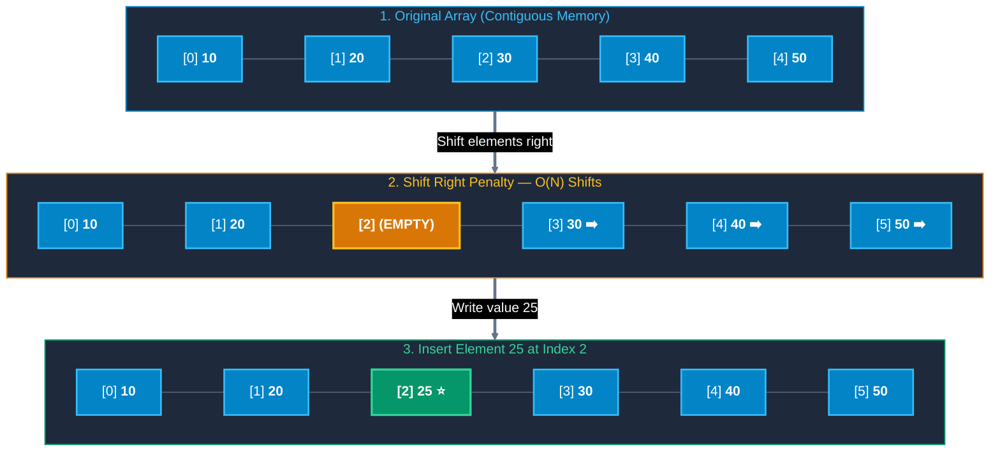
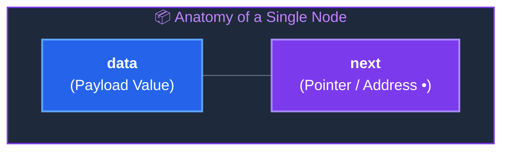
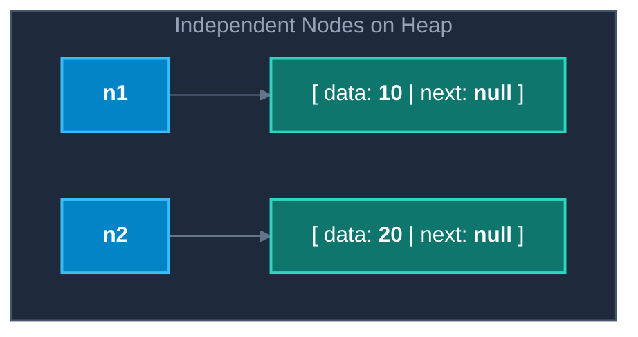
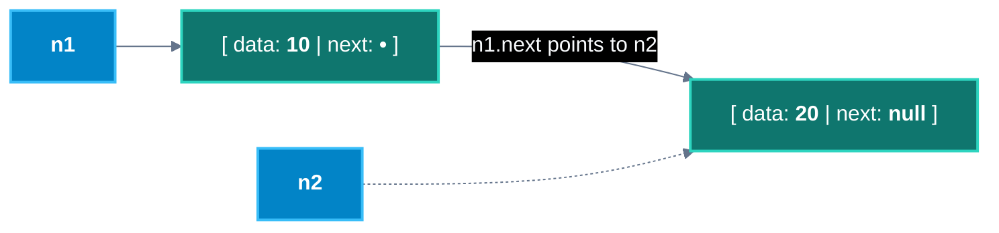
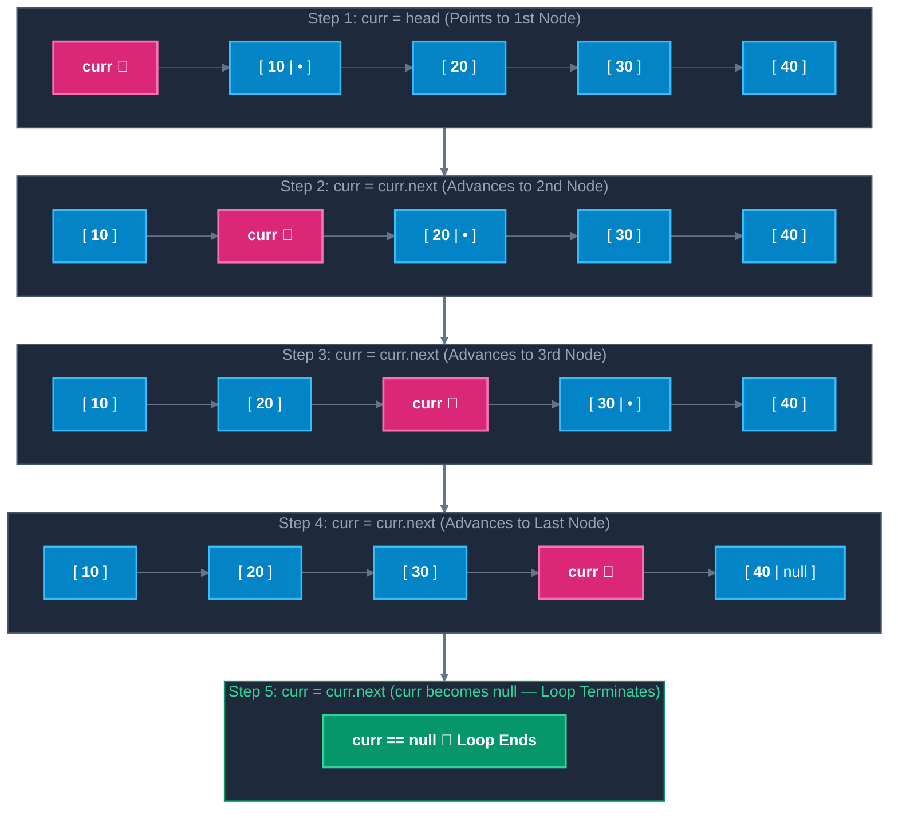
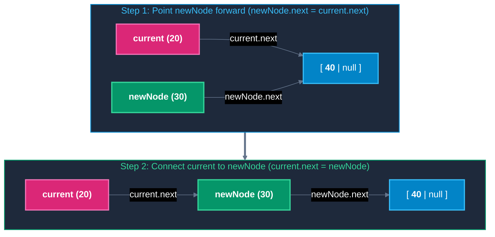
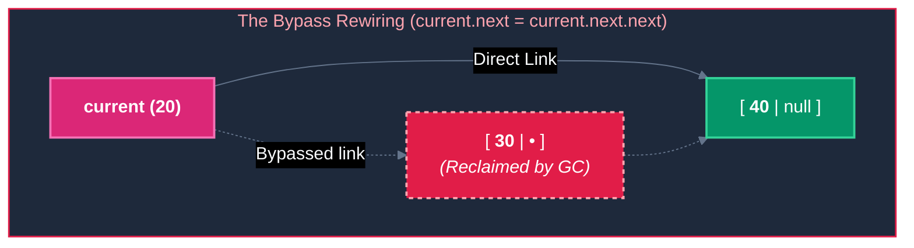
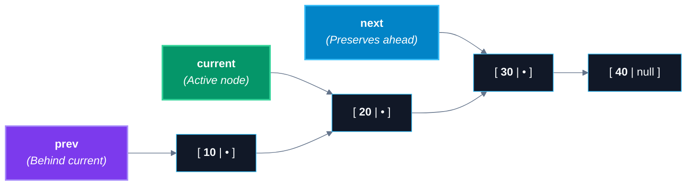

# 🧱 Linked List Fundamentals

> [!abstract] Module Overview
> **Module Master Note:** [[CS/DSA/03. Linked Lists/00. Linked Lists Core|03. Linked Lists]]  
> **Related Notes:** [[02. Linked List Patterns]] | [[Quick Look|⚡ Quick Look Cheatsheet]] | [[CS/DSA/00. DSA Nexus|DSA Master Roadmap]] | [[Home|🧭 Main Command Center]]

---

## 1. What Problem Does a Linked List Solve?

> [!tip] 🎨 Memory Architecture: Array vs. Linked List (Draw.io Vector Model)
> ![[array_vs_linked_list_memory_model.drawio.svg]]

### The Contiguous Memory Model of Arrays
In an **Array**, elements are allocated in a single, contiguous block of physical memory. Because elements sit side-by-side, access by index is instantaneous:
$$\text{Memory Address}(\text{arr}[i]) = \text{Base Address} + (i \times \text{Element Size})$$

Hence, **array random access is $O(1)$**.

---

### The Weakness of Arrays: Costly Insertions & Deletions

If you want to insert an element into the middle of an array (e.g., insert `25` at index `2`):



> [!warning] The $O(N)$ Shift Penalty
> Every element to the right of the insertion point must be physically shifted by one position, requiring **$O(N)$ operations**. Deletion from the front or middle incurs the exact same $O(N)$ shift penalty.

---

## 2. The Core Idea of a Linked List 💡

Instead of forcing all elements into contiguous memory slots, a **Linked List** breaks data down into independent units called **Nodes**.

A node contains two fundamental components:
1. **`data`**: The actual payload value being stored (e.g., `int`, `String`, object).
2. **`next`**: A reference pointer (memory address) to the next node in the chain.



Nodes are scattered across different locations in heap memory and connected via these reference links:


> [!quote] Node Philosophy
> Each node effectively states: *"Here is my data, and here is the memory location where the next node lives."*

---

## 3. The `Node` Class (Java)

```java
class Node {
    int data;     // Payload
    Node next;    // Reference to the next Node (null by default)

    Node(int data) {
        this.data = data;
        this.next = null;
    }
}
```

### Instantiating a Node
When you execute:
```java
Node n1 = new Node(10);
```

You allocate a node instance on the heap:


- `n1.data` is `10`.
- `n1.next` is `null` because no next node is connected yet.

---

## 4. Connecting Nodes to Form a Chain

Suppose we create two separate nodes:
```java
Node n1 = new Node(10);
Node n2 = new Node(20);
```

Initially, both nodes exist independently on the heap:



Connecting them:
```java
n1.next = n2;
```

Now, `n1.next` holds a reference to `n2`:



$$\boxed{10 \longrightarrow 20 \longrightarrow \text{null}}$$

---

## 5. What is `head`? 🧭

To maintain and navigate a linked list, we keep a dedicated pointer/reference to the very first node, conventionally named `head`:

```java
Node head = n1;
```


> [!important] Crucial Rule
> **`head` is NOT the first value. `head` is a REFERENCE to the first node object.**
> - `head` gives access to the node object at the start.
> - `head.data` evaluates to `10` (the payload value).
> - `head.next` evaluates to the second node reference (node containing `20`).
> - `head.next.data` evaluates to `20`.

> [!caution] Losing the Head Reference
> If you lose `head` without another pointer holding it, the entire list becomes unreachable and is reclaimed by Java's Garbage Collector.

---

## 6. Traversing a Linked List 🚶

Because nodes do not have numeric indices in memory, visiting every element requires walking the reference chain starting from `head`.

> [!warning] Never Move `head` Directly for Simple Traversal
> If you execute `head = head.next`, you permanently lose the beginning of your list! Always create a temporary traversal pointer: `Node current = head;`

### 🔍 Step-by-Step Traversal State Trace



### Standard Traversal Boilerplate (Java)
```java
Node current = head;

while (current != null) {
    System.out.println(current.data);
    current = current.next; // Advance to the next node
}
```

> [!tip] Mental Anchor
> `current = current.next;` is the linked list equivalent of `i++` in an array loop.

---

## 7. Time Complexity: Array vs. Linked List ⚖️

| Operation | Array | Singly Linked List | Explanation |
| :--- | :---: | :---: | :--- |
| **Access by index (`arr[i]`)** | **$O(1)$** | **$O(N)$** | Array computes memory offset directly; list must walk $i$ hops. |
| **Search by value** | $O(N)$ | $O(N)$ | Linear scan required for unsorted data in both. |
| **Insert at head** | $O(N)$ | **$O(1)$** | Array must shift all elements; list only attaches `newNode.next = head`. |
| **Delete at head** | $O(N)$ | **$O(1)$** | Array shifts left; list just advances `head = head.next`. |
| **Insert after known node** | $O(N)$ | **$O(1)$** | Re-wiring two pointers takes constant time. |
| **Delete after known node** | $O(N)$ | **$O(1)$** | Re-wiring pointer (`curr.next = curr.next.next`) takes constant time. |

---

## 8. Inserting a Node 🔥

Suppose we have the list:
$$10 \longrightarrow 20 \longrightarrow 40 \longrightarrow \text{null}$$
We want to insert a new node with value `30` between `20` and `40`. Let `current` point to node `20`.

```java
Node newNode = new Node(30);
```



### The Correct 2-Step Pointer Wiring:
1. **Step 1: Point new node to the rest of the list first:**
   ```java
   newNode.next = current.next;
   ```
2. **Step 2: Connect current node to new node:**
   ```java
   current.next = newNode;
   ```

> [!caution] The Most Common Beginner Trap
> If you write the lines in reverse order:
> ```java
> current.next = newNode;      // ❌ WRONG! current.next now points to newNode (30)
> newNode.next = current.next; // ❌ WRONG! newNode.next now points to ITSELF (30), and node 40 is lost forever!
> ```
> **Rule of Thumb:** Always connect the new node's `.next` forward before breaking the existing chain!

---

## 9. Deleting a Node ✂️

Suppose we have:
$$10 \longrightarrow 20 \longrightarrow 30 \longrightarrow 40 \longrightarrow \text{null}$$
We want to delete node `30`. Let `current` point to node `20` (the node *before* the target).



### The Bypass Code:
```java
current.next = current.next.next;
```

### Breakdown:
1. `current.next` is currently pointing to `30`.
2. `current.next.next` is pointing to `40`.
3. By assigning `current.next = current.next.next`, node `20` skips `30` and links directly to `40`.
4. Node `30` has no incoming references and is automatically reclaimed by Java's Garbage Collector.

$$\boxed{10 \longrightarrow 20 \longrightarrow 40 \longrightarrow \text{null}}$$

---

## 10. The 3-Pointer Mental Model 🧠

Most advanced linked list manipulations (reversing, partitioning, reordering) come down to orchestrating three sliding pointers:



- **`prev`**: Tracks the node immediately behind the active position.
- **`current`**: The active node whose links are being inspected or modified.
- **`next`**: Temporarily preserves the upcoming node before `current.next` is re-routed.

---

## 🧪 Self-Check Mini-Test

Test your conceptual understanding on this list:
$$\text{head} \longrightarrow [10] \longrightarrow [20] \longrightarrow [30] \longrightarrow [40] \longrightarrow \text{null}$$

### Q1: What does `head.data` evaluate to?
> [!note]- Reveal Answer
> **`10`**  
> `head` points to the first node `[10 | •]`, so `head.data` retrieves its payload (`10`).

---

### Q2: What does `head.next.data` evaluate to?
> [!note]- Reveal Answer
> **`20`**  
> `head.next` is the second node `[20 | •]`, so `head.next.data` retrieves `20`.

---

### Q3: After running:
```java
Node current = head;
current = current.next;
```
Which node is `current` pointing to?
> [!note]- Reveal Answer
> **The node with value `20` (the 2nd node).**  
> `current` starts at `head` (node `10`), and `current = current.next` advances it by 1 step.

---

### Q4: How do you traverse the entire list and print every value?
> [!note]- Reveal Answer
> ```java
> Node current = head;
> while (current != null) {
>     System.out.println(current.data);
>     current = current.next;
> }
> ```

---

### Q5: If `10 → 20 → 30 → 40` and `current` points to `20`, what does `current.next = current.next.next;` do?
> [!note]- Reveal Answer
> **It deletes / bypasses node `30`.**  
> It re-wires node `20` to point directly to node `40`, producing `10 → 20 → 40 → null`.

---

## 🔗 Next Steps
- Master the 4 interview patterns: **[[02. Linked List Patterns|🧠 Linked List Core Patterns]]**
- Review syntax quick reference: **[[Quick Look|⚡ Java DSA Cheatsheet]]**
