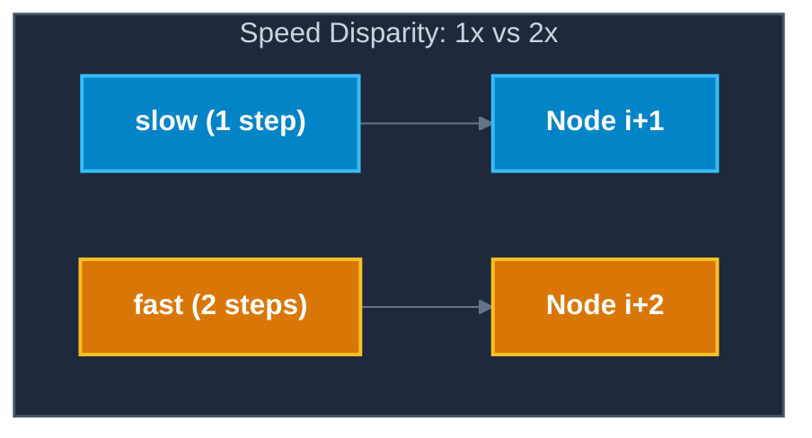
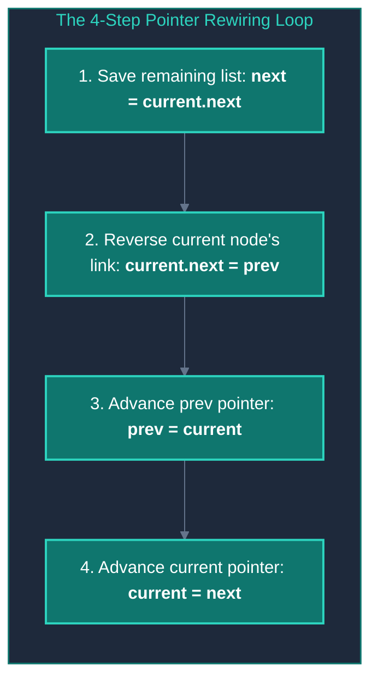

# 🧠 Linked List Core Patterns

> [!abstract] Module Overview
> **Module Master Note:** [[CS/DSA/03. Linked Lists/00. Linked Lists Core|03. Linked Lists]]  
> **Prerequisites:** [[01. Linked List Fundamentals]]  
> **Related Notes:** [[Quick Look|⚡ Quick Look Cheatsheet]] | [[CS/DSA/00. DSA Nexus|DSA Master Roadmap]]

---

## 🎯 Overview of Core Patterns

Mastering linked lists is about recognizing a small set of pointer-manipulation idioms rather than memorizing individual solutions:

| Pattern | Key Idiom | Primary Applications |
| :--- | :--- | :--- |
| **1. Basic Traversal** | `curr = curr.next` | Printing, searching, counting, finding min/max |
| **2. Fast & Slow Pointers** | `slow = slow.next; fast = fast.next.next;` | Finding list middle, cycle detection, palindrome check |
| **3. In-Place Reversal** | `next = curr.next; curr.next = prev; prev = curr; curr = next;` | Reversing lists, reverse sub-segments, reversing in K-groups |
| **4. Dummy Node (Sentinel)** | `Node dummy = new Node(0); dummy.next = head;` | Head deletions, list merges, partition problems |

---

## 1. Pattern 1: Basic Traversal & Linear Aggregation 🚶

The cornerstone template for single-pass processing:

```java
Node current = head;

while (current != null) {
    // Process current node (e.g., search, count, accumulate)
    current = current.next;
}
```

### 🛠️ Common Variants:
- **Search by Value:**
  ```java
  if (current.data == target) return true;
  ```
- **Count Total Nodes:**
  ```java
  int count = 0;
  while (curr != null) { count++; curr = curr.next; }
  ```
- **Find Tail Node:**
  ```java
  while (current.next != null) { current = current.next; }
  ```
  > [!tip] Stopping Condition
  > Checking `current.next != null` stops execution **ON** the last valid node instead of stepping past it into `null`.

---

## 2. Pattern 2: Fast & Slow Pointers (Floyd's Tortoise & Hare) 🐢🐇

Instead of moving one pointer one step at a time, two pointers advance at different speeds:
- `slow` moves **1 step** per iteration: `slow = slow.next;`
- `fast` moves **2 steps** per iteration: `fast = fast.next.next;`



```text
slow
 ↓
[10] ──→ [20] ──→ [30] ──→ [40] ──→ [50] ──→ null
                   ↑
                  fast
```

---

### Use Case A: Finding the Middle Node (Single Pass)

Without knowing the total length of the list in advance:
- When `fast` reaches the end (`fast == null` or `fast.next == null`), `slow` will sit precisely on the **middle node**.

```java
Node slow = head;
Node fast = head;

while (fast != null && fast.next != null) {
    slow = slow.next;
    fast = fast.next.next;
}
// 'slow' now points to the middle node!
```

---

### Use Case B: Cycle Detection (Floyd's Cycle Finding)

- If a cycle exists, `fast` will eventually enter the loop, gain 1 node on `slow` per step, and collide with `slow` (`slow == fast`).
- If no cycle exists, `fast` reaches `null` in $O(N)$ time.

```java
Node slow = head;
Node fast = head;

while (fast != null && fast.next != null) {
    slow = slow.next;
    fast = fast.next.next;
    
    if (slow == fast) {
        return true; // ⚠️ Cycle detected!
    }
}
return false; // ✅ No cycle (reached null)
```

---

### Use Case C: Checking Palindrome Linked List

1. Find the middle of the list using Fast & Slow pointers.
2. Reverse the second half of the list (using Pattern 3).
3. Compare the first half and reversed second half node-by-node.

---

## 3. Pattern 3: In-Place List Reversal 🔄

Transforming $1 \longrightarrow 2 \longrightarrow 3 \longrightarrow 4 \longrightarrow \text{null}$ into $4 \longrightarrow 3 \longrightarrow 2 \longrightarrow 1 \longrightarrow \text{null}$ in **$O(N)$ time** and **$O(1)$ auxiliary space**.



```java
Node prev = null;
Node current = head;

while (current != null) {
    Node next = current.next; // 1. Save next node
    current.next = prev;      // 2. Reverse current node's link
    prev = current;           // 3. Move prev forward
    current = next;           // 4. Move current forward
}

head = prev; // 'prev' is the new head of the reversed list
```

### 🔍 Step-by-Step Visual Pointer Trace:

#### Initial State:
```text
prev = null
current = [ 1 ] ──→ [ 2 ] ──→ [ 3 ] ──→ [ 4 ] ──→ null
```

#### Step 1:
```text
Save:    next = [ 2 ]
Rewire:  [ 1 ] ──→ null
Advance: prev = [ 1 ], current = [ 2 ]
```

#### Step 2:
```text
Save:    next = [ 3 ]
Rewire:  [ 2 ] ──→ [ 1 ] ──→ null
Advance: prev = [ 2 ], current = [ 3 ]
```

#### Step 3:
```text
Save:    next = [ 4 ]
Rewire:  [ 3 ] ──→ [ 2 ] ──→ [ 1 ] ──→ null
Advance: prev = [ 3 ], current = [ 4 ]
```

#### Step 4:
```text
Save:    next = null
Rewire:  [ 4 ] ──→ [ 3 ] ──→ [ 2 ] ──→ [ 1 ] ──→ null
Advance: prev = [ 4 ], current = null (Loop terminates)
New Head = prev ([ 4 ])
```

---

## 4. Pattern 4: Dummy Head Node (Sentinel) 🛡️

### The Problem it Solves:
When modifying a linked list, operations at the very front (`head`) often require messy special-case `if (head == ...)` checks (e.g., removing the first node, inserting before `head`, merging lists).

### The Solution:
Create a fake "dummy" node that sits right before `head`:

```java
Node dummy = new Node(0);
dummy.next = head;
```

```text
dummy ──→ [10] ──→ [20] ──→ [30] ──→ null
  ↑
head reference preserved safely
```

> [!tip] Key Advantages
> 1. The real head (`head`) always has a preceding node (`dummy`), eliminating null-checks for the head.
> 2. At the end of the algorithm, the updated list is always accessible via `dummy.next`.

### Example Application: Remove All Nodes Matching Target Value
```java
Node dummy = new Node(0);
dummy.next = head;
Node curr = dummy;

while (curr.next != null) {
    if (curr.next.data == val) {
        curr.next = curr.next.next; // Safely bypasses even if target was original head!
    } else {
        curr = curr.next;
    }
}

return dummy.next; // New head of modified list
```

---

## ⚠️ Common Pointer Traps & Pitfalls

> [!warning] 1. `NullPointerException` on Chained Pointer Access
> Writing `current.next.next` without checking `current.next != null` first causes runtime crashes if `current` is the tail node. Always verify `fast != null && fast.next != null` in fast-pointer loops.

> [!warning] 2. Breaking the Reference Chain Early
> Overwriting `current.next` before caching the remaining list or before pointing the new node forward breaks the list irreversibly.

> [!warning] 3. Accidental Infinite Cycles
> Forgetting to terminate the tail with `null` after reversing or reordering nodes produces infinite loops in subsequent traversals.

---

## 🔗 Related Notes & Practice
- [[01. Linked List Fundamentals|🧱 Linked List Fundamentals]]
- [[CS/DSA/03. Linked Lists/00. Linked Lists Core|🔗 03. Linked Lists Master Note]]
- [[Quick Look|⚡ Quick Look Cheatsheet]]
- [[CS/DSA/00. DSA Nexus|🌳 DSA Roadmap]]
- [[Home|🧭 Main Command Center]]
