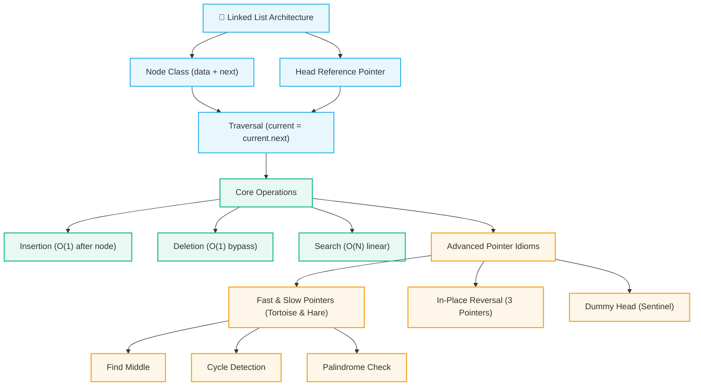

# 🔗 Linked Lists Module

> [!abstract] Module Overview
> Welcome to the **Linked Lists** module. Linked lists are a foundational linear data structure where elements (nodes) are stored non-contiguously in heap memory, connected through explicit reference pointers.

---

## 🧭 Module Learning Path

---

## 📚 Module Notes

1. **[[01. Linked List Fundamentals|🧱 Linked List Fundamentals]]**
   - **The Problem:** Array memory contiguity & $O(N)$ shift penalties vs. scattered node allocation.
   - **The Node Architecture:** `data` and `next` reference in Java.
   - **The Head Pointer:** Why `head` is a reference, not a value.
   - **Core Operations:** Traversal, Insertion (Order of pointer updates), Deletion (`current.next = current.next.next`).
   - **Array vs. Linked List Complexity:** Trade-off comparison table.
   - **Self-Check Test:** 5 foundational conceptual questions & answers.

2. **[[02. Linked List Patterns|🧠 Linked List Core Patterns]]**
   - **Pattern 1:** Standard Traversal & Aggregation (`current = current.next`).
   - **Pattern 2:** Fast & Slow Pointers (Floyd's Tortoise and Hare for Middle, Cycle Detection, Palindromes).
   - **Pattern 3:** In-Place Reversal (`prev`, `curr`, `next` iterative pointer rewiring).
   - **Pattern 4:** Dummy Head Node (Eliminating edge cases for head insertions/deletions).
   - **Pointer Pitfalls:** `NullPointerException`, reference loss, and cycle creation.

---

## ⚡ Quick Comparison: Array vs. Linked List

| Operation | Array | Singly Linked List | Key Reason |
| :--- | :---: | :---: | :--- |
| **Access by Index (`i`)** | $O(1)$ | $O(N)$ | Arrays compute offset directly; Linked Lists must traverse from `head`. |
| **Search (by Value)** | $O(N)$ | $O(N)$ | Both require linear scan (unless array is sorted: $O(\log N)$). |
| **Insert at Beginning** | $O(N)$ | $O(1)$ | Array shifts all $N$ elements; Linked List updates 2 pointers. |
| **Delete at Beginning** | $O(N)$ | $O(1)$ | Array shifts remaining elements left; Linked List moves `head = head.next`. |
| **Insert after Known Node** | $O(N)$ | $O(1)$ | Array shifts downstream items; Linked List re-links pointers in $O(1)$. |
| **Delete after Known Node** | $O(N)$ | $O(1)$ | Array shifts left; Linked List bypasses node via `curr.next = curr.next.next`. |

---

## 🔗 Related Notes & Navigation
- [[CS/DSA/README|🌳 DSA Master Roadmap]]
- [[Quick Look|⚡ Quick Look & Cheatsheet]]
- [[01. Linked List Fundamentals|🧱 Linked List Fundamentals]]
- [[02. Linked List Patterns|🧠 Linked List Patterns]]
- [[Home|🧭 Main Command Center]]
