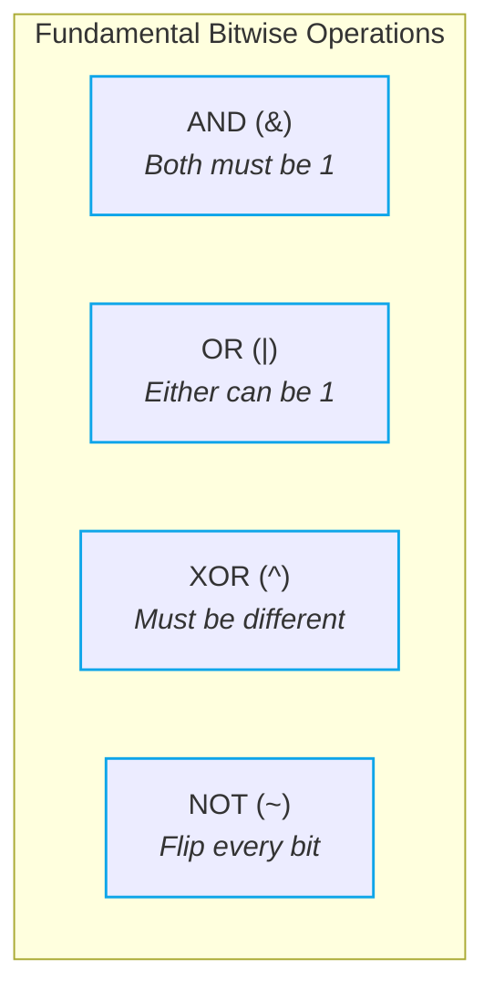

# ⚡ Bitwise Operators

> [!abstract] Module Overview
> **Master Note:** [[Bit Manipulation]]  
> **Related Notes:** [[02. Bit Tricks]] | [[03. XOR Patterns]] | [[04. Bit Manipulation Problems]] | [[Quick Look|⚡ Quick Look Cheatsheet]]

---

## 1. Overview

Bitwise operators perform low-level operations directly on the individual binary bits (`0` and `1`) of integer operands at hardware speed ($O(1)$ CPU cycles).



| Operator | Symbol | Bit Rule | Common Use Case |
| :--- | :---: | :--- | :--- |
| **AND** | `&` | `1` only if **both** bits are `1` | Masking, isolating bits, parity check |
| **OR** | <code>&#124;</code> | `1` if **either** bit is `1` | Setting bits, combining flag sets |
| **XOR** | `^` | `1` if bits are **different** ($0 \oplus 1$ or $1 \oplus 0$) | Toggling, duplicate cancellation, parity |
| **NOT** | `~` | Inverts every bit (bitwise complement: $0 \leftrightarrow 1$) | Creating inverted masks, two's complement |

---

## 2. Universal Truth Table

| $A$ | $B$ | $A \ \& \ B$ (AND) | $A \ \vert \ B$ (OR) | $A \ \oplus \ B$ (XOR) |
| :---: | :---: | :---: | :---: | :---: |
| `0` | `0` | `0` | `0` | `0` |
| `0` | `1` | `0` | `1` | `1` |
| `1` | `0` | `0` | `1` | `1` |
| `1` | `1` | `1` | `1` | `0` |

### 🔄 NOT (`~`) Operation
The NOT operator inverts all bits (one's complement):
- `~0 = 1`
- `~1 = 0`

> [!info] Two's Complement Inversion
> In Java / 2's complement representation:
> $$\sim X = -(X + 1)$$
> - `~0` evaluates to `-1` (all 32 bits set to `1`).
> - `~1` evaluates to `-2`.

---

## 3. Worked Examples (Class Demonstration)

Consider decimal numbers $20$ and $45$:

```text
20₁₀ = 0 1 0 1 0 0₂  (16 + 4)
45₁₀ = 1 0 1 1 0 1₂  (32 + 8 + 4 + 1)
```

### 1️⃣ Bitwise AND (`20 & 45 = 4`)
```text
  0 1 0 1 0 0  (20)
& 1 0 1 1 0 1  (45)
─────────────
  0 0 0 1 0 0  (4)   → Only bit 2 (weight 4) is 1 in both operands
```

### 2️⃣ Bitwise OR (`20 | 45 = 61`)
```text
  0 1 0 1 0 0  (20)
| 1 0 1 1 0 1  (45)
─────────────
  1 1 1 1 0 1  (61)  → 32 + 16 + 8 + 4 + 1 = 61
```

### 3️⃣ Bitwise XOR (`20 ^ 45 = 57`)
```text
  0 1 0 1 0 0  (20)
^ 1 0 1 1 0 1  (45)
─────────────
  1 1 1 0 0 1  (57)  → 32 + 16 + 8 + 1 = 57 (bit 2 cancels: 1 ^ 1 = 0)
```

---

## 4. Fundamental Algebraic Properties

### 🛡️ AND Properties (`&`)
```text
A & 0 = 0
A & A = A
```
- Any bit AND-ed with `0` is cleared to `0`.
- Any bit AND-ed with itself remains unchanged.

### 🌟 OR Properties (`|`)
```text
A | 0 = A
A | A = A
```
- Any bit OR-ed with `0` remains unchanged.
- Any bit OR-ed with itself remains unchanged.

### ⚡ XOR Properties (`^`)
```text
A ^ 0 = A
A ^ A = 0
```

> [!important] Core XOR Identities
> - `A ^ 0 = A` — XOR with zero preserves the original value.
> - `A ^ A = 0` — XOR with self cancels to zero (**self-inversion**).
> 
> *For algorithmic cancellation patterns, duplicate identification, and bit contribution, see [[03. XOR Patterns]].*

### 🔄 Commutative & Associative Laws

Bitwise operations satisfy the algebraic commutative and associative laws:

```text
Commutative:
A & B = B & A
A | B = B | A
A ^ B = B ^ A

Associative:
(A & B) & C = A & (B & C)
(A | B) | C = A | (B | C)
(A ^ B) ^ C = A ^ (B ^ C)
```

> [!tip] Algorithmic Reordering Power
> Because XOR is commutative and associative, any sequence of XOR operations across an entire array can be freely rearranged in any order — allowing duplicate pairs to cancel each other regardless of where they sit in memory! *(See [[04. Bit Manipulation Problems]]).*

---

## 🔗 Related Notes
- [[CS/DSA/00. DSA Nexus|🌳 DSA Master MOC]]
- [[Bit Manipulation|⚡ Bit Manipulation Master Note]]
- [[02. Bit Tricks]]
- [[03. XOR Patterns]]
- [[04. Bit Manipulation Problems]]
- [[Quick Look|⚡ Quick Look Cheatsheet]]
