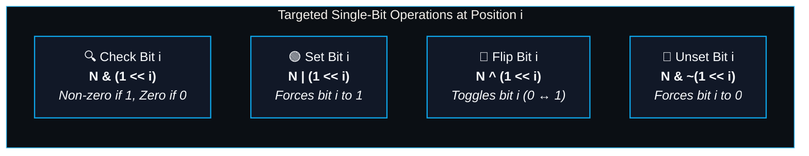
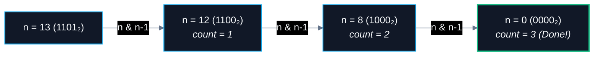

# 🛠️ Bit Tricks & Masking Techniques

> [!abstract] Module Overview
> **Master Note:** [[Bit Manipulation]]  
> **Related Notes:** [[01. Bitwise Operators]] | [[03. XOR Patterns]] | [[04. Bit Manipulation Problems]] | [[Quick Look|⚡ Quick Look Cheatsheet]]

---

## 1. Even / Odd Check (Parity) ⚖️

Checking parity using bitwise AND operates directly on the CPU register without division or remainder hardware operations (`N % 2`).

```text
Formula: N & 1
```

| Result | Binary LSB | Number Property |
| :---: | :---: | :--- |
| `1` | `...1` | **Odd** ($2^0 = 1$ is present) |
| `0` | `...0` | **Even** (All powers of 2 are divisible by 2) |

> [!tip] Why It Works
> In binary representation, every bit position $i \ge 1$ represents an even value ($2^1 = 2, 2^2 = 4, 2^3 = 8, \dots$). Only bit 0 (the Least Significant Bit or LSB) represents an odd value ($2^0 = 1$).
> - If bit 0 is `1`, the number is odd.
> - If bit 0 is `0`, the number is even.
> - `N & 1` isolates bit 0 and masks out all higher bits.

---

## 2. Left Shift (`<<`) ⬅️

Left shifting moves all bits to the left by $n$ positions, filling vacated bits on the right with `0`.

$$\boxed{A \ll n = A \times 2^n}$$

```text
Example: 10 << 2
10₁₀   = 0 0 1 0 1 0₂
Shift  = 1 0 1 0 0 0₂  (40₁₀ = 10 × 2²)
```

| Expression | Calculation | Result |
| :--- | :--- | :---: |
| `10 << 1` | $10 \times 2^1$ | `20` |
| `10 << 2` | $10 \times 2^2$ | `40` |
| `10 << 3` | $10 \times 2^3$ | `80` |
| `10 << 4` | $10 \times 2^4$ | `160` |
| `10 << 5` | $10 \times 2^5$ | `320` |

> [!tip] Multiplication by Powers of 2
> Each left shift by 1 effectively **multiplies the integer by 2** at hardware speed.

---

## 3. Right Shift (`>>`) ➡️

Right shifting moves all bits to the right by $n$ positions, discarding the rightmost bits.

$$\boxed{A \gg n = \lfloor A / 2^n \rfloor \quad (\text{integer / floor division})}$$

```text
Example: 10 >> 2
10₁₀   = 0 0 1 0 1 0₂
Shift  = 0 0 0 0 1 0₂  (2₁₀ = ⌊10 / 4⌋)
```

| Expression | Calculation | Result |
| :--- | :--- | :---: |
| `10 >> 1` | $\lfloor 10 / 2^1 \rfloor$ | `5` |
| `10 >> 2` | $\lfloor 10 / 2^2 \rfloor$ | `2` |
| `10 >> 3` | $\lfloor 10 / 2^3 \rfloor$ | `1` |
| `10 >> 4` | $\lfloor 10 / 2^4 \rfloor$ | `0` |

> [!tip] Division by Powers of 2
> Each right shift by 1 effectively **divides the number by 2** (floor division).

---

## 4. Single-Bit Mask Operations

Let `i` = **bit position** (0-indexed from the right, where bit 0 has weight $2^0 = 1$).

The fundamental building block for targeted bit manipulation is the single-bit mask:
```text
1 << i  →  000...0001000...000  (Only bit i is set to 1)
```



---

### 1️⃣ Check Bit (Is bit $i$ set?)

To test whether the $i$-th bit is `1` or `0`:

```text
Formula: N & (1 << i)
```

- **Non-zero (`!= 0` / `> 0`)** $\to$ Bit $i$ is **1** (set).
- **Zero (`== 0`)** $\to$ Bit $i$ is **0** (unset).

> [!tip] Alternative Single-Bit Read
> `(N >> i) & 1` shifts the target bit to index 0 and evaluates directly to `1` or `0`.

---

### 2️⃣ Set Bit (Force bit $i$ to 1)

To turn bit $i$ ON without modifying any other bit:

```text
Formula: N | (1 << i)
```

- If bit $i$ was `0`, it becomes `1`.
- If bit $i$ was already `1`, it remains `1`.
- All other bits OR-ed with `0` are unchanged ($A \mid 0 = A$).

---

### 3️⃣ Flip Bit (Toggle bit $i$)

To toggle bit $i$ ($0 \to 1$ or $1 \to 0$):

```text
Formula: N ^ (1 << i)
```

- Since $0 \oplus 1 = 1$ and $1 \oplus 1 = 0$, XOR-ing with `1` inverts the target bit.
- All other bits XOR-ed with `0` remain unchanged ($A \oplus 0 = A$).

---

### 4️⃣ Unset Bit (Force bit $i$ to 0)

To turn bit $i$ OFF without modifying any other bit:

```text
Formula: N & ~(1 << i)
```

> [!info] Why It Works:
> 1. `(1 << i)` has only bit $i$ set: `0000 0100` (for $i = 2$).
> 2. `~(1 << i)` creates a mask where **every bit is 1 except bit $i$**: `1111 1011`.
> 3. AND-ing `N` with this inverted mask clears bit $i$ to `0` while keeping all other bits identical ($A \& 1 = A$).

---

## 📊 Summary of Single-Bit Operations

| Operation | Formula | Mask Used | Example ($N = 10 = 1010_2, i = 0$) |
| :--- | :--- | :--- | :--- |
| **Check $i$-th bit** | `N & (1 << i)` | `1 << i` | `10 & 1 = 0` (bit 0 is unset) |
| **Set $i$-th bit** | <code>N &#124; (1 &lt;&lt; i)</code> | `1 << i` | `10 \| 1 = 11` (`1011_2`) |
| **Flip $i$-th bit** | `N ^ (1 << i)` | `1 << i` | `10 ^ 1 = 11` (`1011_2`) |
| **Unset $i$-th bit** | `N & ~(1 << i)` | `~(1 << i)` | `10 & ~1 = 10` (`1010_2`) |

---

## 5. The All-Ones Mask (`-1L`) & Mask Generation 🎭

### What is `-1L`?
In Java:
- `-1` is the decimal value negative one.
- `L` suffix specifies a 64-bit signed `long`.

### Why is `-1L` all 1s in Binary?
Java uses **two's complement** for signed integers:
- For 64-bit `1L`: `00000000 00000000 ... 00000001`
- Inverting bits (`~1L`): `11111111 11111111 ... 11111110`
- Adding 1 (`two's complement`): `11111111 11111111 ... 11111111`

$$\text{Binary of } -1\text{L} = \underbrace{11111111 \dots 11111111}_{64 \text{ ones}}$$

### High-Yield Mask Patterns:

```java
// 1. Creating B Trailing Zeros:
long maskTrailingZeros = -1L << B;    // 1111...11000...000 (B zeros at bottom)

// 2. Creating B Trailing Ones:
long maskTrailingOnes  = ~(-1L << B);  // 0000...00111...111 (B ones at bottom)

// 3. Creating a Range Mask [L, R] (Bits L through R set to 1):
long rangeMask = (-1L << L) & ~(-1L << (R + 1));
// or:
long rangeMask2 = ((1L << (R - L + 1)) - 1) << L;
```

---

## 6. Counting Set Bits (Hamming Weight / Population Count) 🔢

### 1️⃣ Built-in Method — `Integer.bitCount(n)` (Fastest & Recommended)

Java provides high-performance hardware-accelerated methods (using CPU POPCNT instructions):

```java
int count = Integer.bitCount(n);   // For 32-bit int
long countLong = Long.bitCount(n); // For 64-bit long
```

#### Example Walkthrough ($n = 13$):
$$13_{10} = 1101_2$$
- Bit positions set: bit 0 (`1`), bit 2 (`1`), bit 3 (`1`) $\implies$ total set bits = **3**.
```java
Integer.bitCount(13); // returns 3
```

- **Time Complexity:** $O(1)$
- **Space Complexity:** $O(1)$

---

### 2️⃣ Brian Kernighan’s Algorithm ($O(\text{set bits})$)

If asked to implement manual bit counting without built-in libraries:



```java
public int countSetBits(int n) {
    int count = 0;
    while (n != 0) {
        n = n & (n - 1); // Clears the lowest set bit in each iteration
        count++;
    }
    return count;
}
```

> [!tip] Why `n & (n - 1)` Clears the Lowest Set Bit:
> - Subtracting 1 from `n` flips the lowest set bit from `1` to `0`, and turns all trailing `0`s to `1`s (e.g. `1100 - 1 = 1011`).
> - AND-ing `n` with `n - 1` cancels that lowest set bit to `0` while leaving all higher bits intact.
> - The loop executes **only as many times as there are set bits** (3 iterations for `13 = 1101`), running much faster than looping through all 32 bits!

---

## 🔗 Related Notes
- [[CS/DSA/00. DSA Nexus|🌳 DSA Master MOC]]
- [[Quick Look|⚡ DSA & Java Quick Look Reference]]
- [[Bit Manipulation|⚡ Bit Manipulation Master Note]]
- [[01. Bitwise Operators]]
- [[03. XOR Patterns]]
- [[04. Bit Manipulation Problems]]
