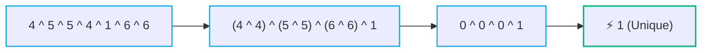
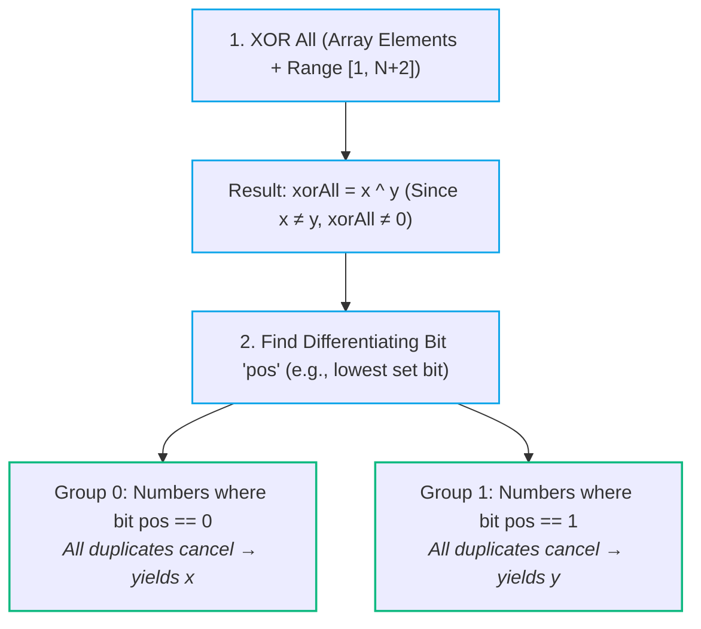
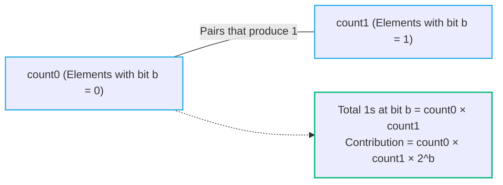

# 💡 Bit Manipulation Practice Problems

> [!abstract] Module Overview
> **Master Note:** [[Bit Manipulation]]  
> **Related Notes:** [[03. XOR Patterns]] | [[02. Bit Tricks]] | [[01. Bitwise Operators]] | [[Quick Look|⚡ Quick Look Cheatsheet]]

---

## 1. Single Number

> [!question] Problem Statement
> Given an array `A[]` where every number occurs **twice** except **one** element that occurs **once**, find that single unique element.

### Examples
```text
A = [4, 5, 5, 4, 1, 6, 6]        →   Answer = 1
A = [7, 5, 5, 1, 7, 6, 1, 6, 4]  →   Answer = 4
```

### 💡 Key Observation
From [[03. XOR Patterns]]:
- $A \oplus A = 0$ (identical pairs cancel out to zero)
- $A \oplus 0 = A$ (XOR with zero preserves the value)

Because XOR is commutative and associative, we can rearrange the entire array XOR sequence:



### ⚙️ Algorithm (Java)
```java
int singleNumber(int[] A) {
    int ans = 0;
    for (int x : A) {
        ans ^= x;
    }
    return ans;
}
```

### 📊 Complexity
- **Time Complexity:** $O(N)$ — single pass over the array
- **Space Complexity:** $O(1)$ — constant auxiliary space

> [!tip] Bit-Count Alternative
> As observed in [[03. XOR Patterns#4. Bit-Count XOR Observation (Theoretical Foundation) 🔬|Bit-Count XOR Observation]], counting the frequency of set bits across all numbers at each bit position (0 to 31) reveals that any bit with an **odd count** belongs to the unique number.

---

## 2. Two Missing Numbers

> [!question] Problem Statement
> Given an array `A[]` of length $N$ containing distinct integers from the range $[1, N+2]$. Exactly two numbers from that range are missing. Find the two missing numbers.

### Examples
```text
A = [5, 1, 3, 6]   →   Range [1, 6]   →   Missing: {2, 4}
A = [3, 2, 4]       →   Range [1, 5]   →   Missing: {1, 5}
```

---

### 🔍 Strategy Comparison

| Approach | Technique | Time Complexity | Space Complexity | Notes / Trade-offs |
| :--- | :--- | :---: | :---: | :--- |
| **Approach 1** | Sorting & Scan | $O(N \log N)$ | $O(1)$ | Simple, but slower due to sorting |
| **Approach 2** | Sum & Square Sum | $O(N)$ | $O(1)$ | Math-based, risk of **integer overflow** ($x^2 + y^2$) |
| **Approach 3** | **XOR Partitioning (Optimal)** | **$O(N)$** | **$O(1)$** | **No overflow risk**, single-bit separation |

---

### Approach 1 — Sorting

Sort the array, then iterate from $1$ to $N+2$ comparing each expected number against the current pointer in the sorted array.

```text
A = [5, 1, 3, 6]
Sorted:   [1, 3, 5, 6]
Expected: [1, 2, 3, 4, 5, 6]
Missing:       2     4
```

- **Time Complexity:** $O(N \log N)$
- **Space Complexity:** $O(1)$ (in-place sort)

---

### Approach 2 — Sum and Square Sum

Let the two missing numbers be $x$ and $y$.

#### Step 1 — Linear Sum:
Total expected sum of numbers from $1$ to $N+2$:
$$S = \frac{(N+2)(N+3)}{2}$$

$$x + y = S - \sum_{i=0}^{N-1} A[i]$$

#### Step 2 — Sum of Squares:
Total expected sum of squares of numbers from $1$ to $N+2$:
$$T = \frac{(N+2)(N+3)(2(N+2)+1)}{6}$$

$$x^2 + y^2 = T - \sum_{i=0}^{N-1} A[i]^2$$

#### Step 3 — Solve System of Equations:
Using $(x - y)^2 = 2(x^2 + y^2) - (x + y)^2$, find $(x - y)$, and then compute $x$ and $y$.

- **Time Complexity:** $O(N)$
- **Space Complexity:** $O(1)$
- *Caveat:* Potential integer overflow with large values during square calculations.

---

### Approach 3 — XOR Partitioning (Optimal) 🚀



#### Class Worked Example:
```text
A = [5, 1, 3, 6]   →   Range [1, 6]   →   Missing: {2, 4}

xorAll = (5 ^ 1 ^ 3 ^ 6) ^ (1 ^ 2 ^ 3 ^ 4 ^ 5 ^ 6)
       = 2 ^ 4 = 6 = 110₂

pos = 1  (bit 1 is set: 2 has bit 1=1, 4 has bit 1=0)

Group with bit 1 = 0:
  Numbers: {1, 4, 5, 1, 4, 5} → XOR = 4 (x = 4)

Group with bit 1 = 1:
  Numbers: {3, 6, 2, 3, 6}    → XOR = 2 (y = 2)

Missing numbers = {2, 4}  ✓
```

### ⚙️ Algorithm (Java)
```java
int[] twoMissingNumbers(int[] A, int N) {
    // Step 1: XOR everything together
    int xorAll = 0;
    for (int v : A) xorAll ^= v;
    for (int i = 1; i <= N + 2; i++) xorAll ^= i;

    // Step 2: Find a set bit position
    int pos = 0;
    while (((xorAll >> pos) & 1) == 0) pos++;

    // Step 3: Partition and XOR separately
    int x = 0, y = 0;
    for (int v : A) {
        if (((v >> pos) & 1) == 0) x ^= v;
        else y ^= v;
    }
    for (int i = 1; i <= N + 2; i++) {
        if (((i >> pos) & 1) == 0) x ^= i;
        else y ^= i;
    }
    return new int[]{x, y};
}
```

### 📊 Complexity
- **Time Complexity:** $O(N)$
- **Space Complexity:** $O(1)$

---

## 3. Minimum XOR Pair

> [!question] Problem Statement
> Given an integer array `A[]` of $N$ integers, find the **minimum XOR value** among all pairs $(i, j)$ where $i \ne j$.

### Examples
```text
A = [0, 2, 5, 7]

0 ^ 2 = 2   0 ^ 5 = 5   0 ^ 7 = 7
2 ^ 5 = 7   2 ^ 7 = 5   5 ^ 7 = 2

Answer = 2
```

```text
A = [3, 10, 12, 4, 7, 14]   →   Answer = 2  (= 0010₂)
```

### 💡 Key Observation
XOR represents bitwise difference. Two numbers that are **close in value** share more leading (most significant) bits in common, which results in a smaller XOR value.
- After sorting the array in ascending order, the minimum XOR pair is **guaranteed to be adjacent** ($A[i]$ and $A[i+1]$).
- It is never necessary to check non-adjacent pairs after sorting ($O(N^2) \to O(N \log N)$).

### ⚙️ Algorithm (Java)
```java
int minXorPair(int[] A) {
    Arrays.sort(A);
    int ans = A[0] ^ A[1];
    for (int i = 1; i < A.length - 1; i++) {
        ans = Math.min(ans, A[i] ^ A[i + 1]);
    }
    return ans;
}
```

### 📊 Complexity
- **Time Complexity:** $O(N \log N)$ — dominated by sorting
- **Space Complexity:** $O(1)$ (or $O(\log N)$ depending on sort implementation)

> [!note] Note on Source
> The original handwritten notes noted "max" in the final algorithm line, which contradicts the problem goal (minimum XOR). The clearly intended operation is **minimum** (`Math.min`).

---

## 4. Sum of XOR of All Pairs

> [!question] Problem Statement
> Given an array `A[]` of $N$ integers, find the **sum of XOR of all pairs** $(i, j)$ where $i < j$.
> Return the answer **modulo $10^9 + 7$**.

### Example
```text
A = [3, 4, 2]

3 ^ 4 = 7
3 ^ 2 = 1
4 ^ 2 = 6

Sum = 7 + 1 + 6 = 14
```

### 💡 Key Observation: Bit Contribution Technique

Calculating all pairs directly requires $O(N^2)$ time. To optimize to $O(N)$, analyse each **bit position independently**:

For any fixed bit position $b$ ($0 \le b < 32$):
- Let `count0` = number of elements in $A$ with bit $b = 0$.
- Let `count1` = number of elements in $A$ with bit $b = 1$.

A pair of numbers $(A[i], A[j])$ produces a `1` at bit $b$ in $(A[i] \oplus A[j])$ **if and only if** one number has bit $b = 0$ and the other has bit $b = 1$.



$$\boxed{\text{Contribution}_b = \text{count0} \times \text{count1} \times 2^b}$$

Summing contributions across all 32 bits gives the total sum of XOR for all pairs in $O(32 \times N) = O(N)$.

### ⚙️ Algorithm (Java)
```java
int sumXorPairs(int[] A, int N) {
    long ans = 0;
    long MOD = 1_000_000_007L;

    for (int b = 0; b < 32; b++) {
        long x = 0, y = 0; // x = count of 0s, y = count of 1s

        for (int i = 0; i < N; i++) {
            if ((A[i] & (1 << b)) == 0) x++;
            else y++;
        }

        ans = (ans + (x * y) % MOD * (1L << b) % MOD) % MOD;
    }

    return (int) ans;
}
```

### 📊 Complexity
- **Time Complexity:** $O(N)$ — outer loop runs exactly 32 times ($32 \times N = O(N)$)
- **Space Complexity:** $O(1)$ — only constant counters and accumulators

---

## 5. Master Complexity Summary Table

| Problem | Approach | Time Complexity | Space Complexity | Primary Mechanism |
| :--- | :--- | :---: | :---: | :--- |
| **Single Number** | XOR Accumulation | $O(N)$ | $O(1)$ | $A \oplus A = 0$ duplicate cancellation |
| **Two Missing Numbers** | Sorting Scan | $O(N \log N)$ | $O(1)$ | In-place Sort + Missing scan |
| **Two Missing Numbers** | Sum & Square Sum | $O(N)$ | $O(1)$ | Quadratic equation solving |
| **Two Missing Numbers** | **XOR Partitioning (Optimal)** | **$O(N)$** | **$O(1)$** | Set-bit parity grouping |
| **Minimum XOR Pair** | Sort + Adjacent Check | $O(N \log N)$ | $O(1)$ | Sorting shared bit-prefixes |
| **Sum of XOR of All Pairs** | Bit Contribution (32 bits) | $O(N)$ | $O(1)$ | Independent bit counting ($c_0 \times c_1 \times 2^b$) |

---

## 🔗 Related Notes
- [[Bit Manipulation|⚡ Bit Manipulation Master Note]]
- [[03. XOR Patterns]]
- [[02. Bit Tricks]]
- [[01. Bitwise Operators]]
- [[CS/DSA/00. DSA Nexus|🌳 DSA Master MOC]]
- [[Quick Look|⚡ Quick Look Cheatsheet]]
