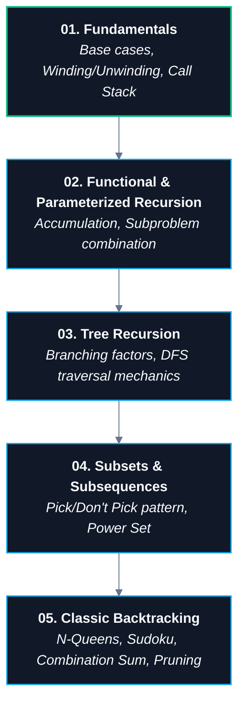

# 🔁 05. Recursion & Backtracking

> [!abstract] Module Overview
> Master hub for recursive problem solving, call stack mechanics, divide-and-conquer paradigms, tree recursions, subset generation, and state-space tree backtracking.

---

## 🗺️ Module Knowledge Graph & Roadmap

---

## 📑 Module Notes

1. **[[01. Recursion Fundamentals|01. Recursion Fundamentals]]**
   - What is recursion & the infinite recursion trap
   - Base case vs Recursive case
   - **Call Stack Invariant:** Stack stores *function calls & suspended state*, not output
   - The Two Phases: Going Down (Pre-recursion) vs. Coming Back Up (Post-recursion unwinding)
   - Factorial call stack tracing & value accumulation
   - The 3-Question Recursion Formula
   - Why recursion is naturally perfect for hierarchical trees

---

## 🔗 Master Connections
- [[CS/DSA/00. DSA Nexus|DSA Master Roadmap]]
- [[CS/DSA/07. Trees & BSTs/02. Binary Tree Traversals|🚶‍♂️ Binary Tree Traversals (Tree Recursion in Action)]]
- [[CS/DSA/06. Stacks & Queues/01. Stack Fundamentals|🥞 Call Stack & LIFO Architecture]]
- [[home|🧭 Main Command Center]]
