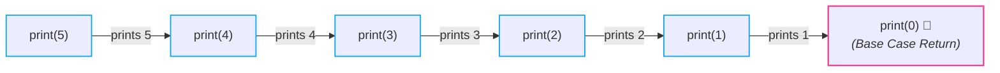
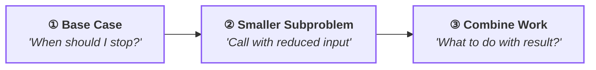

# 🔄 Recursion Fundamentals

> [!abstract] Module Overview
> **Master MOC:** [[CS/DSA/05. Recursion & Backtracking/00. Recursion Core|05. Recursion & Backtracking]]  
> **Related Notes:** [[CS/DSA/07. Trees & BSTs/02. Binary Tree Traversals|🚶‍♂️ Binary Tree Traversals]] | [[CS/DSA/06. Stacks & Queues/01. Stack Fundamentals|🥞 Call Stack Mechanics]] | [[CS/DSA/00. DSA Nexus|DSA Master Roadmap]] | [[home|🧭 Main Command Center]]

---

## 1. 🧠 What is Recursion?

> [!important] 🎯 Core Definition
> **Recursion** is a programming technique where **a function calls itself** to solve smaller instances of the exact same problem until it reaches a trivial stopping point.

### The Infinite Recursion Trap 💀
Consider a function that blindly calls itself without an exit condition:

```java
void hello() {
    System.out.println("Hello");
    hello(); // Calls itself forever
}
```

Because each function invocation places a new stack frame onto the memory call stack, this runs forever until the system crashes with a **`StackOverflowError`** 💥.

### The 2 Non-Negotiable Pillars of Every Recursive Function:
1. **Base Case:** The condition where recursion **stops** without making further recursive calls.
2. **Recursive Case:** The step where the function **calls itself** with a smaller, simpler input moving toward the base case.

---

## 2. 1️⃣ Your First Recursion: Printing from $N$ down to $1$

Let's print numbers from `5` down to `1`:

```java
void print(int n) {
    // 1. Base Case
    if (n == 0) {
        return;
    }

    // 2. Current Work
    System.out.println(n);

    // 3. Recursive Call (smaller problem)
    print(n - 1);
}
```

### Execution Trace (`print(5)`)



```text
Output:
5
4
3
2
1
```

> [!tip] 🔑 The Key Role of the Base Case
> ```java
> if (n == 0) return;
> ```
> Without this check, the call stack grows indefinitely ($5 \rightarrow 4 \rightarrow 3 \rightarrow \dots \rightarrow -999999$) until memory is exhausted.

---

## 3. 2️⃣ The Mental Model: Don't Execute Everything at Once

When beginners struggle with recursion, it's usually because they try to hold the entire call stack in their head simultaneously.

> [!quote] The Trust Mental Model
> **"Do the current unit of work, and trust the recursive call to solve the smaller problem."**

When calling `print(3)`:
- `print(3)`: prints `3` $\rightarrow$ asks `print(2)` to handle the rest.
- `print(2)`: prints `2` $\rightarrow$ asks `print(1)` to handle the rest.
- `print(1)`: prints `1` $\rightarrow$ asks `print(0)` to handle the rest.
- `print(0)`: hits base case $\rightarrow$ stops and returns.

---

## 4. 3️⃣ The Two Phases of Recursion: Going Down vs. Coming Back Up 🔥

Now examine what happens when we move `System.out.println(n)` **after** the recursive call:

### Case A: Work Done on the Way DOWN (Pre-Recursion)

```java
void printDown(int n) {
    if (n == 0) return;

    System.out.println(n); // ⬅️ Executed BEFORE recursing
    printDown(n - 1);
}
```
**Output for `printDown(3)`:**
$$\mathbf{3 \rightarrow 2 \rightarrow 1}$$

---

### Case B: Work Done on the Way UP (Post-Recursion)

```java
void printUp(int n) {
    if (n == 0) return;

    printUp(n - 1);        // ⬅️ Recurse FIRST (calls go down)
    System.out.println(n); // ⬅️ Executed on the return journey (UNWINDING)
}
```
**Output for `printUp(3)`:**
$$\mathbf{1 \rightarrow 2 \rightarrow 3}$$

> [!important] 🧠 Critical Memory Invariant: What is Actually Stored?
> **It does NOT store the *output*; it stores the *function calls / execution state* on the call stack.**
> 
> Each function frame is suspended in memory, essentially saying:
> > *"I'll wait right here until `print(n - 1)` finishes."*

---

### Step-by-Step Call Pause & Resume Trace (`print(4)`)

When executing:
```java
void print(int n) {
    if (n == 0) return;
    print(n - 1);
    System.out.println(n);
}
```

#### 1. ⬇️ Calls Going Deeper ($4 \rightarrow 3 \rightarrow 2 \rightarrow 1 \rightarrow 0$)
Every call pushes a new frame onto the call stack and waits:

```text
print(4)  ← waiting for print(3)
print(3)  ← waiting for print(2)
print(2)  ← waiting for print(1)
print(1)  ← waiting for print(0)
print(0)  ← executes return (Base Case reached)
```

#### 2. ⬆️ Returning Back / Stack Unwinding ($0 \rightarrow 1 \rightarrow 2 \rightarrow 3 \rightarrow 4$)
Frames finish **backwards** (LIFO order):

```text
print(1) resumes ➔ prints 1
print(2) resumes ➔ prints 2
print(3) resumes ➔ prints 3
print(4) resumes ➔ prints 4
```

$$\begin{aligned}
\mathbf{\Downarrow\text{ Calls Going Deeper:}} & \quad 4 \rightarrow 3 \rightarrow 2 \rightarrow 1 \rightarrow 0 \\
\mathbf{\Uparrow\text{ Returning Back:}} & \quad 0 \rightarrow 1 \rightarrow 2 \rightarrow 3 \rightarrow 4
\end{aligned}$$

> [!tip] 🎨 Visual Call Stack & Execution Lifecycle
> ![[recursion_call_stack_lifecycle.drawio.svg]]

---

> [!tip] 📌 The Golden Rule of Traversal Timing 🧠
> - **Statement BEFORE the recursive call:**
>   ```java
>   System.out.println(n);
>   print(n - 1);
>   ```
>   ➡️ Happens while **GOING DOWN** (in forward call order).
>
> - **Statement AFTER the recursive call:**
>   ```java
>   print(n - 1);
>   System.out.println(n);
>   ```
>   ➡️ Happens while **COMING BACK UP** (in reverse call order / LIFO unwinding).
> 
> **🌳 Direct Tree Traversal Link:** This exact mechanic is why **Preorder** processes roots on the way down, while **Postorder** processes roots on the way back up!

---

## 5. 4️⃣ Value Accumulation: Factorial ($N!$)

Mathematical definition:
$$5! = 5 \times 4 \times 3 \times 2 \times 1 = 120$$

$$N! = N \times (N - 1)!$$

```java
int factorial(int n) {
    // 1. Base Case
    if (n == 1) {
        return 1;
    }

    // 2. Combine current work + return value of smaller subproblem
    return n * factorial(n - 1);
}
```

### Call Stack Multiplier Trace (`factorial(5)`)

```text
factorial(5)
  = 5 * factorial(4)
          ↓
        4 * factorial(3)
              ↓
            3 * factorial(2)
                  ↓
                2 * factorial(1)
                      ↓
                      1 (Base Case reached!)
```

### Unwinding and Evaluation:
- $\text{factorial}(1) = 1$
- $\text{factorial}(2) = 2 \times 1 = \mathbf{2}$
- $\text{factorial}(3) = 3 \times 2 = \mathbf{6}$
- $\text{factorial}(4) = 4 \times 6 = \mathbf{24}$
- $\text{factorial}(5) = 5 \times 24 = \mathbf{120}$

---

## 6. 🧩 The 3-Question Recursion Formula

Whenever approaching any recursive problem, break your logic down using these three questions:



| Question | Purpose | Example in `factorial(n)` |
| :--- | :--- | :--- |
| **① Base Case** | Halting condition | `if (n == 1) return 1;` |
| **② Smaller Subproblem** | Self-call with reduced state | `factorial(n - 1)` |
| **③ Combine Work** | Return transition | `return n * factorial(n - 1);` |

---

## 7. 🌳 Why Recursion is Naturally Perfect for Trees

A tree is not a linear list — it is a **recursive data structure**. Every node is the root of its own smaller subtrees:

> [!tip] 🎨 Visual Tree Recursion & Traversal Flow
> ![[recursion_tree_decomposition.drawio.svg]]

```text
        1
       / \
      2   3
     / \
    4   5
```

When writing tree algorithms:
> *"I will process node `1`, and I delegate the left subtree and right subtree to recursion."*

```java
void traverse(Node root) {
    if (root == null) return; // Base case: reached beyond leaf

    // Work on current node (Root)
    System.out.println(root.data);

    // Recursively solve left and right subtrees
    traverse(root.left);
    traverse(root.right);
}
```

Because trees are recursively self-similar, recursive tree algorithms are concise, elegant, and avoid complex manual pointer book-keeping.

---

## 8. Summary Cheatsheet

- **Recursion:** Function calling itself on smaller inputs.
- **Base Case:** Mandatory halting condition to prevent `StackOverflowError`.
- **Pre-Recursion Work:** Executes going **DOWN** the call stack (top $\rightarrow$ bottom).
- **Post-Recursion Work:** Executes coming **UP** the call stack (bottom $\rightarrow$ top).
- **Core Mental Model:** Trust the recursive step, define clear base cases, and combine results on return.

---

## 🔗 Related & Next Steps
- [[CS/DSA/05. Recursion & Backtracking/00. Recursion Core|05. Recursion & Backtracking Module MOC]]
- [[CS/DSA/07. Trees & BSTs/02. Binary Tree Traversals|🚶‍♂️ Binary Tree Traversals (Preorder, Inorder, Postorder)]]
- [[CS/DSA/06. Stacks & Queues/01. Stack Fundamentals|🥞 Call Stack & LIFO Architecture]]
- [[CS/DSA/00. DSA Nexus|DSA Master Roadmap]]
