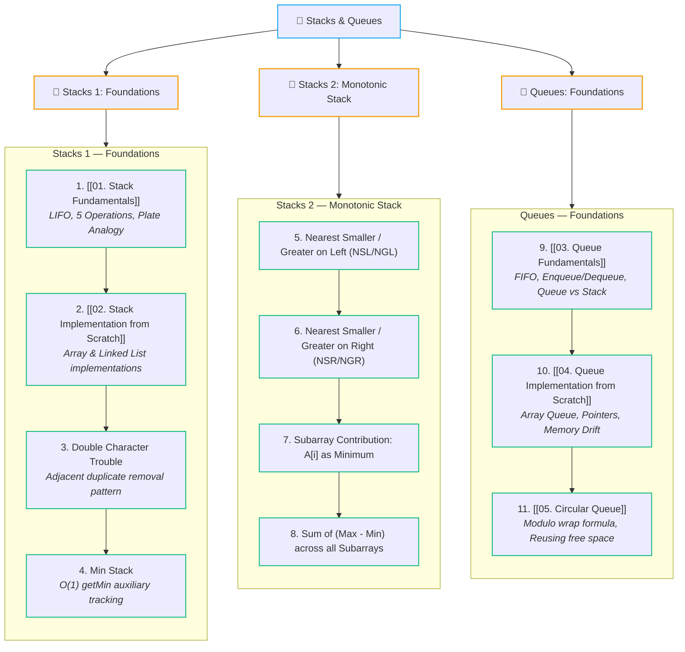

# 🥞 Stacks & Queues Module

> [!abstract] Module Overview
> Welcome to the **Stacks & Queues** module. Stacks (LIFO) and Queues (FIFO) are foundational restricted-access linear data structures critical for simulation, expression parsing, recursion management, tree/graph traversals, and monotonic sliding windows.

---

## 🗺️ Module Learning Path

---

## 📚 Syllabus & Notes Breakdown

### 🧱 Stacks 1 — Foundations
1. **[[01. Stack Fundamentals|🥞 01. Stack Fundamentals]]**
   - Core Concept: **LIFO (Last In, First Out)** & Plate Analogy
   - The 5 Essential Operations: `push(x)`, `pop()`, `peek()`, `isEmpty()`, `size()`
   - Java Standard Library (`Stack<T>` vs `ArrayDeque<T>`)
2. **[[02. Stack Implementation from Scratch|🛠️ 02. Stack Implementation from Scratch]]**
   - **Array Implementation:** `arr[]` + `top` pointer, Overflow / Underflow checks
   - **Linked List Implementation:** `head` as `top`, dynamic memory, $O(1)$ operations
   - **Deep Comparison:** Memory overhead, cache locality, and runtime trade-offs
3. **Double Character Trouble**
   - Eliminating adjacent duplicate characters via Stack simulation
4. **Min Stack**
   - Constant-time $O(1)$ minimum element retrieval (`2x - min` vs auxiliary stack)

---

### 🧠 Stacks 2 — Monotonic Stack Patterns
5. **Nearest Smaller & Greater Element on Left (NSL / NGL)**
   - Maintaining monotonic increasing/decreasing order from left to right
6. **Nearest Smaller & Greater Element on Right (NSR / NGR)**
   - Monotonic stack traversal from right to left (Next Greater Element)
7. **Count of Subarrays where $A[i]$ is Minimum**
   - Contribution technique using boundary spans `(i - left) * (right - i)`
8. **Sum of $(Max - Min)$ for All Subarrays**
   - Combining monotonic stack boundaries to solve range sum differences in $O(N)$

---

### 🔄 Queues & Deques
9. **[[03. Queue Fundamentals|🔄 03. Queue Fundamentals]]**
   - Core Concept: **FIFO (First In, First Out)** & Line/Counter Analogy
   - The Fundamental Operations: `enqueue(x)`, `dequeue()`, `front()`, `isEmpty()`, `size()`
   - **Stack vs Queue Comparison:** LIFO vs FIFO, single vs dual endpoints
   - **Pointer Transition Trace:** Tracking `FRONT` & `REAR` shifts through operation sequences
10. **[[04. Queue Implementation from Scratch|🛠️ 04. Queue Implementation from Scratch]]**
    - Array Queue with `front` & `rear` pointer mechanics
    - Logical vs physical deletion
    - **Memory Drift & False Overflow Limitation**
11. **[[05. Circular Queue|🔄 05. Circular Queue]]**
    - Eliminating false overflow via circular ring buffer
    - Modulo arithmetic wrap formula: `(current + 1) % size`
    - Step-by-step state trace & space utilization analysis

---

## 🔗 Related Notes & Navigation
- [[CS/DSA/00. DSA Nexus|🌳 DSA Master Roadmap]]
- [[Quick Look|⚡ Quick Look Cheatsheet]]
- [[01. Stack Fundamentals|🥞 01. Stack Fundamentals]]
- [[02. Stack Implementation from Scratch|🛠️ 02. Stack Implementation from Scratch]]
- [[03. Queue Fundamentals|🔄 03. Queue Fundamentals]]
- [[04. Queue Implementation from Scratch|🛠️ 04. Queue Implementation from Scratch]]
- [[05. Circular Queue|🔄 05. Circular Queue]]
- [[Home|🧭 Main Command Center]]

