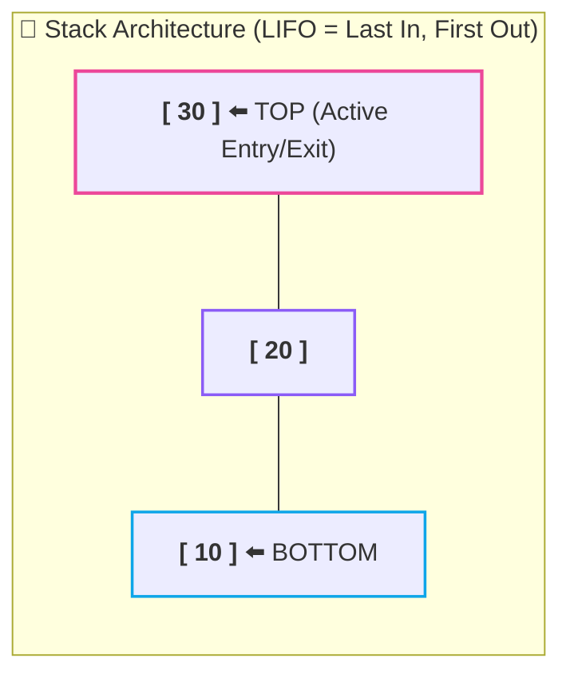
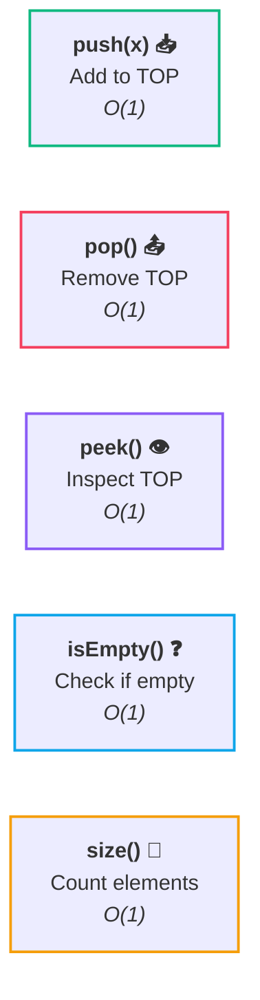
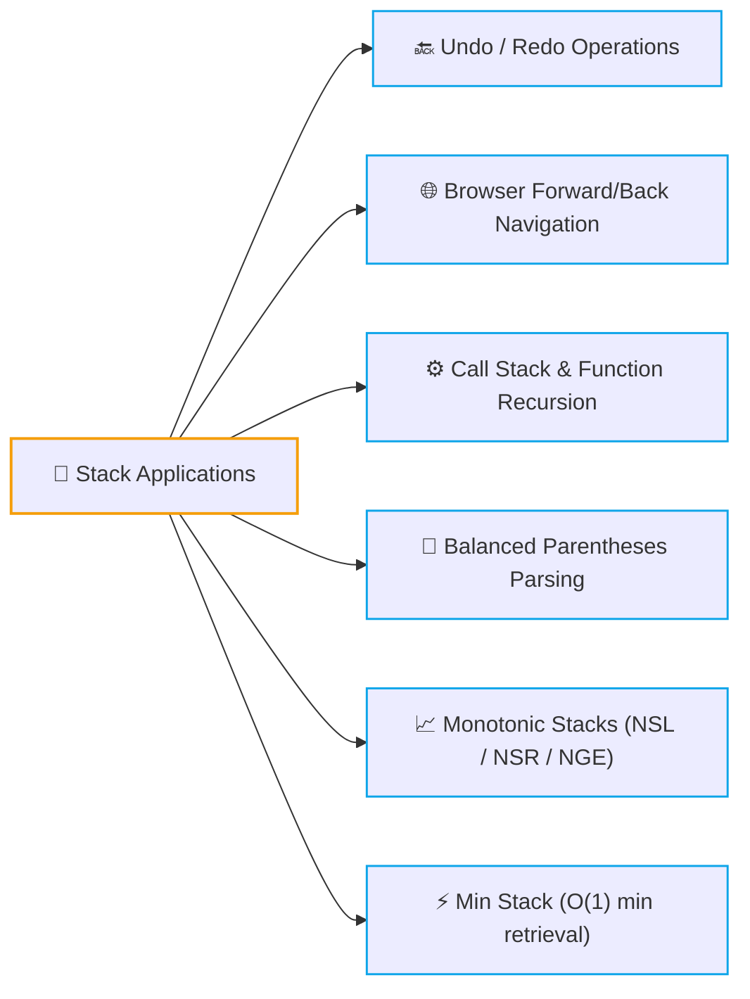
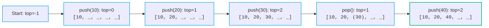

# 🥞 Stack Fundamentals

> [!abstract] Module Overview
> **Module Master Note:** [[CS/DSA/06. Stacks & Queues/00. Stacks & Queues Core|06. Stacks & Queues]]  
> **Related Notes:** [[Quick Look|⚡ Quick Look Cheatsheet]] | [[CS/DSA/00. DSA Nexus|DSA Master Roadmap]] | [[Home|🧭 Main Command Center]]

---

## 1. What is a Stack?

A **Stack** is a linear, restricted-access data structure where elements are inserted and removed from **one end only** (the **TOP**).

Think of a **stack of plates**:

```text
     ┌─────────┐
     │   30    │  ⬅️ TOP (Only accessible point)
     ├─────────┤
     │   20    │
     ├─────────┤
     │   10    │  ⬅️ BOTTOM
     └─────────┘
```



> [!tip] The Golden Rule: LIFO
> **LIFO = Last In, First Out**  
> The **last element pushed in** is always the **first element popped out**.
> 
> **Key Principle:** *We do NOT choose which element to remove.* We can only access and remove whatever is currently sitting at the `TOP`.

---

## 2. The 5 Fundamental Operations

Every standard stack implementation provides 5 core operations, all running in strict **$O(1)$ constant time**:



| Operation | Action | Stack State Mutation | Return Value | Time Complexity | Space Complexity |
| :--- | :--- | :---: | :---: | :---: | :---: |
| **`push(x)`** | Inserts element `x` onto the top | **Mutates** (grows) | `void` | **$O(1)$** | $O(1)$ |
| **`pop()`** | Removes and returns the top element | **Mutates** (shrinks) | `T` (removed item) | **$O(1)$** | $O(1)$ |
| **`peek()` / `top()`** | Reads the top element without removing | **Read-Only** | `T` (current top) | **$O(1)$** | $O(1)$ |
| **`isEmpty()`** | Checks whether stack has $0$ elements | **Read-Only** | `boolean` (`true`/`false`) | **$O(1)$** | $O(1)$ |
| **`size()`** | Returns current number of elements | **Read-Only** | `int` | **$O(1)$** | $O(1)$ |

---

## 3. Visualizing State Mutations

```mermaid
flowchart LR
    subgraph S1 ["1. push(10, 20, 30)"]
        direction TB
        P30["<b>[ 30 ]</b> ⬅️ TOP"]
        P20["<b>[ 20 ]</b>"]
        P10["<b>[ 10 ]</b>"]
        P30 --- P20 --- P10
    end

    subgraph S2 ["2. pop() ➔ removes 30"]
        direction TB
        Q20["<b>[ 20 ]</b> ⬅️ TOP"]
        Q10["<b>[ 10 ]</b>"]
        Q20 --- Q10
    end

    subgraph S3 ["3. peek() ➔ inspects 20"]
        direction TB
        R20["<b>[ 20 ]</b> ⬅️ TOP (Read)"]
        R10["<b>[ 10 ]</b>"]
        R20 --- R10
    end

    S1 ==>|pop()| S2 ==>|peek() (No mutate)| S3

    classDef topBox stroke:#ec4899,stroke-width:2.2px;
    classDef bodyBox stroke:#0ea5e9,stroke-width:1.8px;
    class P30,Q20,R20 topBox;
    class P20,P10,Q10,R10 bodyBox;
```

> [!important] Crucial Distinction: `pop()` vs `peek()`
> - **`peek()`**: **Sees** the top element without removing it. The stack remains unchanged.
> - **`pop()`**: **Removes** the top element from the stack permanently.

---

## 4. Stack in Java (Standard Library)

Java provides `java.util.Stack`, though modern production code and LeetCode best practices often use `java.util.ArrayDeque` for faster, non-synchronized performance:

```java
import java.util.Stack;
import java.util.ArrayDeque;
import java.util.Deque;

public class StackDemo {
    public static void main(String[] args) {
        // Option A: Standard java.util.Stack
        Stack<Integer> stack = new Stack<>();

        // Option B: High-Performance ArrayDeque (Recommended for DSA)
        // Deque<Integer> stack = new ArrayDeque<>();

        // 1. push: add elements
        stack.push(10);
        stack.push(20);
        stack.push(30);

        // 2. peek: inspect top element
        System.out.println(stack.peek()); // Output: 30

        // 3. pop: remove top element
        stack.pop(); // removes 30

        // 4. state checks
        System.out.println(stack.peek());    // Output: 20
        System.out.println(stack.isEmpty()); // Output: false
        System.out.println(stack.size());    // Output: 2
    }
}
```

	### Essential Java Stack Cheat Sheet

```java
stack.push(x);   // Add x to top
stack.pop();      // Remove top element
stack.peek();     // Look at top element
stack.isEmpty();  // Returns true if size == 0
stack.size();     // Returns total element count
```

---

## 5. Custom Stack Implementations from Scratch 🛠️

To understand internal pointers and memory allocation, stacks can be built from scratch in two primary ways:

1. **Fixed / Dynamic Array Stack (`ArrayStack`):** Uses an array + `top` integer index. Fastest execution and optimal cache locality.
2. **Linked List Stack (`LinkedListStack`):** Uses dynamic node allocation with `head` serving as the `top`. No fixed capacity bounds.

> [!tip] Deep-Dive Note
> For the complete line-by-line implementation, pointer traces, and trade-off comparison between Array vs Linked List stacks, see:
> 
> 👉 **[[02. Stack Implementation from Scratch|🛠️ 02. Stack Implementation from Scratch]]**

---

## 6. Where Are Stacks Used in DSA? 🌍



---

## 🧪 Self-Check & Practice Challenges

### Challenge 1: The Step-by-Step State Evaluation
Starting with an empty stack `[]`:

```text
push(10)  → [10]
push(20)  → [10, 20]
push(30)  → [10, 20, 30]
pop()     → removes 30 → [10, 20]
push(40)  → [10, 20, 40]
pop()     → removes 40 → [10, 20]
peek()    → inspects 20
```

#### Q1: What is the final stack?
> [!note]- Reveal Answer
> **`[10, 20]`** (where `10` is at the Bottom, `20` is at the Top).

#### Q2: What does `peek()` return?
> [!note]- Reveal Answer
> **`20`**

---

### Challenge 2: Array Index & Top Pointer Tracking

Given an empty stack of capacity 5 (`top = -1`):



#### Q1: What is the final value of `top`?
> [!note]- Reveal Answer
> **`2`**  
> `push(10)` $\to 0$, `push(20)` $\to 1$, `push(30)` $\to 2$, `pop()` $\to 1$, `push(40)` $\to 2$.

#### Q2: What does `size()` return?
> [!note]- Reveal Answer
> **`3`** (`top + 1` = $2 + 1 = 3$).

---

## 🔗 Related Notes
- [[CS/DSA/06. Stacks & Queues/00. Stacks & Queues Core|🥞 06. Stacks & Queues Master Note]]
- [[02. Stack Implementation from Scratch|🛠️ 02. Stack Implementation from Scratch]]
- [[03. Queue Fundamentals|🔄 03. Queue Fundamentals]]
- [[Quick Look|⚡ Quick Look & Cheatsheet]]
- [[CS/DSA/00. DSA Nexus|🌳 DSA Master Roadmap]]
- [[Home|🧭 Main Command Center]]


