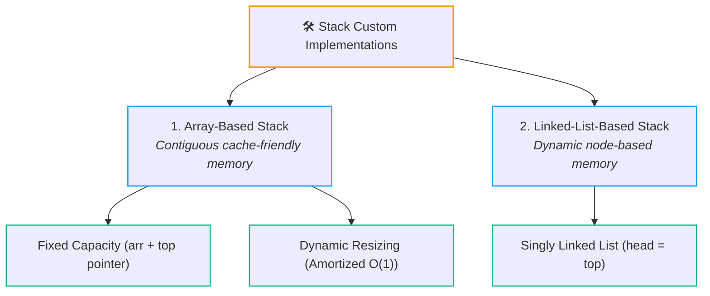
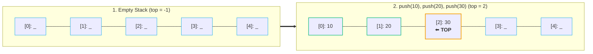
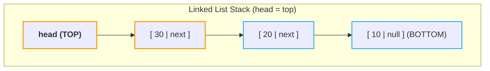
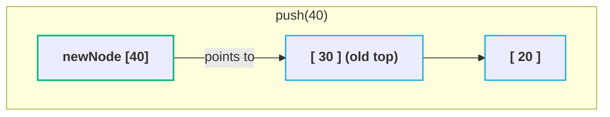
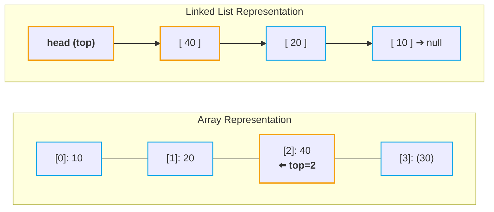

# 🛠️ Stack Implementation from Scratch

> [!abstract] Module Navigation
> **Master Roadmap:** [[CS/DSA/06. Stacks & Queues/00. Stacks & Queues Core|06. Stacks & Queues]]  
> **Prerequisites:** [[01. Stack Fundamentals|🥞 01. Stack Fundamentals]] | [[01. Linked List Fundamentals|🔗 Linked List Fundamentals]]  
> **Related Notes:** [[Quick Look|⚡ Quick Look Cheatsheet]] | [[CS/DSA/00. DSA Nexus|DSA Master Roadmap]]

---

## 📌 Overview: Why Build a Stack from Scratch?

While standard libraries (`java.util.Stack` or `ArrayDeque`) are used in competitive programming, implementing a stack from scratch is essential for:
1. Understanding internal memory layouts, pointer movements, and pointer boundaries (`top`).
2. Handling boundary conditions (**Stack Overflow** vs **Stack Underflow**).
3. Analyzing the core trade-offs between **contiguous memory (Arrays)** and **node-based pointer memory (Linked Lists)**.



---

## 1. Array Implementation (Fixed Capacity) 🧱

### Core Mechanics
- Maintain an array `arr[]` of fixed capacity $C$.
- Maintain an integer pointer `top` denoting the index of the uppermost element.
- Initial state: `top = -1` (denoting an empty stack since array indexing starts at $0$).



---

### Step-by-Step Operations

#### 1️⃣ `push(x)` — Insertion
- **Check Overflow:** If `top == capacity - 1`, the array is full.
- **Action:** Increment `top++`, then assign `arr[top] = x`.

#### 2️⃣ `pop()` — Removal
- **Check Underflow:** If `top == -1`, the stack is empty.
- **Action:** Read `val = arr[top]`, decrement `top--`, return `val`.
- > [!tip] Logical Deletion
  > The removed value physically remains inside the array slot, but moving `top` down renders it logically dead. It will be cleanly overwritten on subsequent `push` calls.

#### 3️⃣ `peek()`, `isEmpty()`, `size()`
- **`peek()`**: Returns `arr[top]` without mutating `top`.
- **`isEmpty()`**: Returns `top == -1`.
- **`size()`**: Returns `top + 1`.

---

### ☕ Complete Java Code: `ArrayStack`

```java
public class ArrayStack {
    private int[] arr;
    private int top;
    private int capacity;

    public ArrayStack(int capacity) {
        this.capacity = capacity;
        this.arr = new int[capacity];
        this.top = -1;
    }

    // Push: O(1)
    public void push(int x) {
        if (top == capacity - 1) {
            System.out.println("❌ Stack Overflow: Capacity reached (" + capacity + ")");
            return;
        }
        arr[++top] = x;
    }

    // Pop: O(1)
    public int pop() {
        if (isEmpty()) {
            System.out.println("❌ Stack Underflow: Stack is empty");
            return -1;
        }
        return arr[top--];
    }

    // Peek: O(1)
    public int peek() {
        if (isEmpty()) {
            System.out.println("⚠️ Stack is empty");
            return -1;
        }
        return arr[top];
    }

    // IsEmpty: O(1)
    public boolean isEmpty() {
        return top == -1;
    }

    // Size: O(1)
    public int size() {
        return top + 1;
    }
}
```

---

## 2. Linked List Implementation (Dynamic Memory) 🔗

### Core Mechanics
Instead of a fixed contiguous block, each element is wrapped in a `Node` containing `data` and a `next` pointer.

- **Where is the `TOP`?**  
  Always let the **Head of the Linked List** act as the **`TOP` of the Stack**.
  - **Push at Head:** $O(1)$ time (new node points to old head, head moves to new node).
  - **Pop from Head:** $O(1)$ time (head moves to `head.next`).

> [!important] Why Head and not Tail?
> - Inserting and deleting at the **Head** of a Singly Linked List is strictly **$O(1)$**.
> - Deleting at the **Tail** requires traversing $O(N)$ to find the previous node (unless using a Doubly Linked List with extra memory overhead).



---

### Step-by-Step Operations

#### 1️⃣ `push(x)` via Linked List
1. Create a new `Node(x)`.
2. Set `newNode.next = top`.
3. Update `top = newNode`.
4. Increment `size++`.



#### 2️⃣ `pop()` via Linked List
1. Check if empty (`top == null`).
2. Store `val = top.data`.
3. Advance `top = top.next`.
4. Decrement `size--`.
5. Return `val`.

---

### ☕ Complete Java Code: `LinkedListStack`

```java
public class LinkedListStack {

    // Internal Node Definition
    private static class Node {
        int data;
        Node next;

        Node(int data) {
            this.data = data;
            this.next = null;
        }
    }

    private Node top;
    private int count;

    public LinkedListStack() {
        this.top = null;
        this.count = 0;
    }

    // Push: O(1)
    public void push(int x) {
        Node newNode = new Node(x);
        newNode.next = top;
        top = newNode;
        count++;
    }

    // Pop: O(1)
    public int pop() {
        if (isEmpty()) {
            System.out.println("❌ Stack Underflow: Stack is empty");
            return -1;
        }
        int poppedVal = top.data;
        top = top.next;
        count--;
        return poppedVal;
    }

    // Peek: O(1)
    public int peek() {
        if (isEmpty()) {
            System.out.println("⚠️ Stack is empty");
            return -1;
        }
        return top.data;
    }

    // IsEmpty: O(1)
    public boolean isEmpty() {
        return top == null;
    }

    // Size: O(1)
    public int size() {
        return count;
    }
}
```

---

## 3. Comparison & Trade-Offs: Array vs Linked List ⚖️

| Metric | Array-Based Stack | Linked-List-Based Stack |
| :--- | :--- | :--- |
| **Push Time** | $O(1)$ (or amortized $O(1)$ if dynamic) | Strict $O(1)$ always |
| **Pop Time** | Strict $O(1)$ | Strict $O(1)$ |
| **Peek Time** | Strict $O(1)$ | Strict $O(1)$ |
| **Memory Overhead** | Minimal (stores only primitive elements) | Extra pointer/reference (`next`) per element |
| **Memory Allocation** | Contiguous block in heap/stack | Fragmented dynamic heap allocations |
| **Cache Locality** | ⚡ **Exceptional** (contiguous spatial locality) | 🐢 **Poor** (pointer chasing across heap) |
| **Capacity Limit** | Fixed (unless resized dynamically) | Unlimited (only bounded by available RAM) |
| **Stack Overflow** | Yes (when fixed array fills) | No (grows on demand) |

> [!tip] Practical Recommendation
> For competitive programming and high-performance production systems, **Array-based stacks** (such as Java's `ArrayDeque`) are almost always preferred due to **cache locality** and zero node allocation overhead.

---

## 🧪 Self-Check & Implementation Trace

### Challenge: Pointer Tracking in Array vs Linked List
Given operations:
```java
push(10);
push(20);
push(30);
pop();
push(40);
```



#### Q1: In the array implementation, what happens to value `30` after `pop()`?
> [!note]- Reveal Answer
> It physically remains in index `2` until the subsequent `push(40)` overwrites it. Logically, decrementing `top` from `2` to `1` deleted it instantly in $O(1)$.

#### Q2: In the linked list implementation, what happens to node `30` after `pop()`?
> [!note]- Reveal Answer
> `top` moves to `Node(20)`. `Node(30)` has no incoming references and becomes eligible for JVM Garbage Collection.

---

## 🔗 Related Notes & Navigation
- [[CS/DSA/06. Stacks & Queues/00. Stacks & Queues Core|🥞 06. Stacks & Queues Master Note]]
- [[01. Stack Fundamentals|🥞 01. Stack Fundamentals]]
- [[01. Linked List Fundamentals|🔗 Linked List Fundamentals]]
- [[Quick Look|⚡ Quick Look & Cheatsheet]]
- [[Home|🧭 Main Command Center]]
