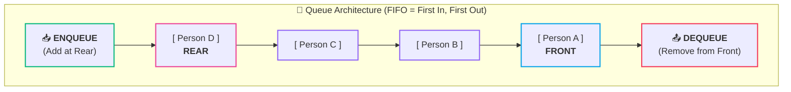
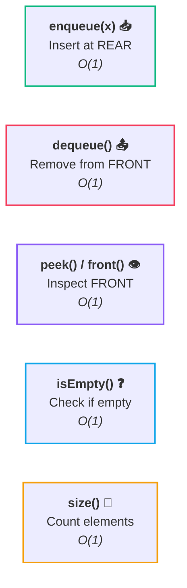
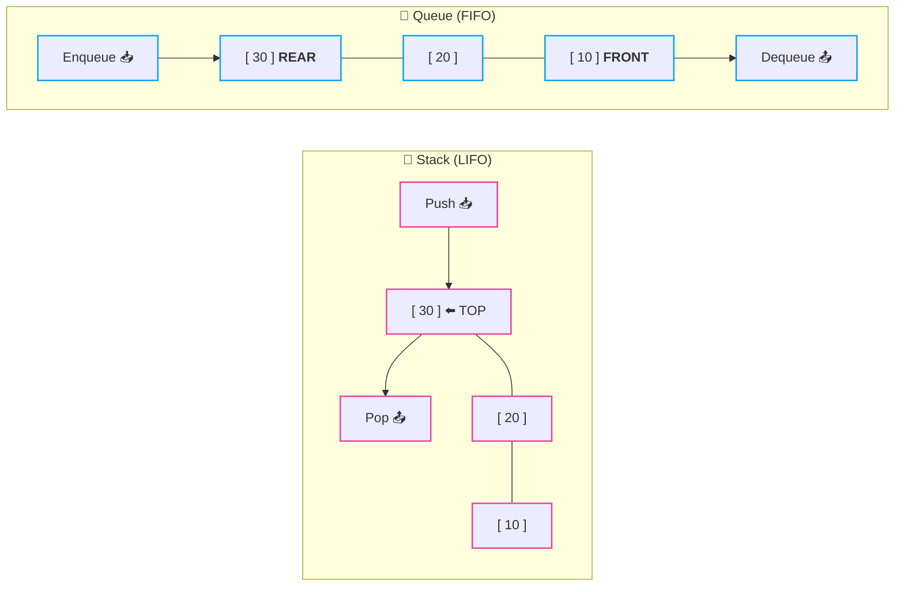

# 🔄 Queue Fundamentals

> [!abstract] Module Overview
> **Module Master Note:** [[CS/DSA/06. Stacks & Queues/00. Stacks & Queues Core|06. Stacks & Queues]]  
> **Related Notes:** [[01. Stack Fundamentals|🥞 01. Stack Fundamentals]] | [[02. Stack Implementation from Scratch|🛠️ 02. Stack Implementation from Scratch]] | [[CS/DSA/00. DSA Nexus|DSA Master Roadmap]] | [[Home|🧭 Main Command Center]]

---

## 1. What is a Queue?

A **Queue** is a linear, restricted-access data structure that follows the strict principle of:

> [!tip] The Golden Rule: FIFO
> **FIFO — First In, First Out**  
> The **first element inserted** is always the **first element removed**.

### 🧍 Real-World Analogy: Line at a Counter
Think of people standing in line at a ticket counter or coffee shop:

```text
Person A → Person B → Person C → Person D
   ↑                               ↑
 FRONT                           REAR
 (Served First)             (Joined Last)
```

- **Person A** arrived first $\rightarrow$ **Person A** gets served first.
- New people join at the **REAR** (back of the line).
- People leave from the **FRONT** (front of the line).

```text
First inserted  ───→  First removed
```



---

### 🧪 Step-by-Step Example

Let's watch a queue evolve starting from completely empty:

1. **Start empty:**
   ```text
   Queue: []
   ```

2. **Add `10`:**
   ```text
   [10]
   ```

3. **Add `20`:**
   ```text
   [10, 20]
   ```

4. **Add `30`:**
   ```text
   [10, 20, 30]
   ```

5. **Now remove an element:**
   ```text
   [20, 30]
     ↑
   10 removed
   ```

> [!note] Why did `10` leave?
> **`10` comes out first** because it entered first.

---

## 2. Core Queue Operations

Unlike a [[01. Stack Fundamentals|Stack]] which operates only on one end (`TOP`), a **Queue** operates on **two distinct ends**:



### 1. `enqueue(x)`
Adds an element to the **REAR** (back) of the queue.

```text
enqueue(10)  ──→  [10]
enqueue(20)  ──→  [10, 20]
```

### 2. `dequeue()`
Removes and returns the element sitting at the **FRONT** of the queue.

```text
State:      [10, 20, 30]
dequeue()   ──→  returns 10
Remaining:  [20, 30]
```

> [!important] Key Rule to Remember
> - **`ENQUEUE`** $\rightarrow$ **ADD at REAR**
> - **`DEQUEUE`** $\rightarrow$ **REMOVE from FRONT**

### Summary of Fundamental Operations

| Operation | Action | End Affected | Mutates State? | Time Complexity | Space Complexity |
| :--- | :--- | :---: | :---: | :---: | :---: |
| **`enqueue(x)`** | Inserts element `x` to back | **REAR** | **Yes** (Grows) | **$O(1)$** | $O(1)$ |
| **`dequeue()`** | Removes & returns front element | **FRONT** | **Yes** (Shrinks) | **$O(1)$** | $O(1)$ |
| **`peek()` / `front()`** | Reads front element without removing | **FRONT** | **No** (Read-Only) | **$O(1)$** | $O(1)$ |
| **`isEmpty()`** | Checks whether queue has $0$ elements | Entire Queue | **No** (Read-Only) | **$O(1)$** | $O(1)$ |
| **`size()`** | Returns current count of elements | Entire Queue | **No** (Read-Only) | **$O(1)$** | $O(1)$ |

---

## 3. Queue vs Stack

Understanding the structural contrast between a **Queue** and a **Stack** is crucial for mastering linear data structures:



### 🥞 Stack: LIFO (Last In, First Out)
- **Analogy:** A stack of plates.
- The most recently added plate sits on top and must be picked up first.
- **Single access point:** Insert and remove from the same end (`TOP`).

```text
[10, 20, 30]
         ↑
     comes out (LIFO)
```

### 🔄 Queue: FIFO (First In, First Out)
- **Analogy:** People standing in a queue.
- The person who arrived earliest is served and leaves first.
- **Dual access points:** Insert at `REAR`, remove from `FRONT`.

```text
[10, 20, 30]
 ↑
comes out (FIFO)
```

### Head-to-Head Comparison

| Characteristic | [[01. Stack Fundamentals\|Stack]] | Queue |
| :--- | :--- | :--- |
| **Guiding Principle** | **LIFO** (Last In, First Out) | **FIFO** (First In, First Out) |
| **Insertion Operation** | `push(x)` | `enqueue(x)` |
| **Removal Operation** | `pop()` | `dequeue()` |
| **Inspection Operation**| `peek()` / `top()` | `front()` / `peek()` |
| **Access Points** | **Single end** (`TOP`) | **Two ends** (`FRONT` and `REAR`) |
| **Removal Side** | Same side as insertion | Opposite side of insertion |
| **Primary Use Cases** | Function call stack, undo/redo, backtracking, syntax parsing | Task scheduling, printer buffers, Breadth-First Search (BFS) |

---

## 4. Pointer Movement & State Transitions

Let's trace how the **`FRONT`** and **`REAR`** pointers move as operations occur:

### Initial Queue State
Four elements are in the queue:

```text
FRONT                REAR
  ↓                    ↓
 [10]   [20]   [30]   [40]
```

---

### Step 1: `dequeue()`
`10` (at `FRONT`) leaves the queue. The `FRONT` pointer advances to the next element:

```text
FRONT             REAR
  ↓                 ↓
 [20]   [30]   [40]
```

---

### Step 2: `dequeue()`
`20` (at `FRONT`) leaves the queue. The `FRONT` pointer moves forward again:

```text
FRONT        REAR
  ↓            ↓
 [30]   [40]
```

---

### Step 3: `enqueue(50)`
`50` is added at the back. The `REAR` pointer shifts right to point to `50`:

```text
FRONT                 REAR
  ↓                     ↓
 [30]   [40]   [50]
```

> [!tip] Mental Model Summary
> - When you **`dequeue`**, `FRONT` moves forward $\rightarrow$ shrinking from the front.
> - When you **`enqueue`**, `REAR` moves forward $\rightarrow$ growing at the back.
> 
> That is the complete fundamental core of how a Queue operates! 😎

---

## 🔗 Related Notes & Navigation

- [[CS/DSA/06. Stacks & Queues/00. Stacks & Queues Core|🥞 Stacks & Queues Module MOC]]
- [[01. Stack Fundamentals|🥞 01. Stack Fundamentals]]
- [[02. Stack Implementation from Scratch|🛠️ 02. Stack Implementation from Scratch]]
- [[CS/DSA/00. DSA Nexus|🌳 DSA Master Roadmap]]
- [[Home|🧭 Main Command Center]]

