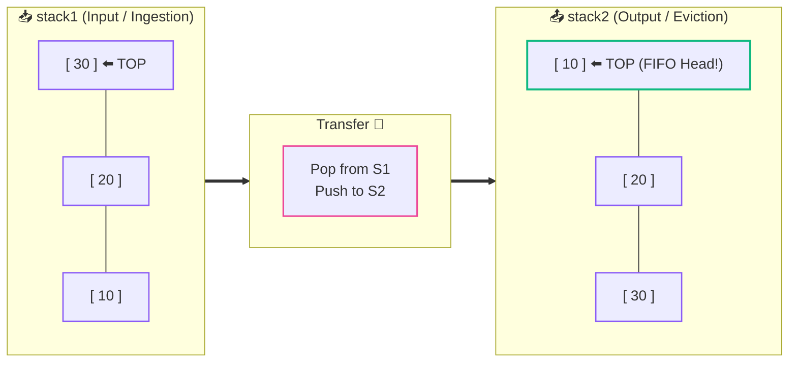

# 🥞➡️🔄 Implement Queue Using Stacks

> [!abstract] Module Navigation
> **Master Roadmap:** [[CS/DSA/06. Stacks & Queues/00. Stacks & Queues Core|06. Stacks & Queues]]  
> **Prerequisites:** [[01. Stack Fundamentals|🥞 01. Stack Fundamentals]] | [[03. Queue Fundamentals|🔄 03. Queue Fundamentals]]  
> **Related Notes:** [[02. Stack Implementation from Scratch|🛠️ 02. Stack Implementation from Scratch]] | [[CS/DSA/00. DSA Nexus|DSA Master Roadmap]] | [[Home|🧭 Main Command Center]]

---

## 📌 The Challenge

We have access **only to standard LIFO Stacks** (`push`, `pop`, `peek`, `isEmpty`).

```text
Stack (LIFO):                   Queue (FIFO):
push(10)                        enqueue(10)
push(20)                        enqueue(20)
push(30)                        enqueue(30)

[10, 20, 30]                    [10, 20, 30]
          ↑                       ↑
        pop() ──→ 30            dequeue() ──→ 10
```

> [!important] 🎯 Core Problem
> **How can we emulate a FIFO (First In, First Out) Queue using only LIFO (Last In, First Out) Stacks?**

---

## 🧠 The Core Trick: Two Stacks Reversal

When elements are popped from one stack and pushed into another, **their relative order is completely reversed**:



- In **`stack1`**: `10` is buried at the bottom.
- Transferring `stack1 → stack2` inverts the sequence: `10` is now sitting at the **`TOP` of `stack2`**!
- Calling `stack2.pop()` gives **`10`**, exactly honoring FIFO.

---

## ⚡ The Amortized Optimization: Lazy Transfer

A naive approach might transfer elements back and forth on every operation ($O(N)$ per call). 

We can optimize this to **$O(1)$ Amortized Time** using a **Lazy Transfer Rule**:

```text
                  ┌───────────────────────────────┐
                  │      TWO-STACK QUEUE          │
                  └──────────────┬────────────────┘
          ┌──────────────────────┴──────────────────────┐
          ↓                                             ↓
   📥 stack1 (IN-STACK)                          📤 stack2 (OUT-STACK)
  Dedicated solely to                           Dedicated solely to
   RECEIVING new items                           EVICTING front items
```

### 📜 The Operational Rules

1. **`enqueue(x)`:**
   - Always push directly into **`stack1`** ($O(1)$).
2. **`dequeue()` / `peek()`:**
   - If **`stack2` is NOT empty:** Pop/peek directly from **`stack2`** ($O(1)$).
   - If **`stack2` IS empty:** Transfer **everything from `stack1 → stack2`**, then pop/peek from **`stack2`**.

> [!tip] 💡 Why is this $O(1)$ Amortized?
> Each element is pushed to `stack1` once, moved to `stack2` once, and popped from `stack2` once.
> Over $N$ operations, every element is moved at most **3 times**, giving an average cost of **$O(1)$ per operation**!

---

## 🧪 Trace Walkthrough: The Test Case

Let's trace the exact sequence:

```text
Operations:
1. enqueue(10)
2. enqueue(20)
3. enqueue(30)
4. dequeue()
5. dequeue()
6. enqueue(40)
7. dequeue()
```

---

### Step 1 to 3: Enqueue `10`, `20`, `30`
All elements go into `stack1`:

```text
stack1: [ 10, 20, 30 ]  (30 is at top)
stack2: [ ]
```

---

### Step 4: First `dequeue()`
`stack2` is empty $\rightarrow$ Transfer all elements from `stack1` to `stack2`:

```text
Transfer:
Pop 30 ──→ Push to stack2
Pop 20 ──→ Push to stack2
Pop 10 ──→ Push to stack2

State after transfer:
stack1: [ ]
stack2: [ 30, 20, 10 ]  (10 is at top)

Action: stack2.pop()
Result: 🎯 Returns 10

State now:
stack1: [ ]
stack2: [ 30, 20 ]      (20 is at top)
```

---

### Step 5: Second `dequeue()`
`stack2` is **NOT empty** $\rightarrow$ No transfer needed! Pop directly from `stack2`:

```text
Action: stack2.pop()
Result: 🎯 Returns 20

State now:
stack1: [ ]
stack2: [ 30 ]          (30 is at top)
```

---

### Step 6: `enqueue(40)`
Push directly into `stack1`:

```text
State now:
stack1: [ 40 ]          (40 is at top)
stack2: [ 30 ]          (30 is at top)
```

---

### Step 7: Third `dequeue()`
`stack2` is **NOT empty** (it still holds `30`) $\rightarrow$ Do NOT transfer `40` yet! Pop directly from `stack2`:

```text
Action: stack2.pop()
Result: 🎯 Returns 30

State now:
stack1: [ 40 ]
stack2: [ ]
```

---

### 📊 Summary of Returned Values:
1. First `dequeue()` $\rightarrow$ **`10`**
2. Second `dequeue()` $\rightarrow$ **`20`**
3. Third `dequeue()` $\rightarrow$ **`30`**

---

## 💻 Java Implementation (LeetCode 232)

```java
import java.util.ArrayDeque;
import java.util.Deque;

class MyQueue {
    // stack1: Ingestion / Push
    // stack2: Eviction / Pop / Peek
    private Deque<Integer> stack1;
    private Deque<Integer> stack2;

    public MyQueue() {
        stack1 = new ArrayDeque<>();
        stack2 = new ArrayDeque<>();
    }

    // O(1) Push to input stack
    public void push(int x) {
        stack1.push(x);
    }

    // O(1) Amortized Pop from output stack
    public int pop() {
        shiftStack1ToStack2();
        return stack2.pop();
    }

    // O(1) Amortized Peek from output stack
    public int peek() {
        shiftStack1ToStack2();
        return stack2.peek();
    }

    // Returns true if both stacks are empty
    public boolean empty() {
        return stack1.isEmpty() && stack2.isEmpty();
    }

    // Helper: Transfers elements ONLY when stack2 is depleted
    private void shiftStack1ToStack2() {
        if (stack2.isEmpty()) {
            while (!stack1.isEmpty()) {
                stack2.push(stack1.pop());
            }
        }
    }
}
```

---

## ⏱️ Complexity Analysis

| Operation | Worst Case | Amortized Case | Space Complexity |
| :--- | :---: | :---: | :---: |
| **`push(x)`** | **$O(1)$** | **$O(1)$** | $O(1)$ |
| **`pop()`** | $O(N)$ (when transferring) | **$O(1)$** | $O(1)$ |
| **`peek()`** | $O(N)$ (when transferring) | **$O(1)$** | $O(1)$ |
| **`empty()`** | **$O(1)$** | **$O(1)$** | $O(1)$ |
| **Total Space** | — | — | **$O(N)$** (Storing elements across two stacks) |

---

## 🔗 Related Notes & Navigation

- [[CS/DSA/06. Stacks & Queues/00. Stacks & Queues Core|🥞 Stacks & Queues Module MOC]]
- [[05. Deque Fundamentals|🃏 05. Deque Fundamentals]]
- [[03. Queue Fundamentals|🔄 03. Queue Fundamentals]]
- [[01. Stack Fundamentals|🥞 01. Stack Fundamentals]]
- [[02. Stack Implementation from Scratch|🛠️ 02. Stack Implementation from Scratch]]
- [[CS/DSA/00. DSA Nexus|🌳 DSA Master Roadmap]]
- [[Home|🧭 Main Command Center]]

