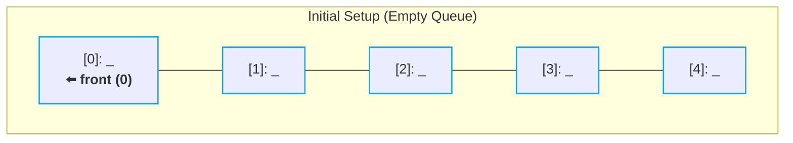
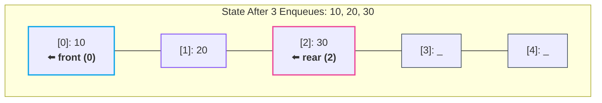

# 🛠️ Queue Implementation from Scratch

> [!abstract] Module Navigation
> **Master Roadmap:** [[CS/DSA/06. Stacks & Queues/00. Stacks & Queues Core|06. Stacks & Queues]]  
> **Prerequisites:** [[03. Queue Fundamentals|🔄 03. Queue Fundamentals]] | [[01. Stack Fundamentals|🥞 01. Stack Fundamentals]]  
> **Related Notes:** [[02. Stack Implementation from Scratch|🛠️ 02. Stack Implementation from Scratch]] | [[CS/DSA/00. DSA Nexus|DSA Master Roadmap]] | [[Home|🧭 Main Command Center]]

---

## 📌 Mental Model: The Two Pointers

A basic array-based Queue relies on **two tracking pointers**:

```text
                  ┌───────────────────┐
                  │       QUEUE       │
                  └─────────┬─────────┘
          ┌─────────────────┴─────────────────┐
          ↓                                   ↓
     🎯 FRONT                             🚀 REAR
  Points to item to                  Points to item most
   REMOVE (dequeue)                   RECENTLY INSERTED (enqueue)
```

> [!important] 🧠 Lock This Into Your Brain
> **Queue = Insert at REAR, Remove from FRONT.**

---

## 1. Array Queue Setup

Suppose we allocate a fixed-size integer array of capacity $5$:

```java
int[] queue = new int[5];
int front = 0;
int rear = -1;
```

### Initial State: Empty Queue

```text
Indices:     [ 0 ]   [ 1 ]   [ 2 ]   [ 3 ]   [ 4 ]
Array:       [ _ ]   [ _ ]   [ _ ]   [ _ ]   [ _ ]
               ↑
             front (0)
   rear (-1) ⬅️ (Off to the left)
```

- **`front = 0`**: Pre-positioned at index $0$, waiting for the first item to remove.
- **`rear = -1`**: Initialized to $-1$, meaning no elements have been enqueued yet.



---

## 2. Step-by-Step Enqueue Simulation

To insert an element $x$:
1. Increment the **`rear`** pointer (`rear++`).
2. Store $x$ at the new rear index (`queue[rear] = x`).

```java
void enqueue(int x) {
    rear++;
    queue[rear] = x;
}
```

---

### Step 1: `enqueue(10)`
- `rear` moves from $-1 \rightarrow 0$
- `queue[0] = 10`

```text
Indices:     [ 0 ]   [ 1 ]   [ 2 ]   [ 3 ]   [ 4 ]
Array:       [ 10 ]  [ _ ]   [ _ ]   [ _ ]   [ _ ]
               ↑
          front, rear (0)
```

---

### Step 2: `enqueue(20)`
- `rear` moves from $0 \rightarrow 1$
- `queue[1] = 20`

```text
Indices:     [ 0 ]   [ 1 ]   [ 2 ]   [ 3 ]   [ 4 ]
Array:       [ 10 ]  [ 20 ]  [ _ ]   [ _ ]   [ _ ]
               ↑       ↑
             front    rear
              (0)     (1)
```

---

### Step 3: `enqueue(30)`
- `rear` moves from $1 \rightarrow 2$
- `queue[2] = 30`

```text
Indices:     [ 0 ]   [ 1 ]   [ 2 ]   [ 3 ]   [ 4 ]
Array:       [ 10 ]  [ 20 ]  [ 30 ]  [ _ ]   [ _ ]
               ↑               ↑
             front            rear
              (0)             (2)
```



---

## 3. Step-by-Step Dequeue Simulation

To remove the front element:
1. Read the element at the current **`front`** (`int x = queue[front]`).
2. Advance the **`front`** pointer forward (`front++`).
3. Return the stored value `x`.

```java
int dequeue() {
    int x = queue[front];
    front++;
    return x;
}
```

---

### Step 4: `dequeue()` $\rightarrow$ Returns `10`

```text
Before dequeue:
Indices:     [ 0 ]   [ 1 ]   [ 2 ]   [ 3 ]   [ 4 ]
Array:       [ 10 ]  [ 20 ]  [ 30 ]  [ _ ]   [ _ ]
               ↑               ↑
             front            rear
              (0)             (2)

After dequeue():
Indices:     [ 0 ]   [ 1 ]   [ 2 ]   [ 3 ]   [ 4 ]
Array:       [ 10 ]  [ 20 ]  [ 30 ]  [ _ ]   [ _ ]
                       ↑       ↑
                     front    rear
                      (1)     (2)
```

> [!tip] 💡 Logical vs Physical Deletion
> Notice something fundamental: **we do NOT need to erase or overwrite the value `10` in memory.**
> 
> Simply moving `front` from `0` to `1` logically invalidates index `0`. As far as the queue is concerned, elements prior to `front` no longer exist!

---

## 4. Basic Queue Implementation (Java)

```java
class Queue {
    private int[] queue;
    private int front;
    private int rear;
    private int capacity;

    public Queue(int capacity) {
        this.capacity = capacity;
        this.queue = new int[capacity];
        this.front = 0;
        this.rear = -1;
    }

    // Add element to REAR
    public void enqueue(int x) {
        rear++;
        queue[rear] = x;
    }

    // Remove element from FRONT
    public int dequeue() {
        int x = queue[front];
        front++;
        return x;
    }

    // View element at FRONT
    public int peek() {
        return queue[front];
    }

    // Check if queue is empty
    public boolean isEmpty() {
        return front > rear;
    }

    // Current number of active elements
    public int size() {
        return rear - front + 1;
    }
}
```

---

## 5. ⚠️ The Big Problem with Simple Array Queues: Memory Drift & False Overflow

Consider what happens after several `enqueue` and `dequeue` operations on an array of size $5$:

```text
Indices:     [ 0 ]   [ 1 ]   [ 2 ]   [ 3 ]   [ 4 ]
Array:       [ 10 ]  [ 20 ]  [ 30 ]  [ 40 ]  [ 50 ]
                                               ↑
                                          front, rear (4)
                                  (After dequeuing 10, 20, 30, 40)
```

1. We have only **1 active element** (`50`) in the queue.
2. Indices `0, 1, 2, 3` are completely empty and unused.
3. However, `rear == 4` (the end of the array).
4. If we call `enqueue(60)`:
   - `rear++` would become `5`, causing an **`ArrayIndexOutOfBoundsException`**!

> [!warning] The False Overflow Problem
> In a simple linear array queue, the queue **drifts to the right**. Even though there is plenty of free space at the beginning of the array, `rear` cannot advance further.
> 
> 🔄 **The Solution:** [[05. Circular Queue|🔄 05. Circular Queue]] (wrapping `rear` and `front` back to index `0` using modulo arithmetic `(rear + 1) % capacity`).

---

## 🔗 Related Notes & Navigation

- [[CS/DSA/06. Stacks & Queues/00. Stacks & Queues Core|🥞 06. Stacks & Queues Master Note]]
- [[03. Queue Fundamentals|🔄 03. Queue Fundamentals]]
- [[05. Circular Queue|🔄 05. Circular Queue]]
- [[02. Stack Implementation from Scratch|🛠️ 02. Stack Implementation from Scratch]]
- [[CS/DSA/00. DSA Nexus|🌳 DSA Master Roadmap]]
- [[Home|🧭 Main Command Center]]

