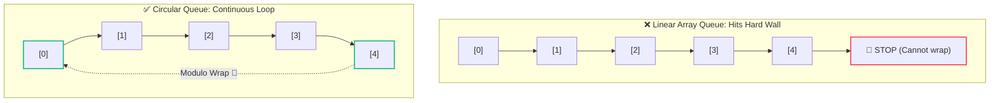
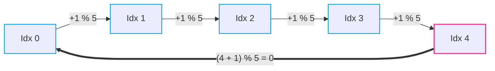
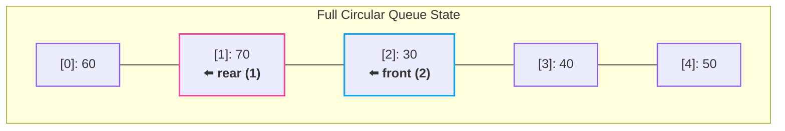

# 🔄 Circular Queue

> [!abstract] Module Navigation
> **Master Roadmap:** [[CS/DSA/06. Stacks & Queues/00. Stacks & Queues Core|06. Stacks & Queues]]  
> **Prerequisites:** [[03. Queue Fundamentals|🔄 03. Queue Fundamentals]] | [[04. Queue Implementation from Scratch|🛠️ 04. Queue Implementation from Scratch]]  
> **Related Notes:** [[Quick Look|⚡ Quick Look Cheatsheet]] | [[CS/DSA/00. DSA Nexus|DSA Master Roadmap]] | [[Home|🧭 Main Command Center]]

---

## 1. The Problem with a Normal Linear Array Queue

In a standard linear array queue of capacity $5$:

```text
[ 10 ][ 20 ][ 30 ][ 40 ][ 50 ]
  ↑                         ↑
front                     rear
```

Suppose we dequeue twice:

```text
dequeue()  ──→  10 leaves
dequeue()  ──→  20 leaves
```

Logically, our queue looks like:

```text
[ _ ][ _ ][ 30 ][ 40 ][ 50 ]
            ↑            ↑
          front        rear
```

We now have **2 empty slots** at indices `0` and `1`.

### The False Overflow Dilemma
If we now attempt:

```java
enqueue(60);
```

Because `rear` is already sitting at the final array index (`rear == 4`), a normal linear queue throws:

> [!warning] ❌ False Overflow ("Queue is Full")
> The linear queue reports that it is completely full, even though indices `[0]` and `[1]` are sitting completely unoccupied and wasted!

```text
[ _ ][ _ ][ 30 ][ 40 ][ 50 ]
  ↑   ↑
  Free Space (Wasted!)
```

---

## 2. The Solution: Circular Queue 🔄

A **Circular Queue** solves memory drift by treating the array as a **continuous logical circle** where the last index connects directly back to the first index.

```text
                  [ 0 ]
            ↗               ↖
        [ 4 ]               [ 1 ]
            ↖               ↗
                [ 3 ] ── [ 2 ]
```



When `rear` or `front` reaches the end of the array, they seamlessly **wrap around to index `0`**.

---

## 3. The Magic Formula: Modulo Arithmetic 🪄

To achieve index wrapping without complex `if-else` branching, we use the **modulo operator (`%`)**:

```java
next_index = (current_index + 1) % size;
```

### 🧮 Trace with `size = 5`:

```text
rear = 0  ──→  (0 + 1) % 5 = 1
rear = 1  ──→  (1 + 1) % 5 = 2
rear = 2  ──→  (2 + 1) % 5 = 3
rear = 3  ──→  (3 + 1) % 5 = 4
rear = 4  ──→  (4 + 1) % 5 = 0   💥 (Wraps back to start!)
```



---

## 4. Step-by-Step Reclaim Walkthrough

Let's resume our earlier state where indices `0` and `1` were freed:

### State Before Enqueue
```text
Indices:     [ 0 ]   [ 1 ]   [ 2 ]   [ 3 ]   [ 4 ]
Array:       [ _ ]   [ _ ]   [ 30 ]  [ 40 ]  [ 50 ]
                               ↑               ↑
                             front            rear
                              (2)             (4)
```

---

### Step 1: `enqueue(60)`
Instead of exceeding bounds:
$$\text{new rear} = (4 + 1) \pmod 5 = 0$$

`60` is placed at index `0`:

```text
Indices:     [ 0 ]   [ 1 ]   [ 2 ]   [ 3 ]   [ 4 ]
Array:       [ 60 ]  [ _ ]   [ 30 ]  [ 40 ]  [ 50 ]
               ↑               ↑
             rear            front
              (0)             (2)
```

---

### Step 2: `enqueue(70)`
$$\text{new rear} = (0 + 1) \pmod 5 = 1$$

`70` is placed at index `1`:

```text
Indices:     [ 0 ]   [ 1 ]   [ 2 ]   [ 3 ]   [ 4 ]
Array:       [ 60 ]  [ 70 ]  [ 30 ]  [ 40 ]  [ 50 ]
                       ↑       ↑
                     rear    front
                      (1)     (2)
```

> [!tip] 🎯 Maximum Space Utilization
> All $5$ slots are now fully utilized without shifting elements or reallocating memory!



---

## 5. Summary & Core Mental Model

| Feature | Linear Array Queue | Circular Queue |
| :--- | :--- | :--- |
| **Array Behavior** | One-way path ($0 \to \text{size}-1$) | Endless circle ($0 \to \text{size}-1 \to 0$) |
| **Pointer Advance** | `ptr++` | `(ptr + 1) % size` |
| **Reusing Freed Space** | ❌ No (requires expensive $O(N)$ shift) | ✅ Yes (instant $O(1)$ modulo wrap) |
| **False Overflow** | ⚠️ Yes (when `rear == size - 1`) | 🛡️ Eliminated completely |

> [!important] 🧠 Rule of Thumb
> - **Normal Queue:** `0 → 1 → 2 → 3 → 4 → STOP ❌`
> - **Circular Queue:** `0 → 1 → 2 → 3 → 4 ──→ 0 (Infinite reuse) 🔄`
> - **The Pointer Engine:** `next = (current + 1) % size;`

---

## 🔗 Related Notes & Navigation

- [[CS/DSA/06. Stacks & Queues/00. Stacks & Queues Core|🥞 Stacks & Queues Module MOC]]
- [[04. Queue Implementation from Scratch|🛠️ 04. Queue Implementation from Scratch]]
- [[03. Queue Fundamentals|🔄 03. Queue Fundamentals]]
- [[01. Stack Fundamentals|🥞 01. Stack Fundamentals]]
- [[CS/DSA/00. DSA Nexus|🌳 DSA Master Roadmap]]
- [[Home|🧭 Main Command Center]]
