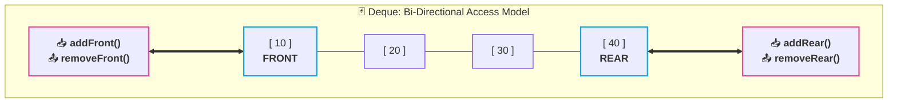
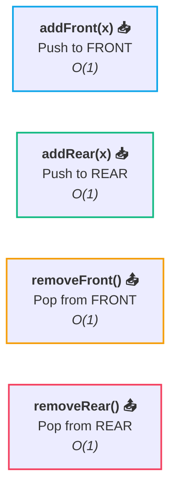
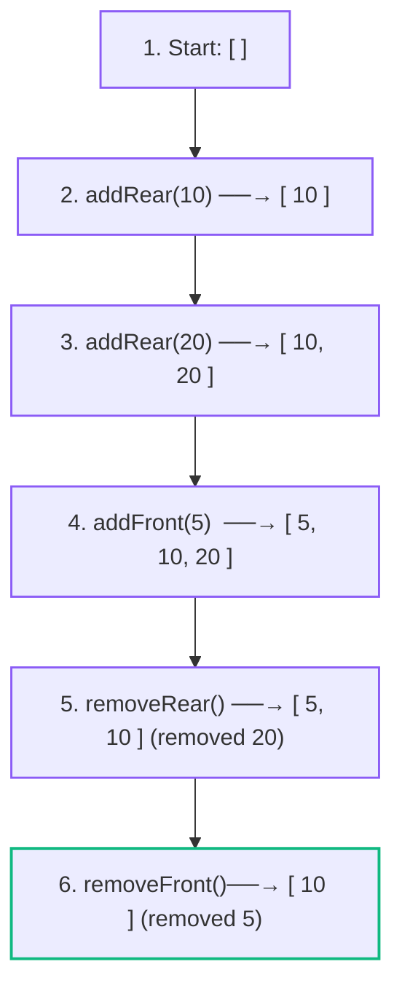

# 🃏 05. Deque Fundamentals (Double-Ended Queue)

> [!abstract] Module Navigation
> **Master Roadmap:** [[CS/DSA/06. Stacks & Queues/00. Stacks & Queues Core|06. Stacks & Queues]]  
> **Prerequisites:** [[03. Queue Fundamentals|🔄 03. Queue Fundamentals]] | [[04. Implement Queue using Stacks|🥞➡️🔄 04. Implement Queue using Stacks]]  
> **Next Note:** [[06. Sliding Window Maximum|🪟 06. Sliding Window Maximum]]  
> **Related Notes:** [[01. Stack Fundamentals|🥞 01. Stack Fundamentals]] | [[Quick Look|⚡ Quick Look Cheatsheet]] | [[CS/DSA/00. DSA Nexus|DSA Master Roadmap]]

---

## 1. What is a Deque?

Forget everything complicated. A **Deque** (pronounced *"deck"*, short for **D**ouble-**E**nded **Que**ue) is simply a queue where you can **insert and remove from BOTH ends**.

```text
                  FRONT                         REAR
                    ↓                             ↓
                 [ 10 ]   [ 20 ]   [ 30 ]   [ 40 ]
                    ↑                             ↑
               add / remove                  add / remove
```



---

## 2. The 4 Core Operations

Because we have access to both sides, every Deque supports 4 core mutations in **$O(1)$ constant time**:



### Contrast: Normal Queue vs Deque

| Operation Type | [[03. Queue Fundamentals\|Normal Queue]] | Deque |
| :--- | :---: | :---: |
| **Add at Front** | ❌ Not Allowed | ✅ `addFront(x)` |
| **Add at Rear** | ✅ `enqueue(x)` | ✅ `addRear(x)` |
| **Remove from Front** | ✅ `dequeue()` | ✅ `removeFront()` |
| **Remove from Rear** | ❌ Not Allowed | ✅ `removeRear()` |

> [!important] 🧠 The Big Mental Rule
> - **Normal Queue:** Insert at **REAR**, Remove from **FRONT**.
> - **Deque:** Insert & Remove allowed at **BOTH ENDS**.

---

## 3. 🧪 Step-by-Step State Trace

Let's watch a Deque evolve starting from completely empty:

### 1️⃣ Start Empty
```text
State: [ ]
```

---

### 2️⃣ `addRear(10)`
```text
State: [ 10 ]
         ↑
     front, rear
```

---

### 3️⃣ `addRear(20)`
```text
State: [ 10,  20 ]
         ↑     ↑
       front  rear
```

---

### 4️⃣ `addFront(5)`
`5` is inserted before `10` at the front:
```text
State: [ 5,   10,  20 ]
         ↑          ↑
       front       rear
```

---

### 5️⃣ `removeRear()` $\rightarrow$ Removes `20`
`20` is popped from the back:
```text
State: [ 5,   10 ]
         ↑     ↑
       front  rear
```

---

### 6️⃣ `removeFront()` $\rightarrow$ Removes `5`
`5` is popped from the front:
```text
State: [ 10 ]
         ↑
     front, rear
```



---

## 4. Java Standard Library (`ArrayDeque`)

In Java, **`java.util.ArrayDeque`** is the standard resizable circular array implementation of `Deque`:

```java
import java.util.ArrayDeque;
import java.util.Deque;

Deque<Integer> dq = new ArrayDeque<>();

// 1. Add operations
dq.addFirst(5);    // or dq.offerFirst(5);  -> O(1)
dq.addLast(20);    // or dq.offerLast(20);  -> O(1)

// 2. Remove operations
int frontVal = dq.removeFirst(); // or dq.pollFirst(); -> O(1)
int rearVal  = dq.removeLast();  // or dq.pollLast();  -> O(1)

// 3. Inspect operations
int f = dq.peekFirst(); // O(1)
int r = dq.peekLast();  // O(1)
```

---

## 5. 🎯 Why Do We Care? (The Bridge to Sliding Window)

Why is Deque such a big deal in DSA?

Because the very next major topic in your roadmap is:

> [!tip] 🔥 The Monotonic Deque Engine
> **Sliding Window Maximum & Minimum**
> 
> When a window of size $K$ slides over an array:
> ```text
> Array:  [ 2,  1,  5,  3,  4 ]
> Window: [ 2,  1,  5 ] ───→ slides right
>           ↑       ↑
>         left    right
> ```
> 
> To maintain the maximum in **$O(N)$ linear time**, we need to:
> 1. Expire outdated elements from the **FRONT** (`removeFront`).
> 2. Discard smaller redundant candidates from the **REAR** (`removeRear`).
> 
> The **Deque** is the *only* fundamental structure that gives us $O(1)$ operations on both boundaries simultaneously!

---

## 🔗 Related Notes & Navigation

- [[CS/DSA/06. Stacks & Queues/00. Stacks & Queues Core|🥞 Stacks & Queues Module MOC]]
- [[06. Sliding Window Maximum|🪟 06. Sliding Window Maximum]]
- [[04. Implement Queue using Stacks|🥞➡️🔄 04. Implement Queue using Stacks]]
- [[03. Queue Fundamentals|🔄 03. Queue Fundamentals]]
- [[01. Stack Fundamentals|🥞 01. Stack Fundamentals]]
- [[CS/DSA/00. DSA Nexus|🌳 DSA Master Roadmap]]
- [[Home|🧭 Main Command Center]]

