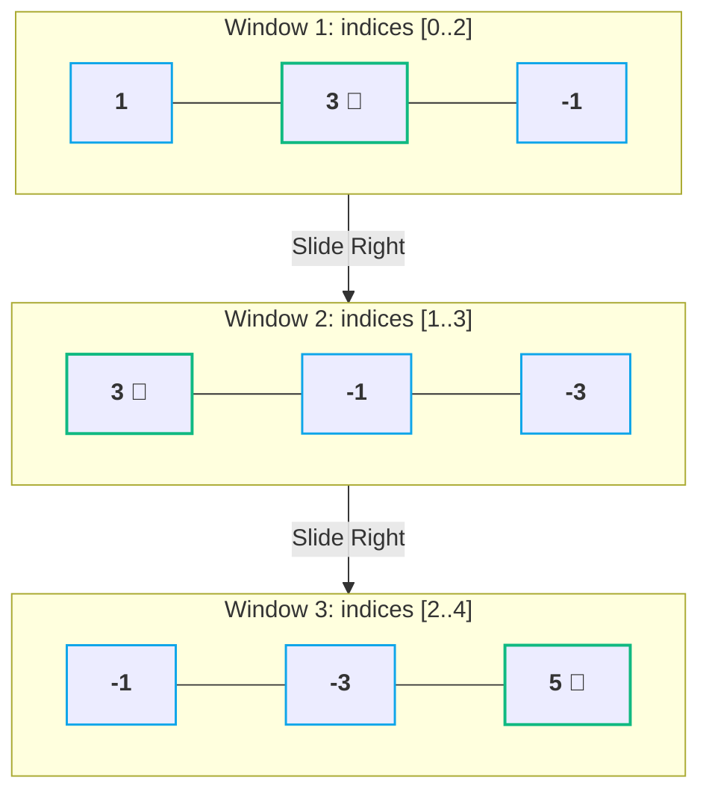
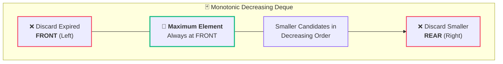
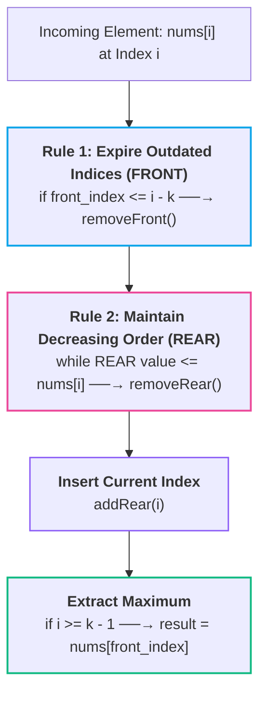

# 🪟 06. Sliding Window Maximum

> [!abstract] Module Navigation
> **Master Roadmap:** [[CS/DSA/06. Stacks & Queues/00. Stacks & Queues Core|06. Stacks & Queues]]  
> **Prerequisites:** [[05. Deque Fundamentals|🃏 05. Deque Fundamentals]] | [[03. Queue Fundamentals|🔄 03. Queue Fundamentals]]  
> **Related Notes:** [[Quick Look|⚡ Quick Look Cheatsheet]] | [[CS/DSA/00. DSA Nexus|DSA Master Roadmap]] | [[Home|🧭 Main Command Center]]

---

## 1. Problem Statement

Given an array of integers `nums` and a sliding window of size `k` which moves from the very left of the array to the very right. 

You can only see the `k` numbers in the window. Each time the sliding window moves right by one position, return the **maximum element** in the window.

```text
Input:  nums = [1, 3, -1, -3, 5, 3, 6, 7],  k = 3
Output: [3, 3, 5, 5, 6, 7]
```

---

## 2. Visualizing the Sliding Window

A **sliding window** is a fixed-size contiguous segment of length $k$ that shifts rightward across the array step-by-step:

```text
Window 1:  [ 1,  3, -1] -3   5   3   6   7   ──→  Max = 3
Window 2:    1  [ 3, -1, -3] 5   3   6   7   ──→  Max = 3
Window 3:    1   3 [-1, -3,  5]  3   6   7   ──→  Max = 5
Window 4:    1   3  -1 [-3,  5,  3]  6   7   ──→  Max = 5
Window 5:    1   3  -1  -3  [5,  3,  6]  7   ──→  Max = 6
Window 6:    1   3  -1  -3   5  [3,  6,  7]  ──→  Max = 7
```



### 🔢 Total Number of Windows
For an array of length $N$ with window size $K$:
$$\text{Total Windows} = N - K + 1$$

For $N = 8, K = 3$:
$$\text{Total Windows} = 8 - 3 + 1 = 6 \text{ windows}$$

---

## 3. 🐌 Approach 1: Brute Force (Scan Every Window)

The most intuitive approach is to iterate through each of the $(N - K + 1)$ windows and compute the maximum by scanning all $K$ elements inside the current window:

```java
class Solution {
    public int[] maxSlidingWindow(int[] nums, int k) {
        int n = nums.length;
        int[] result = new int[n - k + 1];

        for (int i = 0; i <= n - k; i++) {
            int currentMax = nums[i];
            for (int j = i; j < i + k; j++) {
                currentMax = Math.max(currentMax, nums[j]);
            }
            result[i] = currentMax;
        }

        return result;
    }
}
```

### ⏱️ Complexity Analysis:
- **Time Complexity:** $O((N - K + 1) \times K) \approx \mathbf{O(N \cdot K)}$
  - If $N = 10^5$ and $K = 10^4$, operations $\approx 10^9 \rightarrow$ **Time Limit Exceeded (TLE) ❌**
- **Space Complexity:** $O(1)$ auxiliary space (excluding result array).

---

## 4. 💡 The Core Problem with Brute Force: Redundant Work

In the brute force approach, adjacent windows overlap significantly:

```text
Window 1: [ 1,   3,  -1 ]
Window 2:      [ 3,  -1,  -3 ]
               └───────┘
          Overlapping shared elements (scanned again!)
```

We repeatedly re-scan the exact same elements $(K - 1)$ times without utilizing the knowledge gained from previous steps.

---

## 5. 🚀 Why We Need a Deque (The Monotonic Queue Intuition)

To achieve **$O(N)$ linear time**, we need a data structure that can:
1. **Instantly provide the maximum** of the current window in $O(1)$.
2. **Discard expired elements** that slide out from the **LEFT (FRONT)** in $O(1)$.
3. **Discard useless smaller elements** from the **RIGHT (REAR)** as new larger elements enter in $O(1)$.

> [!important] 🧠 The "Useless Element" Elimination Principle
> If an incoming element `nums[i]` is **larger than** elements already present in our window to its left:
> - Those smaller elements can **NEVER be the maximum** in this window or any future window (because `nums[i]` is both larger AND will survive longer!).
> - Therefore, we can ruthlessly pop all smaller elements from the **REAR** of our Deque!



This keeps the Deque strictly sorted in **monotonically decreasing order**, meaning:
$$\text{Front of Deque} = \text{Always the Maximum of the current window!}$$

---

## 6. 🧠 Deque Evolution Walkthrough (`[2, 1, 5, 3, 4, 6]`, $k=3$)

Let's watch how the candidate values evolve as elements arrive:

```text
Array: [ 2,  1,  5,  3,  4,  6 ],   k = 3
```

### 1️⃣ Process `2`
- Deque: `[ 2 ]`

### 2️⃣ Process `1`
- `1` is smaller than `2`, but it enters later (it might become maximum after `2` leaves).
- Deque: `[ 2, 1 ]`

### 3️⃣ Process `5`
- `5` is larger than **both** `1` and `2`.
- Since `5` arrived *after* them AND is *larger*, `2` and `1` will **never be the maximum** for this window or any future window!
- Pop `1` and `2` from REAR:
- Deque: `[ 5 ]` 👑 $\rightarrow$ **Window 1 Max = 5**

---

### Why Can We Safely Evict `2` and `1`?

```text
Window 1: [ 2,  1,  5 ] ──→ 5 is maximum
Window 2:    [ 1,  5,  3 ] ──→ 5 is still present and larger than 1
Window 3:       [ 5,  3,  4 ] ──→ 5 is still present
```

As long as `5` is alive, `2` and `1` have zero chance of being the maximum. And because `5` entered later, `2` and `1` will expire before `5` anyway! They are 100% useless.

---

### 4️⃣ Process `3`
- `3 < 5` $\rightarrow$ keep `3` as a backup candidate for when `5` expires.
- Deque: `[ 5, 3 ]` 👑 $\rightarrow$ **Window 2 Max = 5**

### 5️⃣ Process `4`
- `4 > 3` $\rightarrow$ `3` is now useless. Pop `3` from REAR.
- `4 < 5` $\rightarrow$ keep `4`.
- Deque: `[ 5, 4 ]` 👑 $\rightarrow$ **Window 3 Max = 5**

### 6️⃣ Process `6`
- `6 > 4` and `6 > 5` $\rightarrow$ pop both `4` and `5` from REAR.
- Deque: `[ 6 ]` 👑 $\rightarrow$ **Window 4 Max = 6**

```text
Output Sequence: [ 5,  5,  5,  6 ]
```

---

## 7. 🚨 Why We Must Store INDICES, Not Just Values

If we only store numbers `[5, 4]`, how do we know if `5` has slid out of the active window?

To check if an element is still inside the current window $[i - k + 1, \; i]$, we **store array indices** in the Deque:

```text
Array:    [  2,   1,   5,   3,   4,   6 ]
Indices:     0    1    2    3    4    5
```

Instead of holding values `[ 5, 4 ]`, the Deque holds indices `[ 2, 4 ]`:
- `index 2` $\rightarrow$ `nums[2] = 5`
- `index 4` $\rightarrow$ `nums[4] = 4`

> [!note] Expiration Formula
> For the current window ending at index `i`, any index **$\le i - k$** has fallen out of the window and must be purged!

---

## 8. 🔥 The Two Cardinal Rules of the Deque

For every incoming index `i` with value `nums[i]`:



### 1️⃣ Rule 1 — Remove Expired Indices (from `FRONT`)
If the oldest index in the Deque is outside the window boundary:
```java
if (!deque.isEmpty() && deque.peekFirst() <= i - k) {
    deque.pollFirst(); // Expired!
}
```

### 2️⃣ Rule 2 — Maintain Decreasing Values (from `REAR`)
Before inserting `i`, pop all indices whose values are $\le$ `nums[i]`:
```java
while (!deque.isEmpty() && nums[deque.peekLast()] <= nums[i]) {
    deque.pollLast(); // Smaller & older -> useless!
}
```

### 3️⃣ Insert & Record
```java
deque.offerLast(i);

// Once first window of size k is formed (i >= k - 1):
if (i >= k - 1) {
    result[i - k + 1] = nums[deque.peekFirst()];
}
```

---

## 9. 🧪 Complete Index-by-Index Trace (`nums = [2, 1, 5, 3, 4, 6]`, $k = 3$)

```text
Indices:  0  1  2  3  4  5
Values:   2  1  5  3  4  6
```

| $i$ | Value `nums[i]` | Window Range | Step 1: Expire (Front) | Step 2: Pop Smaller (Rear) | Step 3: Add $i$ (Deque Indices) | Deque Values | Window Complete? | Window Max Recorded |
| :---: | :---: | :---: | :---: | :---: | :---: | :---: | :---: | :---: |
| **0** | `2` | `[0..0]` | None ($0 > 0-3$) | None (empty) | `[ 0 ]` | `[ 2 ]` | ❌ No ($i < 2$) | — |
| **1** | `1` | `[0..1]` | None ($0 > 1-3$) | None ($2 > 1$) | `[ 0, 1 ]` | `[ 2, 1 ]` | ❌ No ($i < 2$) | — |
| **2** | `5` | `[0..2]` | None ($0 > 2-3$) | Pop `1` ($1 \le 5$), Pop `0` ($2 \le 5$) | `[ 2 ]` | `[ 5 ]` | ✅ Window 1 `[2, 1, 5]` | `nums[2] = ` **`5`** |
| **3** | `3` | `[1..3]` | None ($2 > 3-3$) | None ($5 > 3$) | `[ 2, 3 ]` | `[ 5, 3 ]` | ✅ Window 2 `[1, 5, 3]` | `nums[2] = ` **`5`** |
| **4** | `4` | `[2..4]` | None ($2 > 4-3$) | Pop `3` ($3 \le 4$) | `[ 2, 4 ]` | `[ 5, 4 ]` | ✅ Window 3 `[5, 3, 4]` | `nums[2] = ` **`5`** |
| **5** | `6` | `[3..5]` | Pop `2` ($2 \le 5-3$) | Pop `4` ($4 \le 6$) | `[ 5 ]` | `[ 6 ]` | ✅ Window 4 `[3, 4, 6]` | `nums[5] = ` **`6`** |

```text
Final Answer: [ 5,  5,  5,  6 ]
```

---

## 10. 💻 Complete Java Implementation (LeetCode 239)

```java
import java.util.ArrayDeque;
import java.util.Deque;

class Solution {
    public int[] maxSlidingWindow(int[] nums, int k) {
        if (nums == null || nums.length == 0 || k <= 0) {
            return new int[0];
        }

        int n = nums.length;
        int[] result = new int[n - k + 1];
        
        // Deque stores array INDICES in monotonically decreasing order of their values
        Deque<Integer> deque = new ArrayDeque<>();

        for (int i = 0; i < n; i++) {
            // 1. Remove indices that have fallen out of the current sliding window [i - k + 1, i]
            if (!deque.isEmpty() && deque.peekFirst() <= i - k) {
                deque.pollFirst();
            }

            // 2. Remove smaller elements from the rear (they are useless candidates)
            while (!deque.isEmpty() && nums[deque.peekLast()] <= nums[i]) {
                deque.pollLast();
            }

            // 3. Add current element's index to the rear
            deque.offerLast(i);

            // 4. If our window has reached size k, record the maximum at the front
            if (i >= k - 1) {
                result[i - k + 1] = nums[deque.peekFirst()];
            }
        }

        return result;
    }
}
```

---

## ⏱️ Complexity Analysis: Why is it $O(N)$?

| Metric | Complexity | Proof / Rationale |
| :--- | :---: | :--- |
| **Time Complexity** | **$O(N)$** | Although there is an inner `while` loop, **every array index is pushed into the Deque exactly ONCE and popped at most ONCE**. Total push/pop operations across the entire algorithm $\le 2N$. |
| **Space Complexity** | **$O(K)$** | At any point, the Deque holds at most $K$ indices within the active window. |

```text
Comparison:
Brute Force:  O(N × K) ──→ 100,000 × 10,000 = 1,000,000,000 operations (TLE ❌)
Deque Engine: O(N)     ──→ 100,000 operations (~1 ms ⚡✅)
```

---

## 🔗 Related Notes & Navigation

- [[CS/DSA/06. Stacks & Queues/00. Stacks & Queues Core|🥞 Stacks & Queues Module MOC]]
- [[05. Deque Fundamentals|🃏 05. Deque Fundamentals]]
- [[04. Implement Queue using Stacks|🥞➡️🔄 04. Implement Queue using Stacks]]
- [[03. Queue Fundamentals|🔄 03. Queue Fundamentals]]
- [[CS/DSA/00. DSA Nexus|🌳 DSA Master Roadmap]]
- [[Home|🧭 Main Command Center]]


