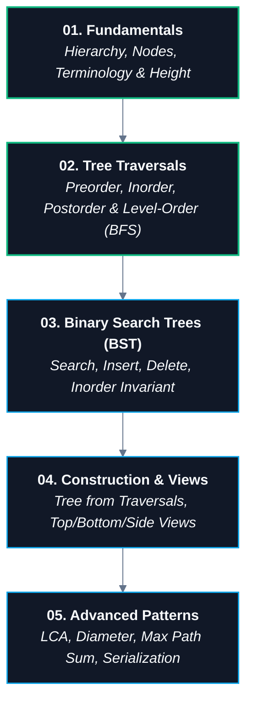

# 🌳 07. Trees & Binary Search Trees (BSTs)

> [!abstract] Module Overview
> Master hub for hierarchical data structures, binary trees, binary search trees (BST), balanced trees (AVL/Red-Black), tree traversals (DFS & BFS), and algorithmic tree patterns.

---

## 🗺️ Module Knowledge Graph & Roadmap

---

## 📑 Module Notes

1. **[[01. Binary Tree Fundamentals|01. Binary Tree Fundamentals]]**
   - What is a Tree (Hierarchical vs Linear)
   - Node anatomy & Java class structure
   - Binary Tree definitions & invariants
   - Terminology (Root, Parent, Child, Siblings, Leaf)
   - Concept Verification Quiz (5/5 mastery check)
   - Height calculations & Edge vs Node conventions
   - Manual Java tree construction (`root.left`, `root.left.right` pointer tracing)

2. **[[02. Binary Tree Traversals|02. Binary Tree Traversals]]**
   - Master mental model: The Root Position Rule (PRE = first, IN = middle, POST = last)
   - **Why recursion works:** Mapping code execution line order directly to $\text{ROOT}$, $\text{LEFT}$, and $\text{RIGHT}$ actions
   - Preorder ($\text{Root} \rightarrow \text{Left} \rightarrow \text{Right}$) trace & recursion
   - Inorder ($\text{Left} \rightarrow \text{Root} \rightarrow \text{Right}$) trace & BST sorting invariant
   - Postorder ($\text{Left} \rightarrow \text{Right} \rightarrow \text{Root}$) trace & bottom-up tree evaluation
   - Level-Order (BFS) overview
   - Complete runnable Java test suite & comparison matrix

---

## 🔗 Master Connections
- [[CS/DSA/00. DSA Nexus|DSA Master Roadmap]]
- [[CS/DSA/Quick Look|⚡ Quick Formula & Pattern Cheatsheet]]
- [[home|🧭 Main Command Center]]
