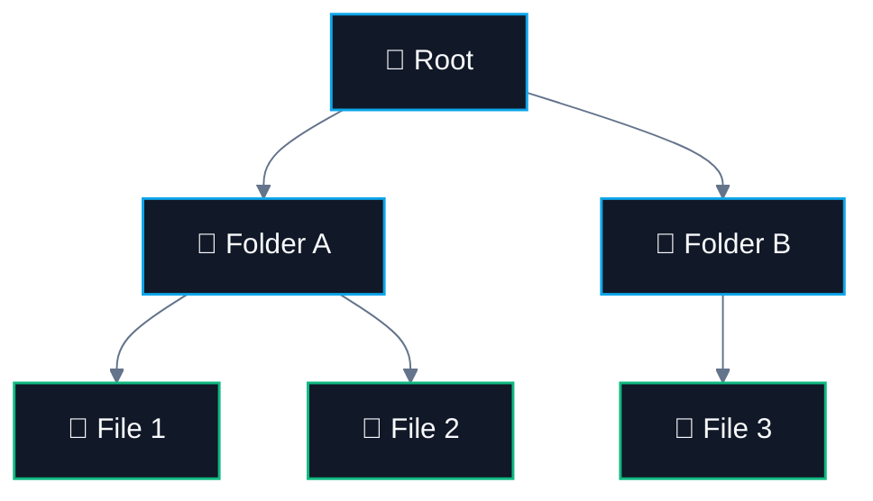
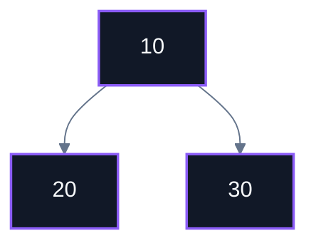
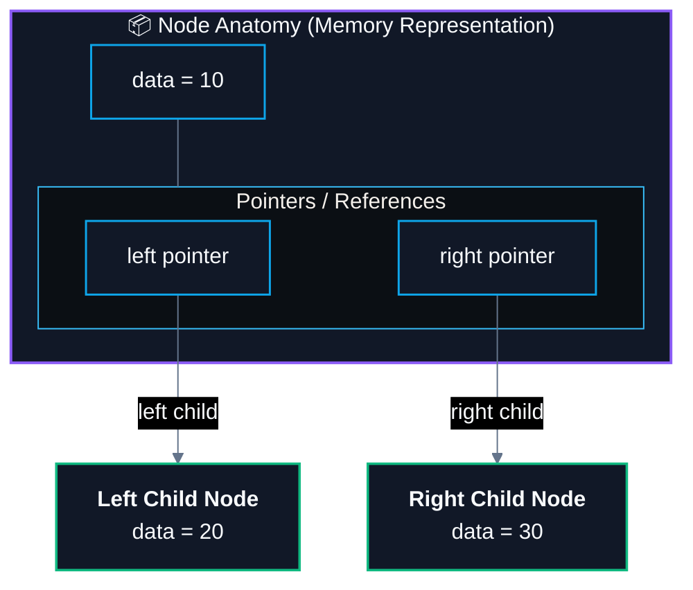
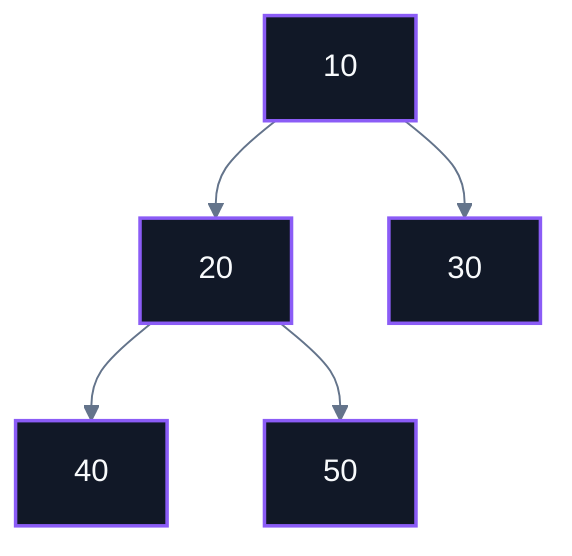
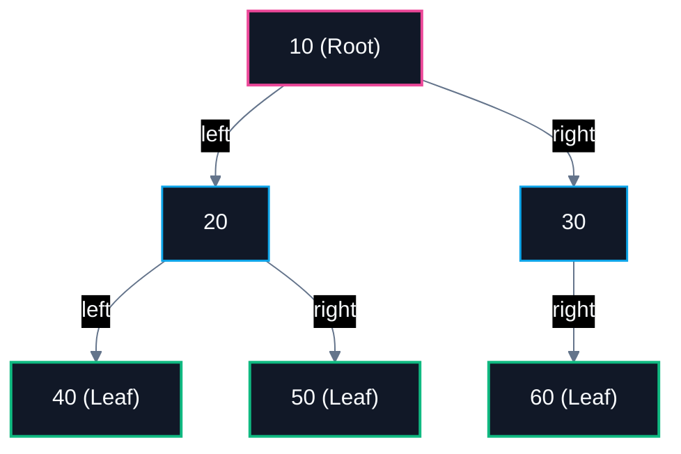
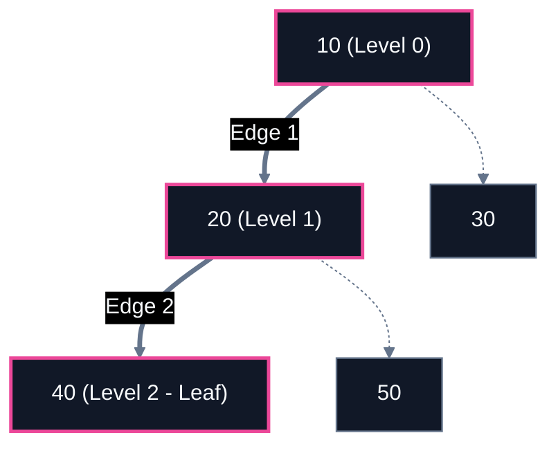
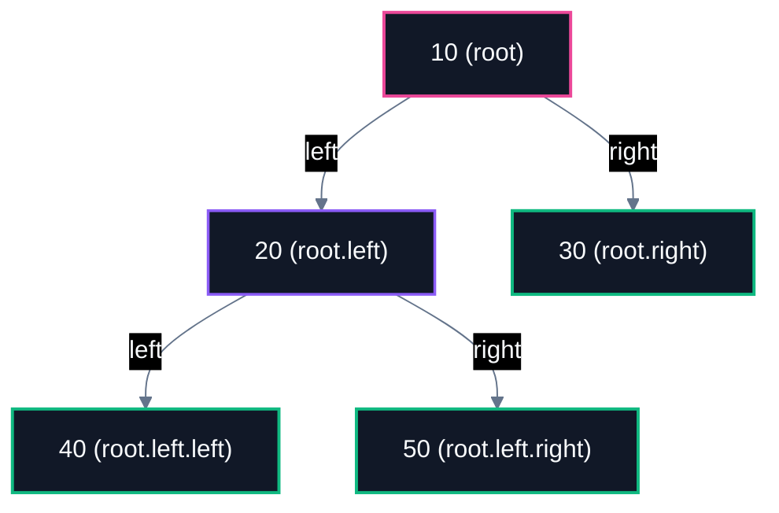
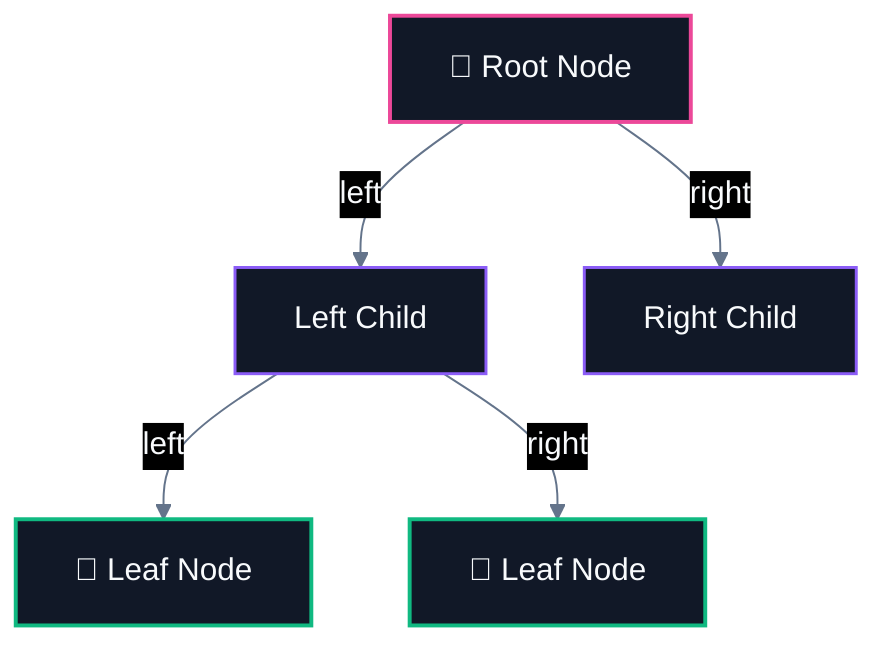

# 🌳 Binary Tree Fundamentals

> [!abstract] Module Overview
> **Master MOC:** [[CS/DSA/07. Trees & BSTs/00. Trees & BSTs Core|07. Trees & BSTs]]  
> **Related Notes:** [[CS/DSA/00. DSA Nexus|DSA Master Roadmap]] | [[CS/DSA/Quick Look|⚡ Quick Look Cheatsheet]] | [[CS/DSA/03. Linked Lists/01. Linked List Fundamentals|🔗 Linked List Fundamentals]] | [[home|🧭 Command Center]]

---

## 1. What is a Tree?

Forget binary for a second.

A **tree** is a non-linear data structure where data is arranged in a **hierarchy**.

### The Real-World Analogy: File Systems
Think of your computer folders:

```text
                Root
              /      \
          Folder A   Folder B
          /    \        \
       File 1  File 2   File 3
```



### Linear vs Hierarchical
Unlike an array:
`[10, 20, 30, 40, 50]`

a tree does not store things in a straight line. **It branches out.**

---

## 2. What is a Node?

Every individual element in a tree is called a **node**.

For example:



There are 3 nodes:
- `10`
- `20`
- `30`

### Anatomical Structure of a Node
Each node contains:
1. **Data / Value**
2. **Links / References** to other nodes



```text
       Node
   ┌───────────┐
   │   data    │
   ├───────────┤
   │   left    │ ────→ another Node
   ├───────────┤
   │   right   │ ────→ another Node
   └───────────┘
```

### In Java (Concept & Class Definition)

```java
class Node {
    int data;
    Node left;
    Node right;

    // Constructor
    public Node(int val) {
        this.data = val;
        this.left = null;
        this.right = null;
    }
}
```

---

## 3. What Makes it a Binary Tree?

A **Binary Tree** is a tree where **each node can have at most 2 children**.

Those two children are called:
- **Left Child**
- **Right Child**

```text
          10
        /    \
       20     30
      /  \
     40   50
```



### Child Count Breakdown:
- **Node 20:** Has **two children** (`40` and `50`).
- **Node 30:** Has **zero children** (`null`, `null`).
- **Node 10:** Has **two children** (`20` and `30`).

> [!tip] The Golden Rule
> **A node can have $0$, $1$, or $2$ children. Never more than $2$.**  
> That is literally what makes it *binary*.

---

## 4. Important Terminology

Consider this reference tree:

```text
             10
           /    \
          20     30
         /  \      \
        40   50     60
```



| Term | Definition | Example in Reference Tree |
| :--- | :--- | :--- |
| **Root 🌱** | The topmost node of the tree with no parent. | `root = 10` |
| **Parent** | A node directly above another node connected by an edge. | `20` is the parent of `40` and `50`. |
| **Child** | The nodes directly below a node. | `40` and `50` are children of `20`. |
| **Siblings** | Nodes that share the exact same parent node. | `40` and `50` are siblings (parent `20`). |
| **Leaf Node 🍃** | A node with **no children** (degree = 0). | `40`, `50`, and `60` are leaves. |
| **Subtree** | Any node treated as the root of its own tree together with all its descendants. | Left subtree of `10` is rooted at `20`. |
| **Ancestor / Descendant** | Ancestor: Any node on the path from root to that node. Descendant: Any node reachable moving downwards. | `10` and `20` are ancestors of `40`. `40` is a descendant of `10`. |

> [!check] 🎯 Concept Verification Check (5/5 Mastery)
> Given this 5-node tree:
> ```text
>              10
>            /    \
>           20     30
>          /  \
>         40   50
> ```
> 1. **Root:** `10` ✅
> 2. **Children of `20`:** `40, 50` ✅
> 3. **Parent of `50`:** `20` ✅
> 4. **Leaf Nodes:** `40, 50, 30` (3 leaves) ✅
> 5. **Total Node Count:** `5` (`10, 20, 30, 40, 50`) ✅

---

## 5. One VERY Important Concept: Height

### Finding the Longest Path
Consider:

```text
             10
           /    \
          20     30
         /  \
        40   50
```

The longest path from the root to a leaf node is:
$$\mathbf{10 \rightarrow 20 \rightarrow 40}$$



---

### Convention 1: Edge-Based Definition (Most Common in Theory)
Counting the number of **edges** on the longest root-to-leaf path:

- $10 \rightarrow 20 = 1\text{ edge}$
- $20 \rightarrow 40 = 1\text{ edge}$
- **$\text{Total Height} = 2$**

$$\text{Height}(\text{single node}) = 0$$
$$\text{Height}(\text{empty tree}) = -1$$

---

### Convention 2: Node-Based Definition (Common in Recursive Problems)
Counting the number of **nodes** on the longest root-to-leaf path:

- Path: $10 \rightarrow 20 \rightarrow 40$
- **$\text{Total Height} = 3\text{ nodes}$**

$$\text{Height}(\text{single node}) = 1$$
$$\text{Height}(\text{empty tree}) = 0$$

> [!warning] ⚠️ Beware of Problem Conventions in DSA / LeetCode
> Some problem statements define height/depth as the number of **nodes**, while others define it by the number of **edges**.
> - **Standard Recursive LeetCode pattern (Maximum Depth of Binary Tree):** Returns **nodes** count where empty tree $= 0$, single node $= 1$.
>   $$\text{maxDepth}(\text{root}) = 1 + \max(\text{maxDepth}(\text{root.left}), \text{maxDepth}(\text{root.right}))$$
> - **Always double-check the base cases and problem constraints** before coding.

---

## 6. Building a Binary Tree in Java (Manual Construction)

### Step 1: The Basic Node Class
Every tree node in Java encapsulates its data and two recursive reference links:

```java
class Node {
    int data;
    Node left;
    Node right;

    // Constructor
    Node(int data) {
        this.data = data;
        this.left = null;
        this.right = null;
    }
}
```

```text
Node
 ├── data
 ├── left
 └── right
```

---

### Step 2: Manually Assembling the Tree Structure

```java
public class BinaryTreeDemo {
    public static void main(String[] args) {
        // 1. Create the root node
        Node root = new Node(10);

        // 2. Connect direct children to root
        root.left = new Node(20);
        root.right = new Node(30);

        // 3. Connect grandchildren to node 20
        root.left.left = new Node(40);
        root.left.right = new Node(50);
    }
}
```

This code builds the exact tree in memory:



---

### Step 3: Understanding the Pointer Mechanics

> [!important] The Pointer Linking Mental Model
> - **`root.left = new Node(20);`**
>   > *"Allocate a new node containing `20` in the heap, and assign its memory address to `10`'s **left** pointer reference."*
> - **`root.left.right = new Node(50);`**
>   > *"Follow `root` (10) $\rightarrow$ travel to its **left** child (`20`) $\rightarrow$ connect a new node containing `50` to its **right** pointer."*

---

## 7. Summary Cheatsheet



```text
                     [ Root ]
                     /      \
            [ Left Child ]  [ Right Child ]
                /      \
           [ Leaf ]  [ Leaf ]
```

- **Tree:** Hierarchical, non-linear branching data structure.
- **Node:** Data payload + `left` pointer + `right` pointer.
- **Binary Tree Rule:** Max 2 children per node ($0, 1, \text{ or } 2$).
- **Leaf:** Any node where `left == null && right == null`.
- **Height:** Length of the longest root-to-leaf path ($\text{Nodes} - 1 = \text{Edges}$).
- **Manual Construction:** Pointer chaining via `root.left`, `root.right`, `root.left.left`, etc.

---

## 🔗 Related & Next Steps
- [[CS/DSA/07. Trees & BSTs/00. Trees & BSTs Core|🌳 07. Trees & BSTs Module MOC]]
- **Next Topic:** [[02. Tree Traversals|🌳⚔️ 02. Tree Traversals (Preorder, Inorder, Postorder, Level-Order)]]
- [[CS/DSA/03. Linked Lists/01. Linked List Fundamentals|🔗 Linked List Pointers Comparison]]
- [[CS/DSA/Quick Look|⚡ DSA Quick Formula Cheatsheet]]
- [[CS/DSA/00. DSA Nexus|DSA Master Roadmap]]
