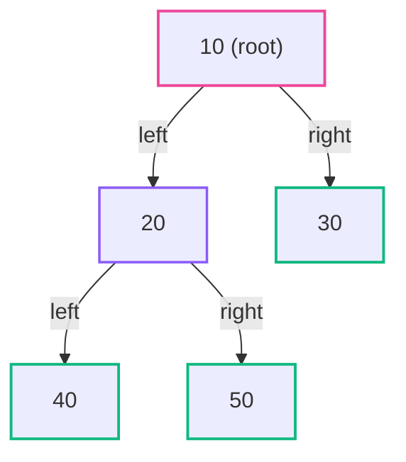
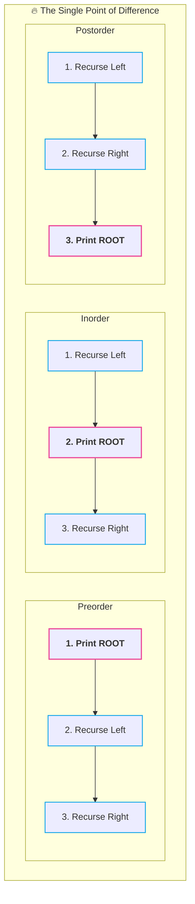
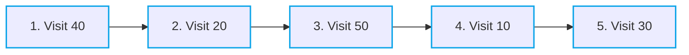
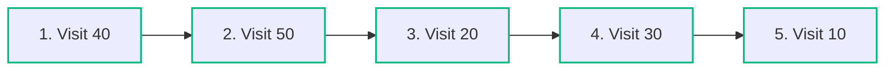
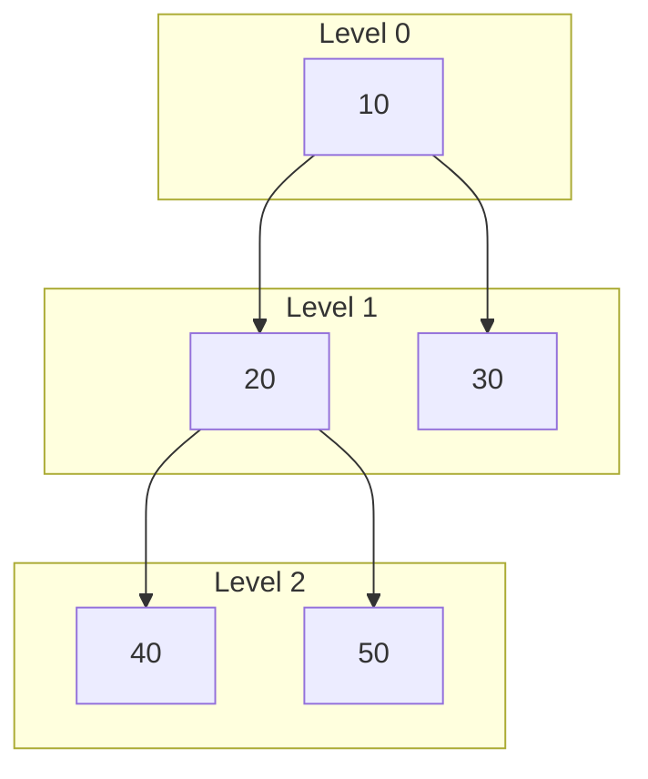

![[CS/DSA/07. Trees & BSTs/Untitled Diagram.svg]]
# 🚶‍♂️ Binary Tree Traversals

> [!abstract] Module Overview
> **Master MOC:** [[CS/DSA/07. Trees & BSTs/00. Trees & BSTs Core|07. Trees & BSTs]]  
> **Prerequisites:** [[CS/DSA/07. Trees & BSTs/01. Binary Tree Fundamentals|🌳 01. Binary Tree Fundamentals]]  
> **Related Notes:** [[CS/DSA/00. DSA Nexus|DSA Master Roadmap]] | [[CS/DSA/Quick Look|⚡ Quick Look Cheatsheet]] | [[home|🧭 Command Center]]

---

## 1. What is Tree Traversal?

In a linear data structure like an Array or Linked List, traversal is trivial because there is only one sequential direction:

$$\text{Index: } 0 \rightarrow 1 \rightarrow 2 \rightarrow 3 \rightarrow \dots$$

In a **Tree**, there is no single straight line. A tree **branches out**.

> [!important] 🎯 Definition
> **Tree Traversal** simply means **visiting every node in the tree exactly once** in a systematic order.

### Reference Tree for Traversals
Consider our canonical 5-node binary tree:



```text
        10
       /  \
      20   30
     /  \
    40   50
```

We have 5 nodes (`10, 20, 30, 40, 50`), and each traversal technique visits them in a different specific sequence.

---

## 2. 🧠 The Master Mental Model (The Root Position Rule)

There are **4 major traversals**:
1. **Preorder (DFS)**
2. **Inorder (DFS)**
3. **Postorder (DFS)**
4. **Level Order (BFS)**

For the 3 Depth-First Search (DFS) traversals, just look at **where the ROOT appears relative to its subtrees**:

| Traversal | Root Position | Rule Order | Easy Mnemonic |
| :--- | :---: | :--- | :--- |
| **Preorder** | **First** | $\mathbf{\text{ROOT} \rightarrow \text{LEFT} \rightarrow \text{RIGHT}}$ | **PRE** = Root at the start |
| **Inorder** | **Middle** | $\mathbf{\text{LEFT} \rightarrow \text{ROOT} \rightarrow \text{RIGHT}}$ | **IN** = Root in the middle |
| **Postorder** | **Last** | $\mathbf{\text{LEFT} \rightarrow \text{RIGHT} \rightarrow \text{ROOT}}$ | **POST** = Root at the end |

```text
PRE:   [ ROOT ]  ➔  ( Left Subtree )  ➔  ( Right Subtree )
IN:    ( Left Subtree )  ➔  [ ROOT ]  ➔  ( Right Subtree )
POST:  ( Left Subtree )  ➔  ( Right Subtree )  ➔  [ ROOT ]
```

---

## 3. 💡 WHY Recursion Works (The Code Anatomy)

> [!important] 🎯 Don't Just Memorize — Look at the Code Execution Flow!
> The entire difference between Preorder, Inorder, and Postorder is literally **where you place the line of code that processes the current node (`ROOT`) relative to the two recursive calls (`LEFT` and `RIGHT`)**.

### The 3 Critical Lines of Code

In every tree traversal function, three fundamental actions must occur:

```java
System.out.println(root.data); // 1. Process current node (ROOT)
traverse(root.left);           // 2. Recurse down left subtree (LEFT)
traverse(root.right);          // 3. Recurse down right subtree (RIGHT)
```

Notice how moving **Line 1** creates the three distinct traversals:

---

### 1. Preorder Structure ($\text{ROOT} \rightarrow \text{LEFT} \rightarrow \text{RIGHT}$)
Process current node **BEFORE** recursing on children:

```java
void preorder(Node root) {
    if (root == null) return;

    System.out.println(root.data); // ⬅️ ROOT (First)
    preorder(root.left);           // ⬅️ LEFT
    preorder(root.right);          // ⬅️ RIGHT
}
```

---

### 2. Inorder Structure ($\text{LEFT} \rightarrow \text{ROOT} \rightarrow \text{RIGHT}$)
Process current node **IN-BETWEEN** left and right subtree recursions:

```java
void inorder(Node root) {
    if (root == null) return;

    inorder(root.left);            // ⬅️ LEFT
    System.out.println(root.data); // ⬅️ ROOT (Middle)
    inorder(root.right);           // ⬅️ RIGHT
}
```

---

### 3. Postorder Structure ($\text{LEFT} \rightarrow \text{RIGHT} \rightarrow \text{ROOT}$)
Process current node **AFTER** both children subtrees have completed:

```java
void postorder(Node root) {
    if (root == null) return;

    postorder(root.left);          // ⬅️ LEFT
    postorder(root.right);         // ⬅️ RIGHT
    System.out.println(root.data); // ⬅️ ROOT (Last)
}
```



---

## 4. 🌳 Preorder Traversal (Root $\rightarrow$ Left $\rightarrow$ Right)

### The Rule
$$\mathbf{\text{ROOT} \rightarrow \text{LEFT} \rightarrow \text{RIGHT}}$$

---

### Step-by-Step Recursive Execution Walkthrough (`preorder(1)`)

Consider our tree:
```text
        1
       / \
      2   3
     / \
    4   5
```

```java
void preorder(Node root) {
    if (root == null) return;

    System.out.println(root.data); // 1. ROOT
    preorder(root.left);           // 2. LEFT
    preorder(root.right);          // 3. RIGHT
}
```

#### Step 1 — Start at Node `1`
- Print **`1`** (Output: `1`).
- Execute `preorder(1.left)` $\rightarrow$ calls `preorder(2)`.

#### Step 2 — At Node `2`
- Print **`2`** (Output: `1 2`).
- Execute `preorder(2.left)` $\rightarrow$ calls `preorder(4)`.

#### Step 3 — At Node `4`
- Print **`4`** (Output: `1 2 4`).
- `4.left` is `null` $\rightarrow$ hits base case `if (root == null) return;` $\rightarrow$ returns.
- `4.right` is `null` $\rightarrow$ hits base case $\rightarrow$ returns.
- **Node `4` is completely finished!**

> [!important] 🔥 Where do we go now? Back to Node `2`!
> We do **NOT** jump to node `3`. Recursion backtracks to its immediate parent caller: **Node `2`**!
> ```text
>         1
>        /
>       2  ← we resume here!
>      /
>     4  ← finished
> ```

#### Step 4 — Node `2` Resumes & Explores Right Subtree
- `2` proceeds to its next statement: `preorder(2.right)` $\rightarrow$ calls `preorder(5)`.
- Print **`5`** (Output: `1 2 4 5`).
- `5.left` and `5.right` are `null` $\rightarrow$ returns.
- **Node `2` is now completely finished!**

#### Step 5 — Back at Root `1` (Left Subtree Complete)
- Root `1` has completely resolved its left subtree!
- Root `1` proceeds to its next statement: `preorder(1.right)` $\rightarrow$ calls `preorder(3)`.
- Print **`3`** (Output: `1 2 4 5 3`).
- `3` has no children $\rightarrow$ returns.

$$\boxed{\text{Final Preorder Sequence: } \mathbf{1 \rightarrow 2 \rightarrow 4 \rightarrow 5 \rightarrow 3}}$$

---

### 🎨 Visual Recursive Journey (Draw.io)

> [!tip] 🎨 Interactive Preorder Recursive Trace
> ![[preorder_recursive_trace.drawio.svg]]

---

### 🔑 The Subtree Delegation Principle

When you read:
```java
preorder(root.left);
```
**Do not think:** *"The function is gone forever."*

> [!quote] The Subtree Delegation Mental Model
> **"Go solve and print the entire left subtree, and once it is 100% complete, return right back here to continue."**

```text
solve(1)
 ├── solve(2)
 │    ├── solve(4) ➔ done
 │    └── solve(5) ➔ done
 │    └── Left Subtree Complete!
 └── solve(3) ➔ done
```

---

### 🎯 Quick Concept Check

Given this tree:
```text
        10
       /  \
      20   30
     /
    40
```

> [!question] ❓ Test Questions
> 1. **What is the Preorder sequence?**
> 2. **After finishing node `40`, which node do we come back to?**

> [!check] ✅ Answer & Explanation
> 1. **Preorder:** `10 ➔ 20 ➔ 40 ➔ 30`
> 2. **Backtrack Target:** After finishing `40`, we return to **`20`** (which checks `20.right == null` and finishes), which then returns to **`10`**, which then launches `preorder(30)`!

---

### Recursive Java Implementation

```java
public void preorder(Node root) {
    // Base case: empty subtree
    if (root == null) return;

    // 1. Visit ROOT
    System.out.print(root.data + " ");

    // 2. Recurse LEFT
    preorder(root.left);

    // 3. Recurse RIGHT
    preorder(root.right);
}
```

> [!tip] 💡 Common Use Cases for Preorder
> - Creating an exact deep copy / clone of a tree.
> - Serializing and deserializing a binary tree structure.
> - Prefix expression evaluation in syntax expression trees.

---

## 5. 🌳 Inorder Traversal (Left $\rightarrow$ Root $\rightarrow$ Right)

### The Rule
$$\mathbf{\text{LEFT} \rightarrow \text{ROOT} \rightarrow \text{RIGHT}}$$

### Step-by-Step Execution Trace
1. **Start at `10`:** Cannot visit yet $\rightarrow$ must go left first to `20`.
2. **At `20`:** Cannot visit yet $\rightarrow$ must go left first to `40`.
3. **At `40`:** `40.left` is `null`, so visit $\rightarrow$ **`40`**. `40.right` is `null`, return up to `20`.
4. **Back at `20`:** Left subtree done $\rightarrow$ visit root $\rightarrow$ **`20`**.
5. **Go Right to `50`:** `50.left` is `null` $\rightarrow$ visit $\rightarrow$ **`50`**. Subtree of `20` complete, return to `10`.
6. **Back at `10`:** Left subtree done $\rightarrow$ visit root $\rightarrow$ **`10`**.
7. **Go Right to `30`:** `30.left` is `null` $\rightarrow$ visit $\rightarrow$ **`30`**.



$$\boxed{\text{Inorder Sequence: } \mathbf{40 \rightarrow 20 \rightarrow 50 \rightarrow 10 \rightarrow 30}}$$

### Recursive Java Implementation

```java
public void inorder(Node root) {
    // Base case: empty subtree
    if (root == null) return;

    // 1. Recurse LEFT
    inorder(root.left);

    // 2. Visit ROOT
    System.out.print(root.data + " ");

    // 3. Recurse RIGHT
    inorder(root.right);
}
```

> [!important] 🌟 Crucial Inorder Property (BSTs)
> In a **Binary Search Tree (BST)**, performing an **Inorder Traversal** ALWAYS visits values in **strictly non-decreasing sorted order**!

---

## 6. 🌳 Postorder Traversal (Left $\rightarrow$ Right $\rightarrow$ Root)

### The Rule
$$\mathbf{\text{LEFT} \rightarrow \text{RIGHT} \rightarrow \text{ROOT}}$$

### Step-by-Step Execution Trace
1. **Start at `10`:** Must process both subtrees before visiting `10`. Go left $\rightarrow$ `20`.
2. **At `20`:** Must process both subtrees before visiting `20`. Go left $\rightarrow$ `40`.
3. **At `40`:** No children $\rightarrow$ visit $\rightarrow$ **`40`**. Return to `20`.
4. **At `20`:** Left done, must process right first $\rightarrow$ go right $\rightarrow$ `50`.
5. **At `50`:** No children $\rightarrow$ visit $\rightarrow$ **`50`**. Return to `20`.
6. **Back at `20`:** Both children (`40` and `50`) done $\rightarrow$ visit root $\rightarrow$ **`20`**. Return to `10`.
7. **At `10`:** Left done, must process right first $\rightarrow$ go right $\rightarrow$ `30`.
8. **At `30`:** No children $\rightarrow$ visit $\rightarrow$ **`30`**. Return to `10`.
9. **Back at `10`:** Both children done $\rightarrow$ finally visit root $\rightarrow$ **`10`**.



$$\boxed{\text{Postorder Sequence: } \mathbf{40 \rightarrow 50 \rightarrow 20 \rightarrow 30 \rightarrow 10}}$$

### Recursive Java Implementation

```java
public void postorder(Node root) {
    // Base case: empty subtree
    if (root == null) return;

    // 1. Recurse LEFT
    postorder(root.left);

    // 2. Recurse RIGHT
    postorder(root.right);

    // 3. Visit ROOT
    System.out.print(root.data + " ");
}
```

> [!tip] 💡 Common Use Cases for Postorder
> - **Bottom-up Tree Computations:** Calculating the height/depth of a tree, tree diameter, or subtree node counts.
> - **Deleting / Garbage Collecting a Tree:** Deleting children before deleting parent avoids memory pointer leaks.
> - **Post-fix / Reverse Polish Notation evaluation.**

---

## 7. 🌐 Level Order Traversal (Breadth-First Search / BFS)

While Preorder, Inorder, and Postorder dive deep down a branch first (DFS), **Level Order Traversal** processes nodes **level by level from top to bottom, left to right**:



$$\boxed{\text{Level Order Sequence: } \mathbf{10 \rightarrow 20 \rightarrow 30 \rightarrow 40 \rightarrow 50}}$$

*Level order traversal is implemented iteratively using a **FIFO Queue** (`ArrayDeque<Node>`).*

---

## 8. 📊 Side-by-Side Traversal Comparison Table

| Traversal | Algorithm Type | Traversal Order | Result for Reference Tree | Key Primary Use Case |
| :--- | :---: | :--- | :--- | :--- |
| **Preorder** | DFS (Stack/Recursion) | $\text{Root} \rightarrow \text{Left} \rightarrow \text{Right}$ | `10 20 40 50 30` | Tree cloning, serialization |
| **Inorder** | DFS (Stack/Recursion) | $\text{Left} \rightarrow \text{Root} \rightarrow \text{Right}$ | `40 20 50 10 30` | Sorted output in BSTs |
| **Postorder** | DFS (Stack/Recursion) | $\text{Left} \rightarrow \text{Right} \rightarrow \text{Root}$ | `40 50 20 30 10` | Height calculation, tree deletion |
| **Level Order** | BFS (Queue) | Level-by-level (Top $\rightarrow$ Bottom) | `10 20 30 40 50` | Shortest path, tree view printing |

---

## 9. Complete Runnable Java Code

```java
import java.util.*;

public class TreeTraversals {
    static class Node {
        int data;
        Node left, right;

        Node(int data) {
            this.data = data;
            this.left = null;
            this.right = null;
        }
    }

    // 1. Preorder: Root -> Left -> Right
    public static void preorder(Node root) {
        if (root == null) return;
        System.out.print(root.data + " ");
        preorder(root.left);
        preorder(root.right);
    }

    // 2. Inorder: Left -> Root -> Right
    public static void inorder(Node root) {
        if (root == null) return;
        inorder(root.left);
        System.out.print(root.data + " ");
        inorder(root.right);
    }

    // 3. Postorder: Left -> Right -> Root
    public static void postorder(Node root) {
        if (root == null) return;
        postorder(root.left);
        postorder(root.right);
        System.out.print(root.data + " ");
    }

    public static void main(String[] args) {
        // Construct the tree:
        //        10
        //       /  \
        //      20   30
        //     /  \
        //    40   50
        Node root = new Node(10);
        root.left = new Node(20);
        root.right = new Node(30);
        root.left.left = new Node(40);
        root.left.right = new Node(50);

        System.out.print("Preorder:   ");
        preorder(root);    // 10 20 40 50 30
        System.out.println();

        System.out.print("Inorder:    ");
        inorder(root);     // 40 20 50 10 30
        System.out.println();

        System.out.print("Postorder:  ");
        postorder(root);   // 40 50 20 30 10
        System.out.println();
    }
}
```

---

## 🔗 Related & Next Steps
- [[CS/DSA/07. Trees & BSTs/00. Trees & BSTs Core|🌳 07. Trees & BSTs Module MOC]]
- [[CS/DSA/07. Trees & BSTs/01. Binary Tree Fundamentals|🧱 01. Binary Tree Fundamentals]]
- [[CS/DSA/Quick Look|⚡ DSA Quick Formula Cheatsheet]]
- [[CS/DSA/00. DSA Nexus|DSA Master Roadmap]]
