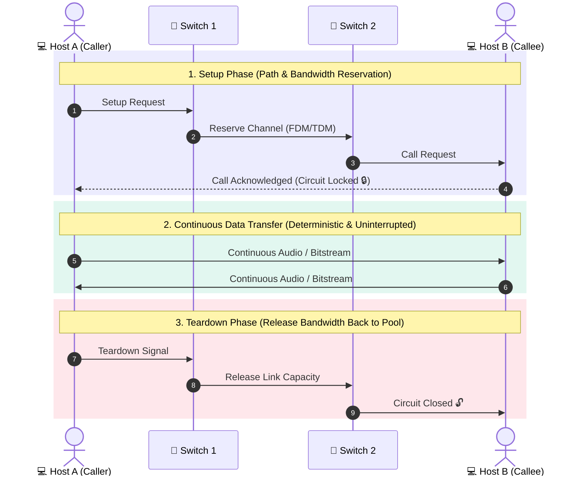
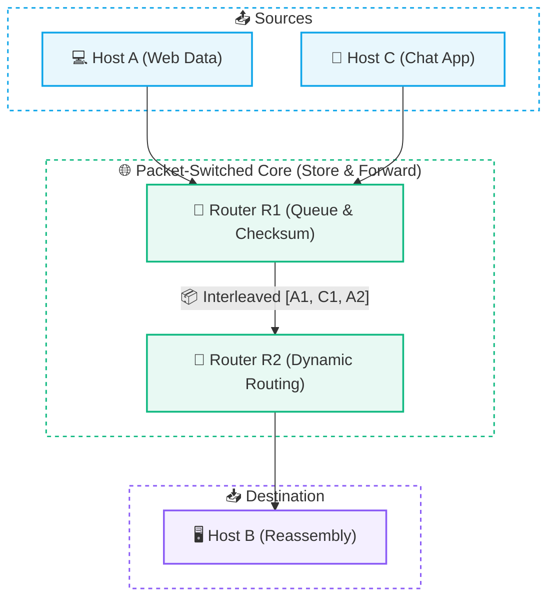
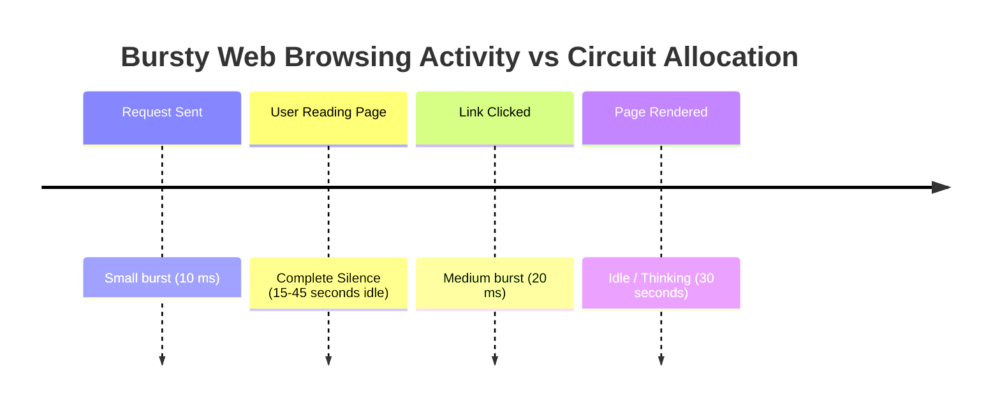
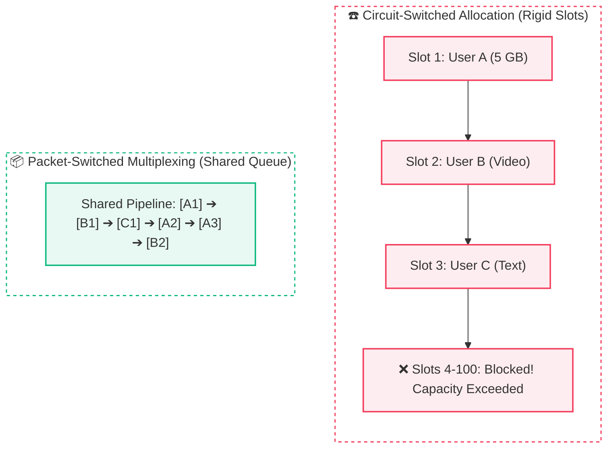

# Switching Techniques: Packet vs. Circuit Switching

> [!abstract] Core Concept Summary
> In computer networks, **switching** refers to the mechanism by which intermediate nodes transfer data between connected transmission links to move messages from a source to a destination. The two fundamental paradigms are **Circuit Switching** (dedicated, reserved paths) and **Packet Switching** (dynamic, shared statistical multiplexing).

---

## ☎️ 1. Circuit Switching (The Traditional Model)

Circuit switching is the foundational technology of traditional public switched telephone networks (PSTN) and legacy landline communications.

### 3-Phase Lifecycle:
1. **Circuit Establishment (Setup Phase):** Before a single bit of data is transmitted, the network establishes an end-to-end dedicated physical/virtual circuit across intermediate switches. Buffers and fixed bandwidth slices (via FDM or TDM) are strictly reserved.
2. **Dedicated Data Transfer:** Data flows across the reserved circuit as a continuous stream. Bandwidth is guaranteed and latency is minimal and deterministic.
3. **Circuit Teardown:** Once communication terminates, explicit signaling tears down the connection and releases the reserved link capacity back to the pool.

> [!example] 🚗 The Private Reserved Highway Analogy
> Imagine reserving an entire lane of an expressway exclusively for your car:
> Even if you pull over and sit completely idle in silence, **no other vehicle is allowed to use your lane**. The unused capacity is completely wasted during silence or idle intervals.

---

## 📦 2. Packet Switching (The Modern Internet Model)

Packet switching is the architectural foundation of the modern **Internet**. Instead of reserving dedicated end-to-end links, data is split into discrete **[[02. Packets and Packet Switching|packets]]** that share physical transmission links on demand.

### Key Principles of Packet Switching:
1. **No Path Reservation:** Endpoints do not establish dedicated end-to-end circuits prior to transmission.
2. **Statistical Multiplexing:** Multiple independent communication streams dynamically interleave their packets across the same physical link. Available link capacity is allocated on the fly based on instantaneous traffic demand.
3. **Store-and-Forward Operation:** Each intermediate router must receive the complete packet, verify its integrity (checksum), inspect the destination address in the header, and place it into an output queue before forwarding it onto the next link.

> [!example] 🛣️ The Public Highway Analogy
> All users share the same road infrastructure. Vehicles (packets) merge, interleave, and take turns traversing lanes based on real-time traffic demand.

---

## ⚡ 3. Why Did the Internet Choose Packet Switching?

The decisive reason why computer networks abandoned circuit switching in favor of packet switching is the **bursty nature of data traffic**:

### The Inefficiency of Circuit Switching for Computers:
- In circuit switching, the link capacity remains locked during the 15–45 seconds of user silence. If 1,000 users are browsing web pages, 90%+ of reserved bandwidth is wasted on idle connections.
- In **packet switching**, during the user's idle "reading" time, the shared physical link is immediately used by other active users (e.g., someone downloading a software update or streaming a video).

> [!tip] Multiplexing Gain
> A 10 Mbps link in a circuit-switched network might only support **10 active users** (if each user is allocated a rigid 1 Mbps slice).  
> In a packet-switched network, the same 10 Mbps link can comfortably support **35+ active users** simultaneously, because the probability of all users transmitting peak bursts at the exact same millisecond is exceedingly low.

---

## ⚔️ 4. Comprehensive Comparison: Packet vs. Circuit Switching

| Architectural Attribute | ☎️ Circuit Switching | 📦 Packet Switching |
| :--- | :--- | :--- |
| **Path Dedication** | Dedicated, pre-reserved end-to-end path | Dynamic, hop-by-hop shared links |
| **Bandwidth Allocation** | Fixed & reserved (via FDM / TDM) | Dynamic / On-demand (Statistical multiplexing) |
| **Call Setup Phase** | Mandatory (introduces initial setup delay) | Not required (packets sent immediately) |
| **Efficiency with Bursty Data** | Very Low (wastes bandwidth during idle times) | Extremely High (interleaves bursts across users) |
| **Congestion Behavior** | **Call Blocking** (New calls rejected if circuits full) | **Queuing Delay & Packet Loss** (Packets buffer or drop) |
| **Latency & Jitter** | Guaranteed, constant, deterministic | Variable (depends on queuing delay & congestion) |
| **Path Traversal** | All data follows the exact same physical path | Packets can follow dynamic alternative paths |
| **Store-and-Forward Delay** | None during transfer phase | Present at every intermediate router hop |
| **Primary Use Cases** | Traditional landline voice telephony | The Internet, Web, APIs, Cloud computing |

---

## 🏗️ 5. Real-World Architecture & Deep Dive Scenarios

### 🏫 The 100-User Shared Campus Link Scenario
> **Scenario:** Imagine 100 users share a single access point:
> - User A is downloading a 5 GB file.
> - User B is watching a video stream.
> - User C is sending a text message.
>
> What happens under **Circuit Switching** vs. **Packet Switching**?

> [!important] Sharpened Intuition
> - **Circuit Switching:** Network resources are **rigidly reserved**. The problem is NOT that small users wait behind the big download; rather, capacity is locked up and unavailable for others even during idle pauses.
> - **Packet Switching:** Network capacity is **dynamically shared**. Packets from lightweight users interleave with heavy download packets in router queues, maximizing total link utilization.

---

## 🔗 Related Notes & Next Concepts

- **Parent MOC:** [[Computer Networking/README|🌐 Computer Networks MOC]]
- **Prerequisites:**
  - [[01. Introduction to Computer Networks|🌍 Introduction to Computer Networks]]
  - [[02. Packets and Packet Switching|📦 Packets and Packet Switching]]
- **Next Logical Topics:**
  - [[04. Network Performance - Delay, Latency, Throughput|⚡ Network Performance - Delay, Latency, Throughput]] — Four components of delay: transmission, propagation, processing, and queuing.
  - [[06. OSI vs TCP-IP Model|🧱 OSI vs TCP-IP Model]] — Where switching operates (Layer 2 Data Link vs. Layer 3 Network).

