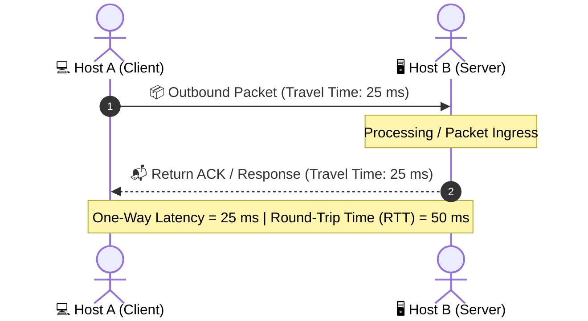
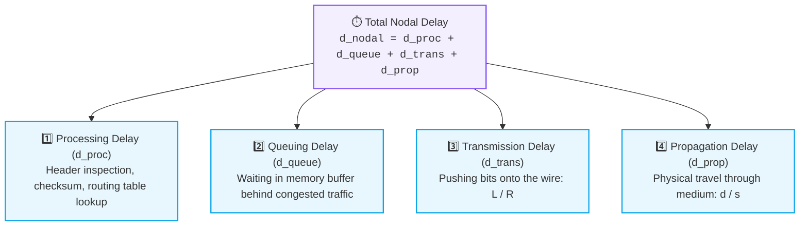
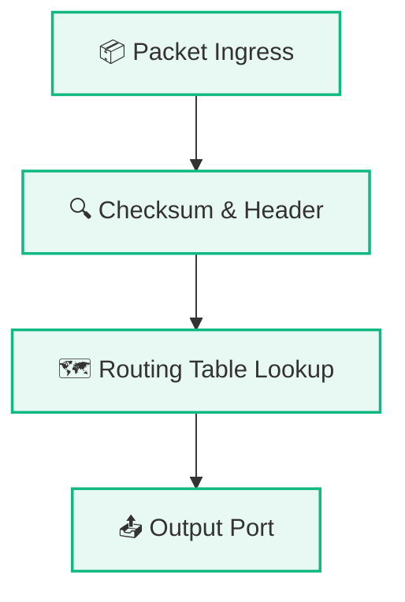
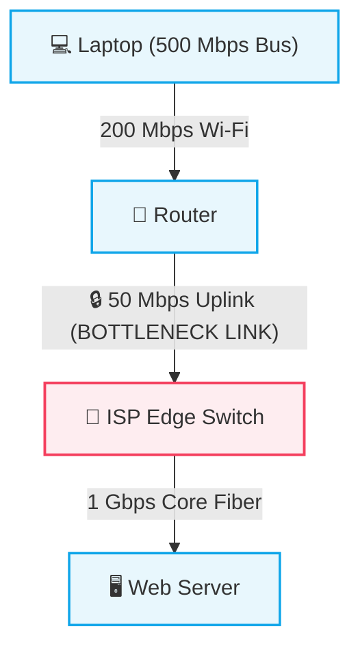

# Network Performance: Delay, Latency & Throughput

> [!abstract] Core Definition
> In computer networks, **Delay** (or **Latency**) represents the total time required for a packet of data to travel from the source host across physical links and intermediate routing devices to reach its destination.

---

## ⏱️ 1. Latency, Delay & Ping (RTT)

- **One-Way Latency:** Time taken for a packet to travel from $\text{Source} \to \text{Destination}$.
- **Round-Trip Time (RTT / "Ping"):** The time taken for a data packet to travel from $\text{Source} \to \text{Destination}$ **plus** the time taken for the acknowledgement/response to travel back from $\text{Destination} \to \text{Source}$.

### 🎮 Real-World Responsiveness Benchmarks (RTT):
- **$< 20\text{ ms}$:** Pristine (Esports competitive gaming, high-frequency financial trading).
- **$20\text{ ms} - 50\text{ ms}$:** Excellent (Real-time voice calls, smooth multiplayer gaming).
- **$50\text{ ms} - 100\text{ ms}$:** Acceptable (Standard web browsing, streaming video buffer).
- **$> 150\text{ ms} - 250+\text{ ms}$:** Noticeable lag (Noticeable conversational delay in voice calls, intercontinental satellite links).

### Unit Conversions:
$$1\text{ second (s)} = 1,000\text{ milliseconds (ms)} = 1,000,000\text{ microseconds (}\mu\text{s)}$$
- $100\text{ ms} = 0.1\text{ s}$
- $50\text{ ms} = 0.05\text{ s}$
- $1\text{ ms} = 0.001\text{ s}$

---

## 🧩 2. The Four Components of Nodal Delay

When a packet traverses an intermediate router or switch, it experiences four distinct, additive sources of delay:

$$
\boxed{d_{\text{nodal}} = d_{\text{proc}} + d_{\text{queue}} + d_{\text{trans}} + d_{\text{prop}}}
$$

---

### 1️⃣ Processing Delay ($d_{\text{proc}}$)
- **What it is:** The time a router takes to inspect the packet's header, verify the checksum for bit errors, determine the output interface using its routing/forwarding table, and execute ACL/firewall rules.
- **Hardware involved:** Router CPU and high-speed ASIC network processors.
- **Typical magnitude:** Microseconds ($\mu\text{s}$) or less. Typically negligible unless deep packet inspection (DPI) or encryption is active.

---

### 2️⃣ Queuing Delay ($d_{\text{queue}}$)
- **What it is:** The time the packet spends waiting in the router's memory buffer queue until the outbound transmission link becomes free.
- **Key characteristic:** Highly variable and non-deterministic. Depends on instantaneous network congestion and traffic intensity.
  - If the link is idle: $d_{\text{queue}} \approx 0$.
  - If heavy traffic arrives faster than the link can serialize bits: packets queue up. If the buffer overflows, **packet loss (drop)** occurs.

---

### 3️⃣ Transmission Delay ($d_{\text{trans}}$)
- **What it is:** The time required to physically push (serialize) all the bits of the packet onto the transmission wire/fiber.
- **Governed by:** Packet size ($L$) and Link transmission speed / bandwidth ($R$).

$$\boxed{d_{\text{trans}} = \frac{L}{R}}$$

Where:
- $L = \text{Packet Length (in bits)}$
- $R = \text{Link Bandwidth / Transmission Rate (in bits per second, bps)}$

#### 🔢 Example Calculation:
- Packet size $L = 1\text{ MB} = 8,000,000\text{ bits}$ (or $8 \times 10^6\text{ bits}$)
- Link speed $R = 10\text{ Mbps} = 10,000,000\text{ bps}$
$$d_{\text{trans}} = \frac{8,000,000\text{ bits}}{10,000,000\text{ bps}} = 0.8\text{ seconds} = 800\text{ ms}$$

---

### 4️⃣ Propagation Delay ($d_{\text{prop}}$)
- **What it is:** The time required for a single bit to physically travel through the physical medium (copper cable, optical fiber, radio waves) from transmitter to receiver.
- **Governed by:** Physical distance between nodes ($d$) and propagation speed through the physical medium ($s$).

$$\boxed{d_{\text{prop}} = \frac{d}{s}}$$

Where:
- $d = \text{Physical distance of the link (in meters or km)}$
- $s = \text{Propagation speed of light in the medium } (\approx 2 \times 10^8\text{ m/s in fiber/copper, } 3 \times 10^8\text{ m/s in vacuum/air})$

#### 🔢 Example Calculation:
- Distance from Mumbai to New York $d = 12,000\text{ km} = 1.2 \times 10^7\text{ meters}$
- Speed of light in fiber optic cable $s \approx 2 \times 10^8\text{ m/s}$
$$d_{\text{prop}} = \frac{1.2 \times 10^7}{2 \times 10^8} = 0.06\text{ seconds} = 60\text{ ms}$$

---

## 🌊 3. Transmission vs. Propagation (The Golden Distinction)

| Dimension | Transmission Delay ($d_{\text{trans}} = L/R$) | Propagation Delay ($d_{\text{prop}} = d/s$) |
| :--- | :--- | :--- |
| **Physical Meaning** | Pumping/serializing bits onto the wire | Traveling down the wire through space |
| **Depends on** | Packet Size ($L$) and Link Speed ($R$) | Distance ($d$) and Medium Physics ($s$) |
| **Analogy** | Time to load 100 passengers onto an airplane | Flight duration from London to Tokyo |
| **Effect of upgrading Bandwidth** | **Reduced significantly** (e.g., 10 Mbps $\to$ 1 Gbps) | **Zero effect** (Distance & speed of light unchanged!) |

> [!caution] Critical Engineering Rule
> Upgrading your home internet plan from **100 Mbps to 1 Gbps** reduces your **Transmission Delay** (files upload/download faster), but does **NOT** reduce the **Propagation Delay** to a server 10,000 km away across the Pacific Ocean!

---

## 🌐 4. Total End-to-End Delay Across Multiple Hops

In a real network path consisting of $N$ links and $(N-1)$ intermediate routers:

$$\boxed{d_{\text{end-to-end}} = \sum_{i=1}^{N} \left( d_{\text{proc}, i} + d_{\text{queue}, i} + d_{\text{trans}, i} + d_{\text{prop}, i} \right)}$$

---

## 🎯 5. Practical Scenario Breakdown

| Scenario | Primary Delay Incurred | Explanation |
| :--- | :--- | :--- |
| **A. Router inspecting header & looking up routing table** | **Processing Delay ($d_{\text{proc}}$)** | CPU/ASIC computational time to determine destination port. |
| **B. Packet waiting behind 50 other packets in memory** | **Queuing Delay ($d_{\text{queue}}$)** | Congestion buffer delay waiting for the outbound interface to clear. |
| **C. Pushing a 10 MB file over a slow 10 Mbps link** | **Transmission Delay ($d_{\text{trans}}$)** | Serializing bits onto the wire ($\frac{10\text{ MB}}{10\text{ Mbps}} = 8\text{ s}$). |
| **D. Signal traversing 5,000 km across undersea fiber cable** | **Propagation Delay ($d_{\text{prop}}$)** | Physical speed of light in optical glass ($\frac{5,000\text{ km}}{200,000\text{ km/s}} = 25\text{ ms}$). |

---

## 🚀 6. Bandwidth, Throughput & Bottlenecks

| Term | Meaning | Metaphor |
| :--- | :--- | :--- |
| **Bandwidth** | Maximum theoretical data-carrying capacity of a link (e.g., 1 Gbps). | Width of the highway pipe |
| **Throughput** | Actual measured rate of successful data delivery over time (e.g., 50 Mbps). | Actual traffic speed flowing through |
| **Goodput** | Useful application-level payload delivered (excluding protocol headers & retransmissions). | Payload cargo inside the trucks |

---

### 2. The Bottleneck Link Principle

> [!important] The Bottleneck Law
> In an end-to-end network path consisting of multiple links in series ($R_1, R_2, \dots, R_N$), the maximum achievable end-to-end throughput is **strictly constrained by the link with the lowest transmission rate**.
>
> $$\boxed{\text{Throughput} \le \min(R_1, R_2, \dots, R_N)}$$

#### 🔍 Practical Bottleneck Analysis:
- In the path above, even though the laptop has a 500 Mbps bus, Wi-Fi runs at 200 Mbps, and the ISP core has 1 Gbps fiber, the **maximum throughput is strictly capped at 50 Mbps**.
- A bottleneck is a **specific communication link or interface**, not simply a physical device.

---

### 3. Why a 1 Gbps ISP Plan $\neq$ 1 Gbps Download Speed

1. **Local Access Bottlenecks:** Older Wi-Fi routers (e.g. 2.4 GHz 802.11n) or interference may cap wireless links to 50–150 Mbps.
2. **Server-Side Upload Limits:** The remote web server hosting the file may throttle per-client connections to preserve bandwidth across millions of users.
3. **Core Peering Congestion:** Congested transit links between disparate ISPs at Internet Exchange Points (IXPs).
4. **Transport Layer Overhead:** TCP flow control, congestion control windows, and packet acknowledgements (ACK latency).

---

## 🔗 Related Notes & Next Concepts

- **Parent MOC:** [[Computer Networking/README|🌐 Computer Networks MOC]]
- **Prerequisites:**
  - [[01. Introduction to Computer Networks|🌍 Introduction to Computer Networks]]
  - [[02. Packets and Packet Switching|📦 Packets and Packet Switching]]
  - [[03. Switching Techniques - Packet vs Circuit|🔄 Switching Techniques - Packet vs Circuit]]
- **Next Logical Topics:**
  - [[05. Network Hardware - Hub, Switch, Router, Modem|🔌 Network Hardware - Hub, Switch, Router, Modem]] — Physical devices connecting nodes.
  - [[06. OSI vs TCP-IP Model|🧱 OSI vs TCP-IP Model]] — The layered abstraction stack.

