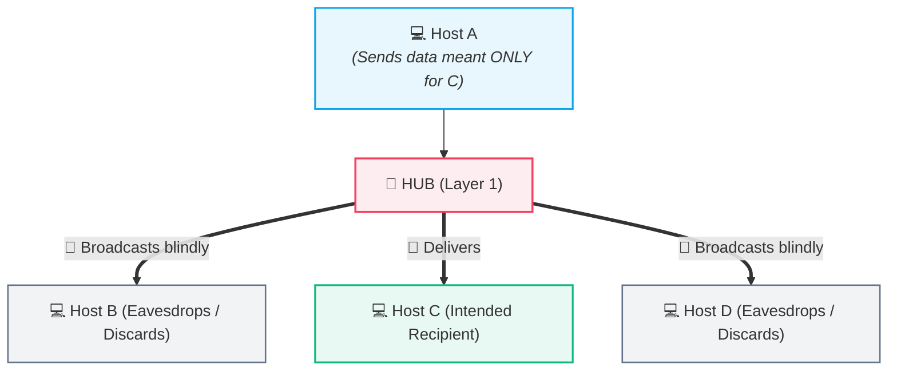
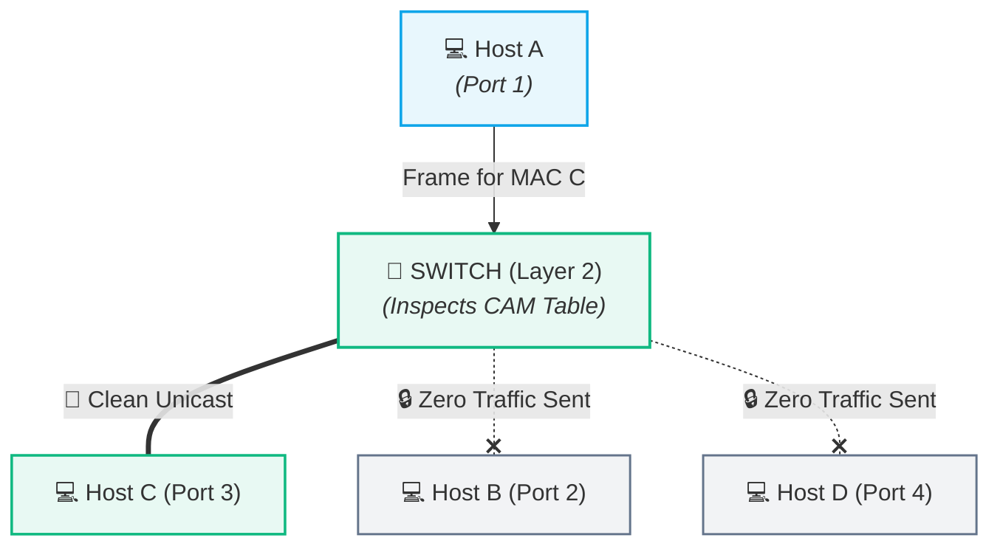
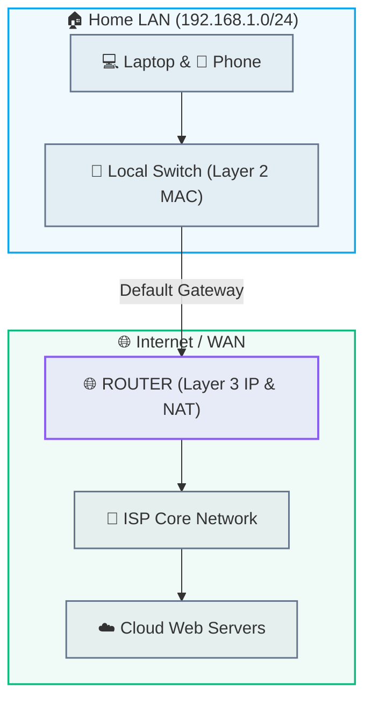
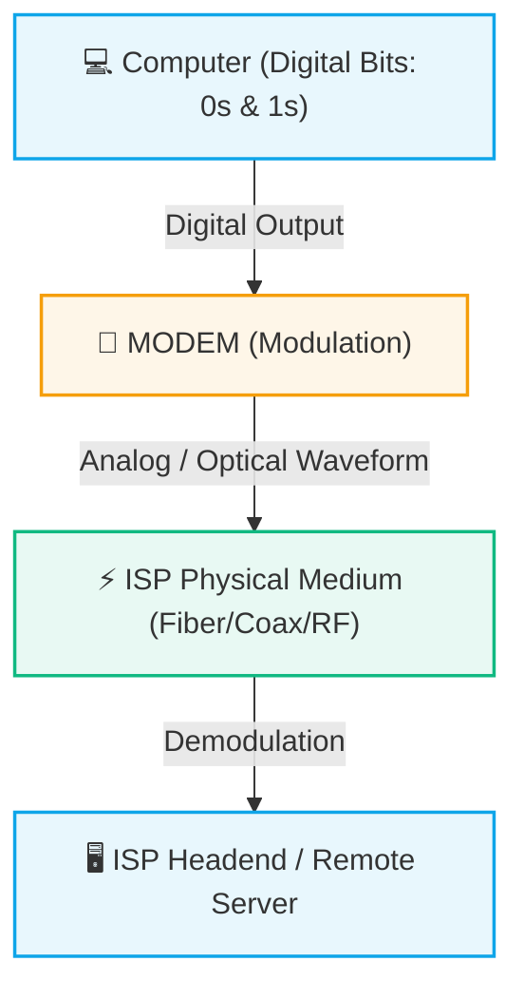
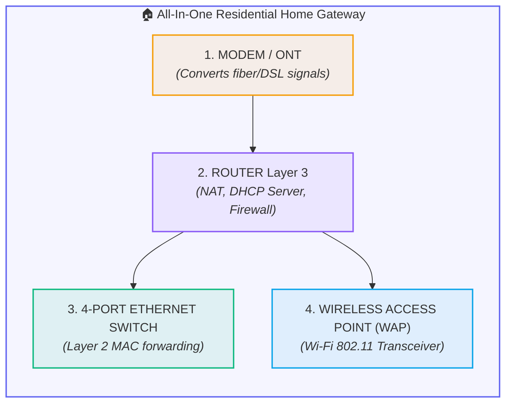

# 🔌 Network Hardware: Hub vs. Switch vs. Router vs. Modem

> [!important] 🎯 Executive Summary
> Connecting multiple computing devices requires specialized interconnect hardware operating at different layers of the network stack:
> - **Hub (Layer 1):** Blindly broadcasts incoming electrical/optical signals to all connected ports.
> - **Switch (Layer 2):** Intelligently inspects **MAC Addresses** and unicasts frames directly to destination devices within a local LAN.
> - **Router (Layer 3):** Inspects **IP Addresses** and routes packets across different, heterogeneous networks and the Internet.
> - **Modem (Physical Layer Interface):** Converts (modulates/demodulates) digital signals into physical analog/optical waveforms suitable for the ISP access medium.

---

## 🔌 1. Hub — The "Blind Broadcaster" (Layer 1)

A **Hub** is a simple, unmanaged Physical Layer (Layer 1) device that acts as a multiport signal repeater.

### How a Hub Operates:
- When a bit arrives on port 1 (from Host A), the hub electrically regenerates and **broadcasts the signal out of all other ports** (ports 2, 3, and 4).
- The hub has **zero intelligence**: it does not understand frames, packets, IP addresses, or MAC addresses.
- **Critical Drawbacks:**
  1. 💥 **Single Collision Domain:** If Host A and Host B transmit at the same instant, their electrical signals collide and corrupt each other.
  2. 🔓 **Security & Privacy Risks:** Every connected machine (Hosts B, C, and D) receives every frame and can capture sensitive traffic using packet sniffers.
  3. 🐌 **Wasted Bandwidth:** All connected devices share a single bandwidth pool (e.g., 10 Mbps shared across all machines).

---

## 🔀 2. Switch — The Intelligent LAN Forwarder (Layer 2)

A **Switch** is a Data Link Layer (Layer 2) device that connects devices within the **same local area network (LAN)** and forwards Ethernet frames based on hardware **MAC Addresses**.

### How a Switch Learns: The MAC Address Table (CAM Table)
A switch dynamically builds and maintains a lookup table (Content Addressable Memory - CAM Table) by inspecting the **Source MAC Address** of every incoming frame:

| 🏷️ MAC Address | 🔌 Switch Port | Device Identity |
| :--- | :--- | :--- |
| `AA:AA:AA:AA:AA:AA` | **Port 1** | Host A |
| `BB:BB:BB:BB:BB:BB` | **Port 2** | Host B |
| `CC:CC:CC:CC:CC:CC` | **Port 3** | Host C |
| `DD:DD:DD:DD:DD:DD` | **Port 4** | Host D |

1. **Learning:** When Host A sends a frame, the switch reads Host A's source MAC address and records: `AA:AA:... is on Port 1`.
2. **Forwarding (Unicast):** If Host C's MAC address is already in the table, the switch forwards the frame **strictly out of Port 3**. Ports 2 and 4 remain completely silent.
3. **Flooding:** If Host C's MAC address is not yet in the table (unknown unicast), the switch temporarily floods the frame to all ports except Port 1 until Host C replies.
4. **Collision Domain Isolation:** Every single port on a switch is its own **independent collision domain** running in full-duplex mode.

---

## 🌐 3. Router — The Inter-Network Gateway (Layer 3)

A **Router** is a Network Layer (Layer 3) device designed to interconnect **multiple distinct, independent networks** (e.g., connecting your Home LAN to your ISP, or connecting an enterprise network to Cloud data centers).

### Switch vs. Router Core Distinction:
- **Switch:** Moves data **within** a single network using Layer 2 **MAC Addresses**.
- **Router:** Moves data **between** different networks using Layer 3 **IP Addresses** and routing tables.
- **Broadcast Domain Isolation:** Routers do not forward Layer 2 broadcast frames by default, preventing local broadcast storms from flooding the entire global Internet.

---

## 📡 4. Modem — The Physical Signal Converter (Layer 1 Interface)

The word **Modem** is an acronym for **MO**dulator / **DEM**odulator.

Computers operate purely on **digital square waves** (`0`s and `1`s), whereas long-distance transmission media (telephone copper wires, coaxial cable, radio waves) require continuous **analog sinusoidal waveforms**, and fiber lines require **optical light pulses** (handled by an **ONT** - Optical Network Terminal).

- **Modulation:** Converts outgoing digital computer bits into physical analog/modulated frequencies.
- **Demodulation:** Converts incoming analog signals from the ISP line back into clean digital bits for the router.

---

## 🏠 5. Demystifying Your "Home Wi-Fi Router" Box

Beginners are often confused because they have only **one physical plastic box** with antennas in their living room.

In reality, a modern home "Wi-Fi Router" is a **combo appliance (residential gateway)** housing 5 distinct hardware and software subsystems in a single chassis:

---

## 📊 6. Comprehensive Hardware Comparison Matrix

| Feature / Device | 🔌 Hub | 🔀 Switch | 🌐 Router | 📡 Modem / ONT |
| :--- | :--- | :--- | :--- | :--- |
| **OSI Layer** | **Layer 1** (Physical) | **Layer 2** (Data Link) | **Layer 3** (Network) | **Layer 1** (Physical / Medium) |
| **Data Unit Handled** | Raw Bits | **Frames** | **Packets** | Analog / Optical Signals |
| **Addressing Used** | None (Blind) | **MAC Address** (48-bit hex) | **IP Address** (32-bit / 128-bit) | None |
| **Forwarding Decision** | Broadcasts to all ports | Unicast via MAC Table | Forward via Routing Table | Direct signal modulation |
| **Collision Domains** | 1 shared domain for all ports | **1 per port** (Isolated) | **1 per port** (Isolated) | N/A |
| **Broadcast Domains** | 1 shared domain | 1 shared domain | **Breaks broadcast domains** | N/A |
| **Network Scope** | Local LAN (Obsolete) | Within a single LAN | **Between different networks** | Endpoint to ISP headend |

---

## 🎯 7. Scenario Test Answers & Explanations

1. **Laptop sends a file to a printer on the same home network:**
   - **Switching Function (Layer 2).** Since both devices share the same local subnet/LAN, the frame is delivered directly using the printer's MAC address through the switch without routing.
2. **Laptop accesses a web server on the Internet:**
   - **Routing Function (Layer 3).** The packet must leave the local LAN and cross into the ISP's network and global autonomous systems using IP routing and NAT.
3. **A Hub receives incoming data:**
   - **(B) Broadcasts it out to all connected ports.** Hubs lack MAC intelligence and blindly repeat electrical signals everywhere.

---

## 🔗 Related Notes & Next Concepts

- **Parent MOC:** [[Computer Networking/README|🌐 Computer Networks MOC]]
- **Prerequisites:**
  - [[01. Introduction to Computer Networks|🌍 Introduction to Computer Networks]]
  - [[02. Packets and Packet Switching|📦 Packets and Packet Switching]]
  - [[04. Network Performance - Delay, Latency, Throughput|⏱️ Network Performance - Delay, Latency, Throughput]]
- **Next Logical Topics:**
  - `[[06. OSI vs TCP-IP Model]]` — The 7-layer vs 4-layer architectural models mapping these exact devices.
  - `[[10. Ethernet and MAC Addressing]]` — Deep dive into 48-bit hex MACs, NICs, and frame structures.
  - `[[12. IP Addressing Fundamentals]]` — How routers read Layer 3 headers to route packets globally.
