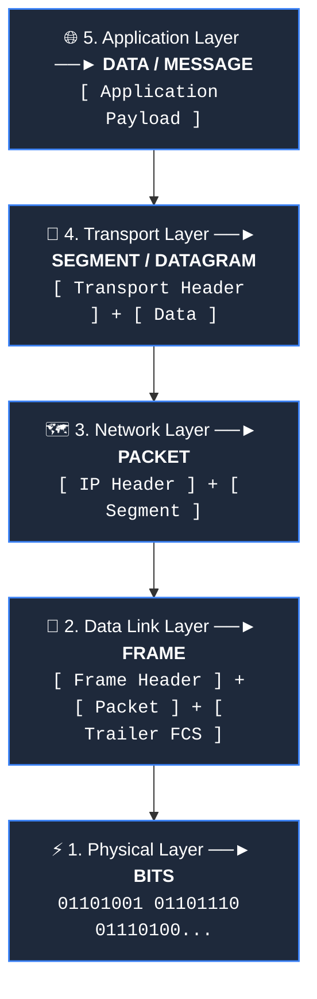
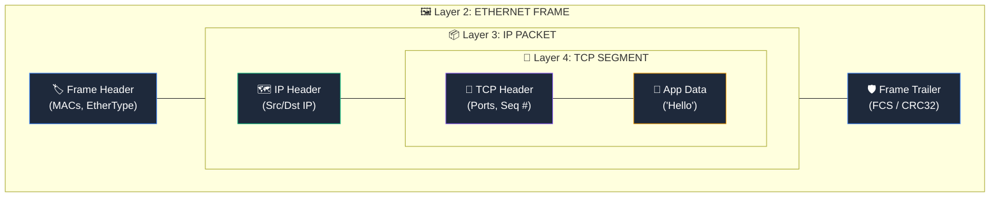
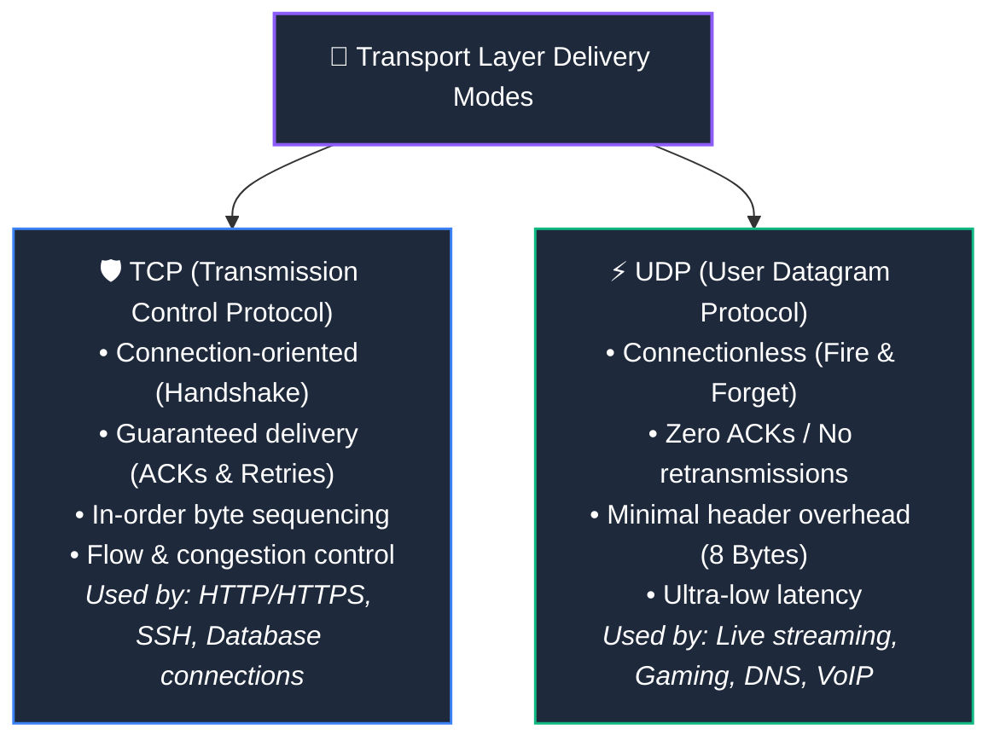
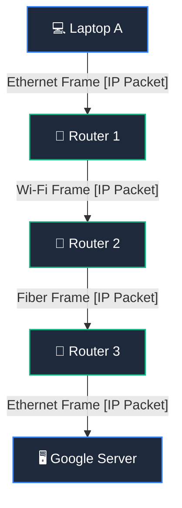

# Protocol Data Units: Segment, Packet, Frame & Bits

> [!abstract] Executive Summary
> In computer networking, data changes its formal name and structural framing at each layer of the protocol stack. A **Protocol Data Unit (PDU)** is the standardized term for a single unit of data—consisting of protocol control headers and user payload—processed at a specific layer:
> - **Application Layer:** **Data / Message**
> - **Transport Layer:** **Segment** (TCP) / **Datagram** (UDP)
> - **Network Layer:** **Packet** (IP Datagram)
> - **Data Link Layer:** **Frame**
> - **Physical Layer:** **Bits**

---

## ❓ 1. Why Does Networking Have Different Names for "Data"?

The answer lies in **layer boundaries and encapsulation scopes**:
- A router does not route "frames" or "segments"; it routes **Layer 3 Packets**.
- A switch does not forward "packets"; it forwards **Layer 2 Frames**.
- An operating system socket receives **Layer 4 Segments** and reassembles them into **Application Data**.

---

## 📦 2. Layer-by-Layer PDU Breakdown

---

### 1️⃣ Application Layer $\to$ Data / Message
- **What it is:** Raw application-generated data formatted according to application protocols (e.g., HTTP GET request, DNS query string, JSON body).
- **Addressing:** URLs, Domain Names, Object URIs.

---

### 2️⃣ Transport Layer $\to$ Segment (TCP) vs. Datagram (UDP)
- **What it is:** Application data segmented and prefixed with a **Transport Header** containing source and destination **Port Numbers** (e.g., Port 80 for HTTP, Port 443 for HTTPS, ephemeral port 54321 for client).

---

### 3️⃣ Network Layer $\to$ Packet (IP Datagram)
- **What it is:** The complete TCP segment or UDP datagram encapsulated with an **IP Header**.
- **Key Header Fields:**
  - **Source IP Address** (Sender's logical address, e.g., `192.168.1.50`).
  - **Destination IP Address** (Target's logical address, e.g., `142.250.190.46`).
  - **Time-to-Live (TTL) / Hop Limit:** Decremented by 1 at every router hop to prevent looping packets from circulating forever.
  - **Protocol Identifier:** Specifies whether the inner payload is TCP (`6`), UDP (`17`), or ICMP (`1`).

---

### 4️⃣ Data Link Layer $\to$ Frame
- **What it is:** The IP packet encapsulated with a **Frame Header** at the front and a **Frame Trailer** at the back.
- **Key Header Fields:**
  - **Source MAC Address** (48-bit physical address of the sending NIC).
  - **Destination MAC Address** (48-bit physical address of the next-hop router or local target).
  - **EtherType:** Indicates the encapsulated network layer protocol (e.g., `0x0800` for IPv4, `0x86DD` for IPv6, `0x0806` for ARP).
- **The Frame Trailer (FCS / CRC):**
  - Contains a 4-byte **Frame Check Sequence (FCS)** computed via Cyclic Redundancy Check (CRC-32). If a single bit was corrupted over the Wi-Fi or Ethernet cable, the receiving switch/NIC detects the checksum mismatch and discards the frame immediately.

---

### 5️⃣ Physical Layer $\to$ Bits
- **What it is:** The entire Frame converted into raw binary pulses (`0`s and `1`s) encoded as voltage levels on copper cables, light pulses through optical fiber, or radio waves across the air.

---

## 📊 3. Comprehensive PDU Comparison Matrix

| Layer | PDU Name | Typical Header Size | Primary Addressing Used | Intermediate Processing Device |
| :--- | :--- | :--- | :--- | :--- |
| **5. Application** | **Data / Message** | Variable (HTTP headers) | URLs, Domain Names, URIs | End Hosts (Web Browsers, Web Servers) |
| **4. Transport** | **Segment** (TCP) / **Datagram** (UDP) | 20–60 bytes (TCP) / 8 bytes (UDP) | **Port Numbers** (e.g., 80, 443, 53) | Operating System Kernel / Sockets |
| **3. Network** | **Packet** (IP Datagram) | 20–60 bytes (IPv4) / 40 bytes (IPv6) | **IP Addresses** (e.g., `192.168.1.1`) | [[Network Hardware - Hub, Switch, Router, Modem|Routers]], Layer 3 Switches |
| **2. Data Link** | **Frame** | 14 bytes header + 4 bytes FCS | **MAC Addresses** (e.g., `AA:BB:CC:11:22:33`) | [[Network Hardware - Hub, Switch, Router, Modem|Switches]], Bridges, NICs |
| **1. Physical** | **Bits** | Preamble (8 bytes) | None (Raw physical signaling) | [[Network Hardware - Hub, Switch, Router, Modem|Hubs]], Modems, Repeaters |

---

## 💡 4. Packets Are End-to-End, Frames Are Hop-by-Hop!

> [!important] The Golden Rule of Inter-Networking
> - **The IP Packet is End-to-End:** The IP packet constructed by your laptop travels all the way to the destination Google server with its Source IP and Destination IP addresses preserved intact.
> - **The Frame is Link-Local (Hop-by-Hop):** A frame only exists to carry the IP packet across **one single physical link**. At every intermediate router, the old frame is discarded and a brand new frame is created for the next medium!

---

## 🎯 5. Architectural Verification & Summary

1. **Protocol to PDU Mapping:**
   - **Application** $\to$ **Data / Message**
   - **TCP** $\to$ **Segment**
   - **IPv4** $\to$ **Packet** (IP Datagram)
   - **Ethernet** $\to$ **Frame**
2. **End-to-End vs Hop-by-Hop:**
   - IP packet payload remains unchanged end-to-end. Layer 2 frames are stripped and replaced at every routing hop to adapt to the local medium.
3. **Compound Structure Names:**
   - `TCP Header + HTTP Data` = **TCP Segment**
   - `IP Header + TCP Header + HTTP Data` = **IP Packet**

---

## 🔗 Related Notes & Next Concepts

- **Parent MOC:** [[Computer Networking/README|🌐 Computer Networks MOC]]
- **Prerequisites:**
  - [[OSI vs TCP-IP Model|🧱 Layered Network Models (OSI vs TCP/IP)]]
  - [[Network Protocols and Standards|📜 Network Protocols and Standards]]
  - [[Encapsulation and Decapsulation|📦 Encapsulation and Decapsulation]]
- **Next Logical Topics (Stage 2):**
  - [[Ethernet and MAC Addressing|🏷️ Ethernet and MAC Addressing]] — 48-bit hex MAC formatting, NICs, and Ethernet frame structures.
  - [[MTU and Fragmentation|✂️ MTU and Fragmentation]] — Maximum Transmission Unit (1500 bytes), IP packet fragmentation, and reassembly.
  - [[IP Addressing Fundamentals|🌐 IP Addressing Fundamentals]] — Deep dive into 32-bit IPv4 structure and subnetting.

