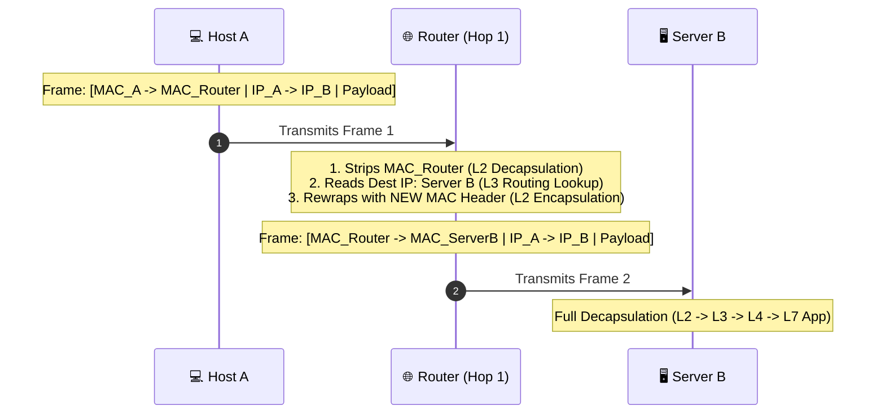
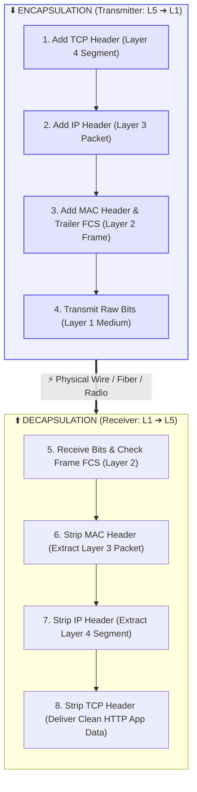

# 📦 Encapsulation and Decapsulation

> [!important] 🎯 Foundational Definitions
> - **Encapsulation:** The process where a transmitting host wraps upper-layer data with lower-layer protocol control metadata (**Headers** and optional **Trailers**) as data moves **down** the protocol stack.
> - **Decapsulation:** The reverse process where a receiving host or intermediate device strips, inspects, and interprets headers layer-by-layer as data moves **up** the protocol stack.

---

## ✉️ 1. The Nested Envelopes Analogy

> [!example] 📮 The Postal Envelope Analogy
> Imagine writing a personal letter that needs to travel internationally:
> 1. You write the raw message: `"Hello, World!"`
> 2. You place it inside an envelope marked: `[Recipient Department: Web Services]`
> 3. The mailroom places that inside an office envelope: `[Process Port #, Sequence #]`
> 4. The courier puts that inside a global shipping box: `[Source IP & Destination IP]`
> 5. The local driver places the box on a specific delivery truck: `[Local Source & Dest MAC]`
> 
> *At the destination, the process is reversed: each handler opens only their specific outer envelope and passes the remaining contents to the next internal department.*

---

## 📦 2. The Step-by-Step Encapsulation Journey

When an application generates data (e.g., sending `"Hello"` over HTTP), it travels down the stack, with each layer prepending its o```mermaid
flowchart TD
    D1["📄 1. Application Layer (Data / Message)<br><code>[ HTTP Header | 'Hello' Payload ]</code>"]
    D2["📦 2. Transport Layer (Segment / Datagram)<br><code>[ TCP Header | HTTP Header | 'Hello' Payload ]</code>"]
    D3["✉️ 3. Network Layer (Packet)<br><code>[ IP Header | TCP Header | HTTP Header | 'Hello' Payload ]</code>"]
    D4["🖼️ 4. Data Link Layer (Frame)<br><code>[ Eth Header | IP Header | TCP Header | HTTP Header | 'Hello' Payload | FCS Trailer ]</code>"]
    D5["⚡ 5. Physical Layer (Bits on the Wire)<br><code>01101001 01101110 01110100 01100101...</code>"]

    D1 -->|"+ TCP Header (Ports, Seq #, Flags)"| D2
    D2 -->|"+ IP Header (Source/Dest IP, TTL)"| D3
    D3 -->|"+ Ethernet Header (MACs) & FCS Trailer"| D4
    D4 -->|"Serialize into voltage / light / radio pulses"| D5

    classDef c1 fill:#0ea5e918,stroke:#0ea5e9,stroke-width:1.8px;
    classDef c2 fill:#6366f118,stroke:#6366f1,stroke-width:1.8px;
    classDef c3 fill:#8b5cf618,stroke:#8b5cf6,stroke-width:1.8px;
    classDef c4 fill:#10b98118,stroke:#10b981,stroke-width:1.8px;
    classDef c5 fill:#f59e0b18,stroke:#f59e0b,stroke-width:1.8px;

    class D1 c1;
    class D2 c2;
    class D3 c3;
    class D4 c4;
    class D5 c5;
```

---

## 🔍 3. The Core Concept: Header vs. Payload Is Relative!

A critical mental model in computer networking is that **what constitutes a "payload" changes at each layer**:

```text
Layer N PDU  = [ Layer N Header ] + [ Layer N Payload ]
                                            │
                                            ▼
                                (Is actually the entire
                                 Layer N+1 PDU!)
```

| Layer | Added Metadata | What It Considers Its "Payload" | Resulting PDU |
| :--- | :--- | :--- | :--- |
| **Application (L5)** | HTTP / DNS Headers | Raw Application text, JSON, HTML, video | **Data / Message** |
| **Transport (L4)** | TCP / UDP Header (Ports, Seq #) | The entire Application Message (HTTP + Data) | **Segment (TCP)** / **Datagram (UDP)** |
| **Network (L3)** | IP Header (Source/Dest IP, TTL) | The entire Transport Segment (TCP + HTTP + Data) | **Packet** (IP Datagram) |
| **Data Link (L2)** | Ethernet Header (MACs) & Trailer (FCS) | The entire Network Packet (IP + TCP + HTTP + Data) | **Frame** |
| **Physical (L1)** | Preamble / Start Frame Delimiter | The entire Data Link Frame serialized into bits | **Bits** |

> [!tip] 🔑 Key Takeaway
> To the **Network Layer (IP)**, the TCP header is not "control data"—it is just opaque, uninspected payload bytes! The IP layer only cares about its own IP header.

---

## 🔄 4. How Network Devices Inspect Envelopes (Partial Decapsulation)

Different network devices inspect only the layers relevant to their operational scope:

| Network Device | Stack Level Inspected | Actions Taken |
| :--- | :--- | :--- |
| 💻 **End Host** *(Client/Server)* | **Full Stack (L1 – L7)** | Decapsulates completely up to Application Layer. |
| 🌐 **Router** *(L3 Gateway)* | **Up to Network Layer (L1 – L3)** | Strips L2 Frame $\to$ reads Dest IP in L3 Header $\to$ wraps **NEW L2 Frame** for next hop. |
| 🔀 **Switch** *(L2 Bridge)* | **Up to Data Link Layer (L1 – L2)** | Reads Dest MAC $\to$ forwards frame without touching IP/TCP headers. |
| 🔌 **Hub** *(L1 Repeater)* | **Physical Layer Only (L1)** | Blindly regenerates raw electrical/optical bit pulses. |



> [!important] The Immutability Rule
> Notice that the **inner IP Header and Payload remain untouched** across the Internet traversal, but the **outer Ethernet Frame MAC Header changes at every single router hop**!

---

## 📊 5. Summary: Headers, Trailers & PDUs



---

## 🔗 Related Notes & Next Concepts

- **Parent MOC:** [[Computer Networking/README|🌐 Computer Networks MOC]]
- **Prerequisites:**
  - [[OSI vs TCP-IP Model|🧱 Layered Network Models (OSI vs TCP/IP)]]
  - [[Network Protocols and Standards|📜 Network Protocols and Standards]]
  - [[Network Hardware - Hub, Switch, Router, Modem|🔌 Network Hardware - Hub, Switch, Router, Modem]]
- **Next Logical Topics (Stage 2):**
  - `[[Data Units - Segment, Packet, Frame, Bits]]` — Deep dive into layer-specific PDUs.
  - `[[Ethernet and MAC Addressing]]` — 48-bit hex MAC formatting, NICs, and frame structures.
  - `[[MTU and Fragmentation]]` — Maximum Transmission Unit, IP fragmentation, and reassembly.
  - `[[IP Addressing Fundamentals]]` — How the destination and source addresses inside the IP header are structured.
