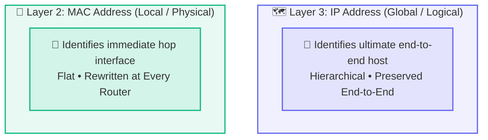
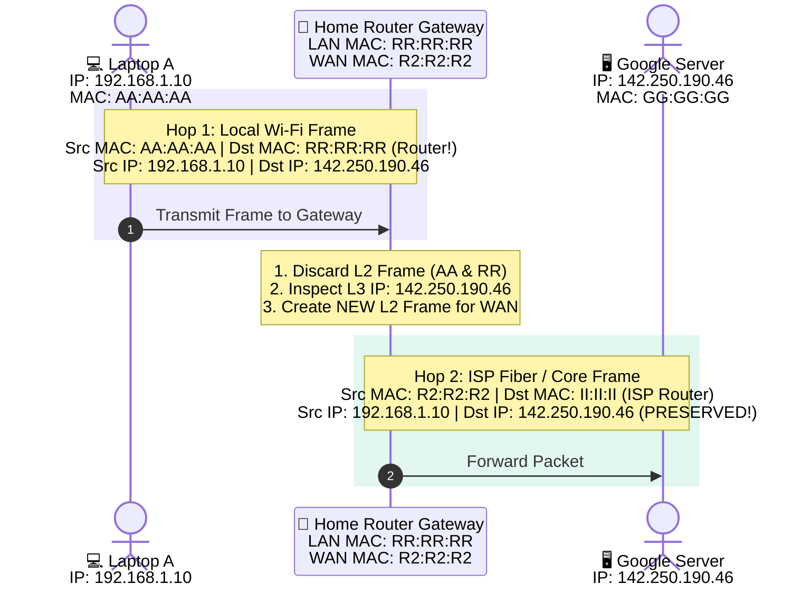
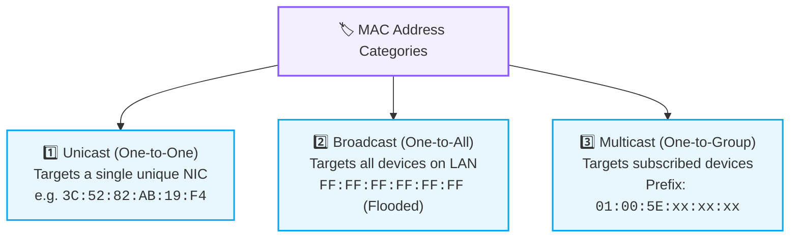

# Ethernet and MAC Addressing

> [!abstract] Executive Summary
> A **MAC Address (Media Access Control Address)** is a 48-bit (6-byte) physical hardware identifier permanently burned into or assigned to a Network Interface Controller (NIC). Operating at the **Data Link Layer (Layer 2)**, MAC addresses facilitate **hop-by-hop local link delivery**, while **IP Addresses** operate at the Network Layer (Layer 3) for **end-to-end global routing**.

---

## 🪪 1. Anatomy of a MAC Address

A standard Ethernet MAC address consists of **48 bits (6 bytes)** represented as 12 hexadecimal digits grouped into pairs separated by colons or hyphens:

```mermaid
flowchart TD
    subgraph MAC ["🪪 48-Bit (6-Byte) MAC Address: 3C:52:82:AB:19:F4"]
        direction TD
        OUI["🏢 OUI (Vendor Identifier)<br/><b>First 24 bits (3 Bytes)</b><br/><code>3C : 52 : 82</code><br/><i>Assigned by IEEE to Apple, Intel, Cisco</i>"]
        NIC["🔌 NIC Specific Serial ID<br/><b>Last 24 bits (3 Bytes)</b><br/><code>AB : 19 : F4</code><br/><i>Unique per physical chip</i>"]
        OUI --> NIC
    end

    classDef oui fill:#0ea5e918,stroke:#0ea5e9,stroke-width:1.8px;
    classDef nic fill:#10b98118,stroke:#10b981,stroke-width:1.8px;
    class MAC fill:#64748b10,stroke:#64748b60,stroke-width:1.5px,stroke-dasharray:4 4;
    class OUI oui;
    class NIC nic;
```

### Breakdown:
1. **OUI (Organizationally Unique Identifier) — First 24 bits (3 bytes):**
   - Assigned by the IEEE to hardware manufacturers (e.g., Apple, Intel, Cisco, Realtek). Identifies the device vendor.
2. **Device / NIC Identifier — Last 24 bits (3 bytes):**
   - Uniquely assigned by the manufacturer to each individual network interface card.
3. **Hexadecimal to Binary Math:**
   - Each hex digit represents 4 bits ($2^4 = 16$).
   - A pair of hex digits (e.g., `3C`) $= 8\text{ bits} = 1\text{ byte}$.
   - $6 \times 8\text{ bits} = \mathbf{48\text{ bits}}$ ($2^{48} \approx 281\text{ trillion}$ unique hardware addresses).

> [!tip] MAC Address Randomization
> While MAC addresses were historically burned permanently into hardware (BIA - Burned-In Address), modern operating systems (iOS, Android, Windows, Linux) now implement **MAC Randomization** by default on Wi-Fi networks to prevent tracking across physical locations.

---

## ⚖️ 2. The Golden Distinction: MAC vs. IP Addresses



### 🚚 The International Postal Delivery Analogy

| Addressing Concept | Physical Postal Counterpart | Function |
| :--- | :--- | :--- |
| **IP Address** | **Recipient Postal Address** (`India -> Bangalore -> Tech Park -> Room 101`) | Directs the package globally across multiple routing hubs until reaching the final destination. |
| **MAC Address** | **Current Transport Handoff** (`Truck #42 -> Sorting Bin #8 -> Courier Van #12`) | Identifies the immediate physical vehicle/interface carrying the parcel across one local leg. |

---

## 🔄 3. How a Packet Traverses Routers: The MAC vs. IP Lifecycle

What happens when your laptop (`192.168.1.10`) accesses a web server on the Internet (`142.250.190.46`)?



> [!important] Crucial Rule
> - **IP Addresses remain constant end-to-end** from the source host to the destination server.
> - **MAC Addresses change at every single router hop**, reflecting only the immediate sender and receiver on that specific local link.
> - Your laptop **never puts Google's MAC address** in a frame; it puts the **MAC address of its local default gateway (router)**!

---

## 🏷️ 4. Types of MAC Addresses



---

## 🔍 5. Real-World Deep Dive & Architectural Edge Cases

1. **Why doesn't the sending host put the remote server's MAC address in the frame?**
   - Ethernet frames cannot cross Layer 3 router boundaries. Switches only understand local MACs. Therefore, the destination MAC is set to the **local default gateway (router)**.
2. **What does the router primarily use to make forwarding decisions?**
   - Destination IP from the Layer 3 header, compared against entries in its routing table.
3. **Does the frame change as it passes through intermediate routers?**
   - **Yes.** At every hop, the router strips the old Layer 2 header/trailer and wraps the IP packet in a new Layer 2 frame with new source and destination MAC addresses.

---

## 🔗 Related Notes & Next Concepts

- **Parent MOC:** [[Computer Networking/README|🌐 Computer Networks MOC]]
- **Prerequisites:**
  - [[Network Hardware - Hub, Switch, Router, Modem|🔌 Network Hardware (Hub, Switch, Router, Modem)]]
  - [[Encapsulation and Decapsulation|📦 Encapsulation and Decapsulation]]
  - [[Data Units - Segment, Packet, Frame, Bits|📊 Data Units - Segment, Packet, Frame, Bits]]
- **Next Logical Topics (Stage 2 & 3):**
  - [[MTU and Fragmentation|✂️ MTU and Fragmentation]] — Maximum Transmission Unit (1500-byte Ethernet limit) and IP fragmentation.
  - [[IP Addressing Fundamentals|🌐 IP Addressing Fundamentals]] — Deep dive into 32-bit IPv4 structure, classes, and subnetting.

