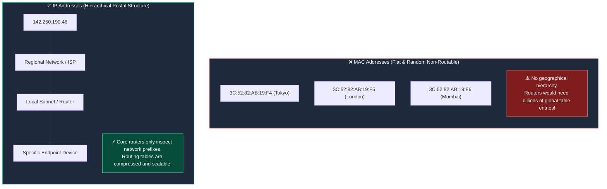

# 🔢 IP Addressing Fundamentals (IPv4 & Binary Basics)

> [!important] 🎯 Executive Summary
> An **IP Address (Internet Protocol Address)** is a logical, hierarchical numerical label assigned to every device connected to an IP network. Operating at the **Network Layer (Layer 3)**, IP addresses enable universal routing, identifying both the **network** a device belongs to and the **specific host** within that network.

---

## ❓ 1. Why Do We Need IP Addresses If We Already Have MAC Addresses?

A beginner might ask: *"If every device already has a unique MAC address, why can't routers just use MAC addresses to route packets across the Internet?"*

### The Flat vs. Hierarchical Addressing Problem



- **MAC addresses are "flat":** They contain no geographic or network hierarchy. If the global Internet routed via MAC addresses, every core router on Earth would need a routing table containing **billions of individual entries**, causing Internet routers to run out of memory and collapse.
- **IP addresses are "hierarchical" (like a postal address):** Core routers only need to inspect the top-level network prefix to forward packets toward the right continent/city/ISP, dramatically compressing routing tables.

---

## 🔢 2. The 32-Bit Structure of IPv4

An **IPv4 Address** is a **32-bit binary number**. Because reading 32 ones and zeros is impossible for humans, it is formatted using **Dotted-Decimal Notation**:

| Octet 1 (8 bits) | Octet 2 (8 bits) | Octet 3 (8 bits) | Octet 4 (8 bits) |
| :---: | :---: | :---: | :---: |
| **`192`** | **`168`** | **`1`** | **`10`** |
| `11000000` | `10101000` | `00000001` | `00001010` |

### Why Does Each Number Range Strictly From 0 to 255?
- Each section is called an **Octet** because it consists of **8 binary bits**.
- With 8 bits, the minimum possible value is all zeros (`00000000` $= 0$).
- The maximum possible value is all ones (`11111111` $= 2^7 + 2^6 + 2^5 + 2^4 + 2^3 + 2^2 + 2^1 + 2^0 = 255$).
- Total unique values per octet = $2^8 = \mathbf{256\text{ values}}$ ($0$ through $255$).
- **Total IPv4 Address Space:** $2^{32} = \mathbf{4,294,967,296}$ (approx. $4.29\text{ billion}$ addresses).

> [!caution] 🚫 Invalid IPv4 Addresses
> Any address with a number outside $0 - 255$ is mathematically impossible in IPv4 (e.g., `192.168.1.300` ❌ is invalid).

---

## 🧮 3. Binary to Decimal Conversion (The 8-Bit Magic Table)

To master subnetting, you must memorize the positional values of an 8-bit octet from left to right:

| Bit Position | $2^7$ | $2^6$ | $2^5$ | $2^4$ | $2^3$ | $2^2$ | $2^1$ | $2^0$ |
| :--- | :---: | :---: | :---: | :---: | :---: | :---: | :---: | :---: |
| **Decimal Place Value** | **`128`** | **`64`** | **`32`** | **`16`** | **`8`** | **`4`** | **`2`** | **`1`** |

### 🔢 Converting Decimal to Binary: `192.168.1.10`

1. **Octet 1 (`192`):** $128 + 64 = 192 \implies \mathbf{11000000_2}$
2. **Octet 2 (`168`):** $128 + 32 + 8 = 168 \implies \mathbf{10101000_2}$
3. **Octet 3 (`1`):** $1 \implies \mathbf{00000001_2}$
4. **Octet 4 (`10`):** $8 + 2 = 10 \implies \mathbf{00001010_2}$

```text
Complete Binary Representation:
192.168.1.10  =  11000000.10101000.00000001.00001010
```

### ⚡ Quick-Fire Binary to Decimal Examples

| Binary Octet | Place Value Calculation ($128, 64, 32, 16, 8, 4, 2, 1$) | Decimal Equivalent |
| :--- | :--- | :--- |
| `00000001` | $1$ | **$1$** |
| `00000100` | $4$ | **$4$** |
| `00001000` | $8$ | **$8$** |
| `00001010` | $8 + 2$ | **$10$** |
| `00010000` | $16$ | **$16$** |
| `11111111` | $128 + 64 + 32 + 16 + 8 + 4 + 2 + 1$ | **$255$** |

---

## 📊 4. MAC Address vs. IPv4 Address

| Dimension | MAC Address | IPv4 Address |
| :--- | :--- | :--- |
| **OSI Layer** | **Layer 2** (Data Link Layer) | **Layer 3** (Network Layer) |
| **Address Length** | **48 bits** (6 bytes) | **32 bits** (4 bytes) |
| **Format** | Hexadecimal (`3C:52:82:AB:19:F4`) | Dotted-Decimal (`192.168.1.10`) |
| **Addressing Structure** | **Flat** (OUI + Serial ID) | **Hierarchical** (Network ID + Host ID) |
| **Scope of Delivery** | Hop-by-hop local link (changes per router hop) | End-to-end global delivery (preserved throughout) |
| **Assignment** | Burned into NIC hardware / randomized by OS | Assigned dynamically (DHCP) or statically by network admin |

---

## 🔗 Related Notes & Next Concepts

- **Parent MOC:** [[Computer Networking/README|🌐 Computer Networks MOC]]
- **Prerequisites:**
  - [[OSI vs TCP-IP Model|🧱 Layered Network Models (OSI vs TCP/IP)]]
  - [[Ethernet and MAC Addressing|🪪 Ethernet and MAC Addressing]]
  - [[MTU and Fragmentation|📏 MTU and IP Fragmentation]]
- **Next Logical Topics (Stage 3 — IP Addressing & Subnetting I):**
  - `[[Network ID and Host ID]]` — Splitting the 32 bits into the Network Prefix and Host identifier.
  - `[[Subnet Masks and CIDR Notation]]` — Classless Inter-Domain Routing (`/24`, `/26`, prefix lengths).
  - `[[Special IP Addresses]]` — Public vs Private (RFC 1918), Loopback (`127.0.0.1`), APIPA, Broadcast.
