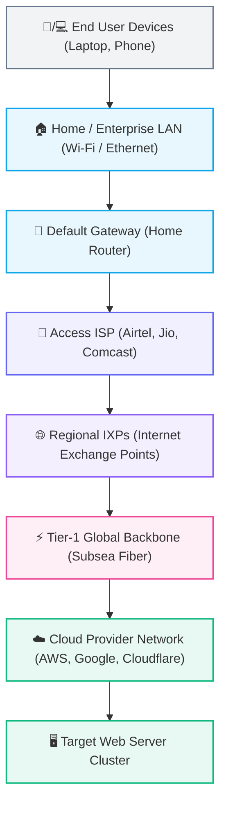
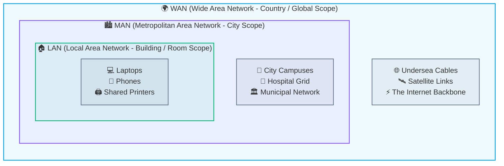
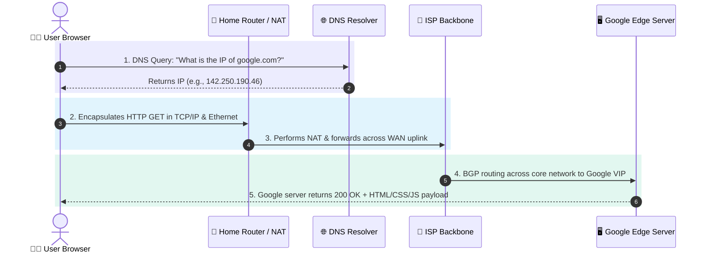
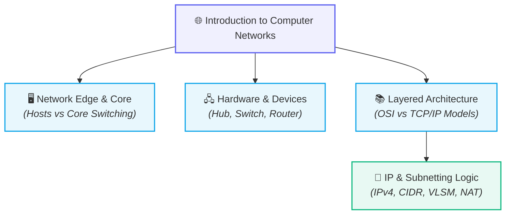

# 🌐 Introduction to Computer Networks

> [!important] 🎯 Key Definition
> A **Computer Network** is an interconnected collection of autonomous computing devices (hosts/nodes) capable of communicating with each other and sharing hardware, software, and data resources over physical or wireless transmission media.

---

## 🌟 1. Why Do Networks Exist?

Without a network, moving data between two isolated computing devices requires a physical storage medium (often humorously termed *Sneake```mermaid
flowchart TD
    subgraph WithoutNetwork["❌ Without Network (Sneakernet)"]
        direction TD
        HostA1["💻 Host A"] --> USB["💾 Physical USB Drive"] --> HostB1["💻 Host B"]
    end

    subgraph WithNetwork["✅ With Network (Instant Transfer)"]
        direction TD
        HostA2["💻 Host A"] ==="⚡ Transmission Media (Fiber/Wireless)"===> HostB2["💻 Host B"]
    end

    classDef danger fill:#f43f5e18,stroke:#f43f5e,stroke-width:1.8px;
    classDef success fill:#10b98118,stroke:#10b981,stroke-width:1.8px;
    classDef usb fill:#f59e0b18,stroke:#f59e0b,stroke-width:1.8px;

    class WithoutNetwork,HostA1,HostB1 danger;
    class WithNetwork,HostA2,HostB2 success;
    class USB usb;
```

### Core Motivations & Use Cases

1. 💬 **Communication & Collaboration:** Real-time data transfer between endpoints across arbitrary distances (chat applications, video streams, messaging protocols).
2. 🖨️ **Resource Sharing:** Multiple machines accessing centralized hardware or software resources without duplication (shared network printers, storage-attached networks (SAN), database clusters).
3. 📁 **File Sharing & Data Transfer:** High-speed, automated movement of files across distributed hosts without manual physical interventions.
4. 🌍 **Internet & Global Connectivity:** Interconnecting local machines to globally reachable public servers and distributed services.
5. ⚡ **Distributed Computing & Microservices:** Modern systems split computational workloads across specialized nodes (Frontend $\rightarrow$ API Gateway $\rightarrow$ Database $\rightarrow$ Cache).

---

## 🌐 2. What Is the Internet?

> [!abstract] 🧠 Fundamental Mental Model
> The **Internet is NOT a single giant computer**, nor is it a single unified centralized server.  
> It is an **interconnected "network of networks"** (*inter-network*).

### The Structural Hierarchy

No single organization owns the Internet. Instead, millions of private, public, academic, business, and government networks connect to each other through standardized protocols.



---

## 🗺️ 3. Classification of Networks by Geographical Scope

Networks are primarily categorized based on the physical distance between nodes and their administrative ownership:



### 1. 🏠 LAN (Local Area Network)
- **Scope:** Confined to a geographically small area (a single home, office room, university laboratory, or single building).
- **Ownership:** Privately owned and administered by an individual or single organization.
- **Characteristics:** Extremely high data transfer rates (1 Gbps – 10 Gbps+), low latency ($<1\text{ ms}$), very low error rates, lower cabling/hardware costs.
- **Example:** Devices in your home connected to your Wi-Fi router (laptop, smartphone, smart TV, home NAS).

### 2. 🏙️ MAN (Metropolitan Area Network)
- **Scope:** Larger than a LAN, covering an entire town, municipality, or metropolitan city area (typically 5 km to 50 km).
- **Ownership:** Usually owned by a consortium of users, a single large enterprise (e.g., a smart city project), or a telecom provider.
- **Characteristics:** Moderate-to-high speeds, moderate latency, bridges multiple distinct LANs together across town.
- **Example:** A municipal cable television network, a city-wide police monitoring camera grid, or a multi-campus university network across a city.

### 3. 🌍 WAN (Wide Area Network)
- **Scope:** Spans vast geographical boundaries—cities, regions, countries, or entire continents (spanning thousands of kilometers).
- **Ownership:** Multiple public and private entities, telecom carriers, and transit providers interconnected.
- **Characteristics:** Highly complex routing, variable transmission speeds, higher propagation delays and latency, relies on leased telecommunications lines and undersea fiber-optic cables.
- **Example:** The **Internet** is the largest public implementation of a WAN.

---

### 📊 Comparative Summary: LAN vs. MAN vs. WAN

| Parameter | 🏠 LAN (Local Area Network) | 🏙️ MAN (Metropolitan Area Network) | 🌍 WAN (Wide Area Network) |
| :--- | :--- | :--- | :--- |
| **Geographic Scope** | Small (Room, Home, Single Building) | Moderate (City or Metro Area) | Vast (Country, Continent, Global) |
| **Coverage Radius** | Typically $< 1\text{ km}$ | $5\text{ km} - 50\text{ km}$ | $100\text{ km} - 100,000+\text{ km}$ |
| **Data Rate (Speed)** | Very High (100 Mbps – 1 Gbps+) | Moderate to High (100 Mbps – 1 Gbps) | Variable / Lower relative to distance |
| **Propagation Delay** | Negligible ($< 1\text{ ms}$) | Low to Moderate ($1\text{ ms} - 10\text{ ms}$) | High ($20\text{ ms} - 250+\text{ ms}$) |
| **Bit Error Rate** | Extremely Low (clean physical media) | Moderate | Higher (noise over long distances) |
| **Ownership** | Private (Homeowner / Company) | Private or Public Consortium / ISP | Distributed across multiple carriers |
| **Hardware Used** | Ethernet cables, Wi-Fi APs, Switches | Routers, Microwave links, City Fiber | Core Routers, Satellites, Submarine Cables |

---

## 🔍 4. The Anatomy of a Web Request (Mental Model: Opening `google.com`)

When you open a web browser, type `google.com`, and press **Enter**, what actually happens across the network layers?



### Step-by-Step Breakdown:

1. **DNS Resolution (Host-Level Address Translation):**
   - Humans remember names (`google.com`); network routing hardware requires numerical **IP addresses** (e.g., `142.250.190.46`).
   - The operating system checks its local DNS cache. If not found, it queries a configured **[[DNS]]** resolver.
2. **Packetization & Encapsulation:**
   - The browser crafts an HTTP/HTTPS GET request payload.
   - The OS encapsulates it into a **TCP Segment** (specifying source/destination ports like 443), an **IP Packet** (with destination IP), and an **Ethernet Frame** (with the router's local MAC address).
3. **Local Egress (LAN $\rightarrow$ Default Gateway):**
   - The laptop transmits the signal over Wi-Fi or Ethernet to the local default gateway (the home router).
4. **ISP Routing & Internet Core Traversal:**
   - The router uses **[[Network Address Translation (NAT)]]** and forwards the packet onto the ISP's network.
   - The ISP routers inspect the destination IP address in the packet header and use dynamic routing protocols (such as BGP and OSPF) to forward the packet hop-by-hop across the network core.
5. **Destination Ingress & Response:**
   - The packet reaches Google's edge network and reverse-proxy load balancers.
   - Google's web server processes the request, constructs an HTTP response containing HTML/CSS/JS, and sends it back across the reverse route to your browser.

---

## 🧭 5. Conceptual Relationships & Next Steps



### Related Notes

- **Upstream Overview:** [[Computer Networking/README|🌐 Computer Networks MOC]]
- **Next Logical Topics:**
  - `[[Network Edge and Core]]` — Understand hosts, access networks, and packet-switched routing cores.
  - `[[Network Hardware - Hub, Switch, Router, Modem]]` — How Layer 1, Layer 2, and Layer 3 devices operate.
  - `[[OSI vs TCP-IP Model]]` — The foundational layered protocol architectures.
  - `[[IP Addressing Fundamentals]]` — Deep dive into 32-bit addresses, classes, and binary arithmetic.
- **Cross-Domain Concepts:**
  - [[WebDev/Backend/README|Web Development & Backend Architecture]]
  - [[Operating Systems]] — Socket programming and network system calls.
