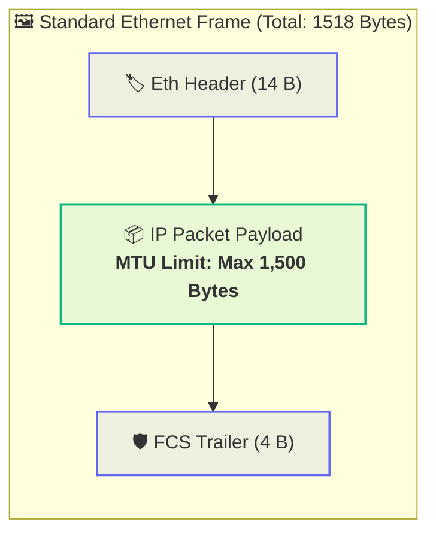
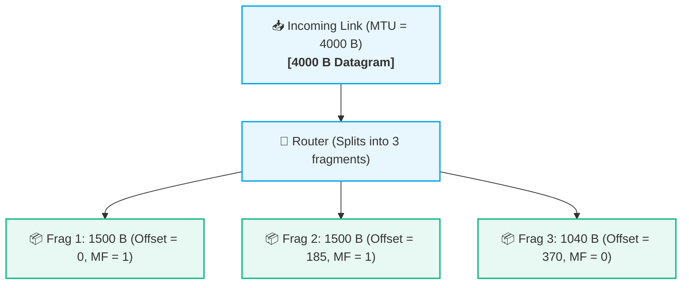
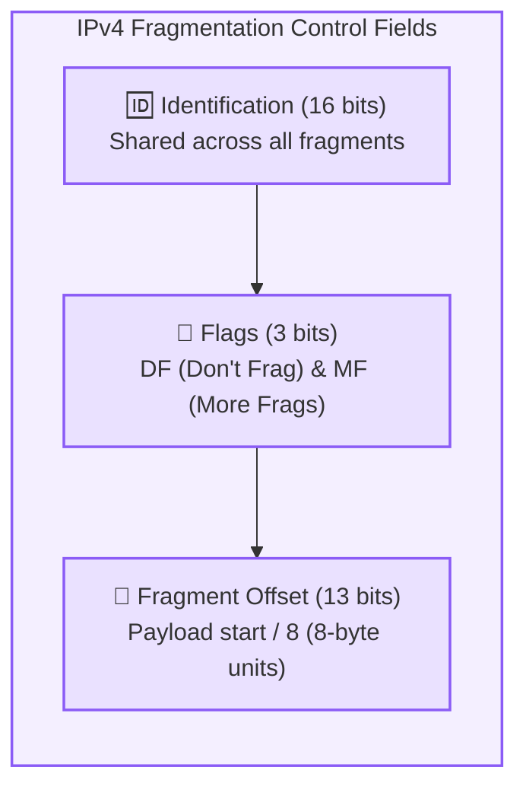

# MTU and IP Fragmentation

> [!abstract] Executive Summary
> - **MTU (Maximum Transmission Unit):** The maximum size (in bytes) of a Network Layer (Layer 3) packet that can be transmitted in a single Data Link Layer (Layer 2) frame over a specific physical link without needing fragmentation.
> - **Standard Ethernet MTU:** **1,500 bytes** of IP packet payload.
> - **IP Fragmentation:** The process of breaking a large IP packet into smaller individual fragments when the packet's total size exceeds the outbound link's MTU.

---

## 📏 1. What is MTU?

Physical link technologies cannot carry arbitrarily large frames. Every link-layer protocol defines a hard upper bound on the size of its payload:

### Common Link Layer MTU Standards:
- **Standard Ethernet (802.3):** $1,500\text{ bytes}$
- **Wi-Fi (802.11):** Up to $2,272\text{ bytes}$
- **Jumbo Frames (Data Centers):** $9,000\text{ bytes}$
- **PPPoE (DSL Broadband):** $1,492\text{ bytes}$
- **IPv6 Minimum Required MTU:** $1,280\text{ bytes}$

> [!warning] Units Distinction: Bytes vs. Bits
> - **MTU** is measured in **Bytes** (e.g., $1500\text{ B} = 12,000\text{ bits}$).
> - **Bandwidth** is measured in **Bits per second** (e.g., $100\text{ Mbps} = 100,000,000\text{ bps}$).
> - $1\text{ Byte} = 8\text{ bits}$.

---

## ✂️ 2. What is IP Fragmentation?

When a host or intermediate router receives an IP packet that needs to be forwarded out of an interface whose **MTU is smaller than the packet size**, the packet must be divided into smaller pieces called **fragments**:

Each fragment becomes its own independent IP packet with its own IP header and is routed separately toward the destination.

---

## 🧩 3. How IPv4 Fragmentation Works: The 3 Header Fields

To allow the destination host to reassemble the fragments into the original pristine packet, the **IPv4 Header** contains three dedicated fields:

1. **Identification (16 bits):**
   - A unique identifier assigned by the sender. **All fragments originating from the same packet share the exact same ID**.
2. **Flags (3 bits):**
   - **Bit 0:** Reserved (must be `0`).
   - **Bit 1 - DF (Don't Fragment):**
     - If `DF = 1`: The router is **forbidden** from fragmenting the packet. If the packet exceeds MTU, the router **drops the packet** and sends back an `ICMP Type 3 Code 4` error (*"Fragmentation Needed and DF set"*).
     - If `DF = 0`: The router is permitted to fragment the packet.
   - **Bit 2 - MF (More Fragments):**
     - If `MF = 1`: There are more fragments following this one.
     - If `MF = 0`: This is the **last fragment** of the original packet.
3. **Fragment Offset (13 bits):**
   - Specifies the position of this fragment's data relative to the beginning of the original unfragmented payload.
   - **Measured in 8-byte (64-bit) blocks** (Offset = $\frac{\text{Byte Position}}{8}$). Therefore, every fragment payload (except the last) must be a **multiple of 8 bytes**.

---

## 🔢 4. Step-by-Step Numerical Walkthrough

Suppose an IP packet of total size **$4,000\text{ bytes}$** (20-byte IP header + 3,980-byte data payload, $\text{ID} = 777$) encounters a link with **$\text{MTU} = 1,500\text{ bytes}$**:

- Maximum available space for payload per fragment = $1500 - 20\text{ (Header)} = 1480\text{ bytes}$.
- $1480$ is divisible by $8$ ($1480 / 8 = 185$).

### Fragment Breakdown:

| Fragment # | Header Size | Payload Size | Total Size | ID | MF Flag | Fragment Offset (8-byte units) | Byte Range Carried |
| :--- | :--- | :--- | :--- | :--- | :--- | :--- | :--- |
| **Fragment 1** | 20 B | 1480 B | **1500 B** | 777 | **`1`** (More) | $\frac{0}{8} = \mathbf{0}$ | Bytes $0 - 1479$ |
| **Fragment 2** | 20 B | 1480 B | **1500 B** | 777 | **`1`** (More) | $\frac{1480}{8} = \mathbf{185}$ | Bytes $1480 - 2959$ |
| **Fragment 3** | 20 B | 1020 B | **1040 B** | 777 | **`0`** (Last) | $\frac{2960}{8} = \mathbf{370}$ | Bytes $2960 - 3979$ |

> [!important] Reassembly Rule
> **Reassembly is ALWAYS performed at the Destination End Host**, never at intermediate routers! Intermediate routers forward fragments independently without waiting or buffering.

---

## ⚔️ 5. IPv4 vs. IPv6 Fragmentation

| Feature | IPv4 | IPv6 |
| :--- | :--- | :--- |
| **Router Fragmentation** | **Allowed** (Intermediate routers can fragment if `DF=0`) | **Strictly Forbidden** (Routers never fragment) |
| **Handling Oversized Packets** | Routers fragment or drop if `DF=1` | Routers **drop packet** and return ICMPv6 *"Packet Too Big"* |
| **Path MTU Discovery (PMTUD)** | Optional | **Mandatory** (Host learns lowest MTU along the path) |
| **Fragmentation Location** | Performed by Sender or Intermediate Routers | Performed **exclusively by the Sending Host** |
| **Header Fields** | In core IPv4 base header | In separate **IPv6 Fragmentation Extension Header** |

---

## 🚫 6. Why Modern Networks Avoid Fragmentation

1. **Catastrophic Loss Multiplier:** If even **1 single fragment** is lost or corrupted in transit, the entire 4,000-byte datagram fails checksum at the receiver, forcing the transport layer (TCP) to retransmit the entire stream.
2. **Router CPU Overhead:** Generating multiple headers and splitting buffers consumes expensive router CPU cycles.
3. **Firewall / NAT Complications:** Subsequent fragments lack Layer 4 port headers (which are only in Fragment 1), making stateful firewall inspection complex.

---

## 🎯 7. Architectural Verification & Key Takeaways

1. **MTU Definition:** Maximum Transmission Unit defines the largest Layer 3 packet size a Layer 2 frame can encapsulate without splitting.
2. **Standard Ethernet MTU:** 1,500 bytes.
3. **Reassembly Endpoint:** Always at the destination host (never in the router mesh).
4. **IPv6 Modernization:** Deprecated router-side fragmentation completely, shifting full responsibility to host-level Path MTU Discovery (PMTUD).

---

## 🔗 Related Notes & Next Concepts

- **Parent MOC:** [[Computer Networking/README|🌐 Computer Networks MOC]]
- **Prerequisites:**
  - [[Encapsulation and Decapsulation|📦 Encapsulation and Decapsulation]]
  - [[Data Units - Segment, Packet, Frame, Bits|📊 Data Units - Segment, Packet, Frame, Bits]]
  - [[Ethernet and MAC Addressing|🪪 Ethernet and MAC Addressing]]
- **Next Logical Topics (Stage 3 — IP Addressing & Subnetting):**
  - [[IP Addressing Fundamentals|🌐 IP Addressing Fundamentals]] — Structure of 32-bit IPv4 addresses, dotted-decimal notation, and binary arithmetic.
  - [[Network ID and Host ID|🎯 Network ID and Host ID]] — Network prefix vs. host identifier.
  - [[Subnet Masks and CIDR Notation|🎭 Subnet Masks and CIDR Notation]] — Classless Inter-Domain Routing (`/24`, `/26`, prefix lengths).

