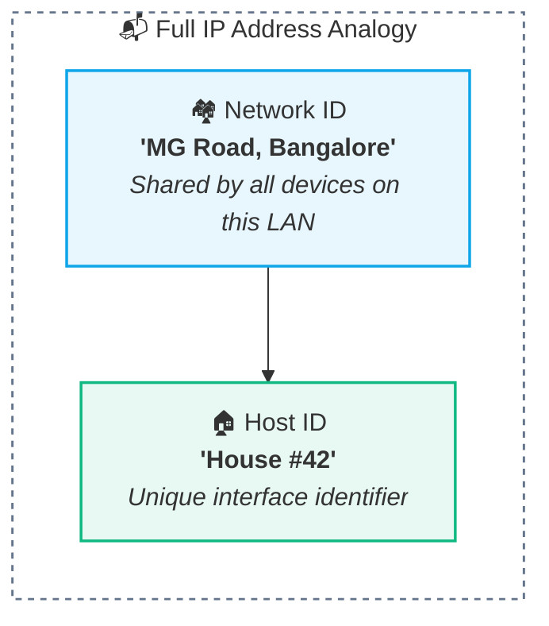
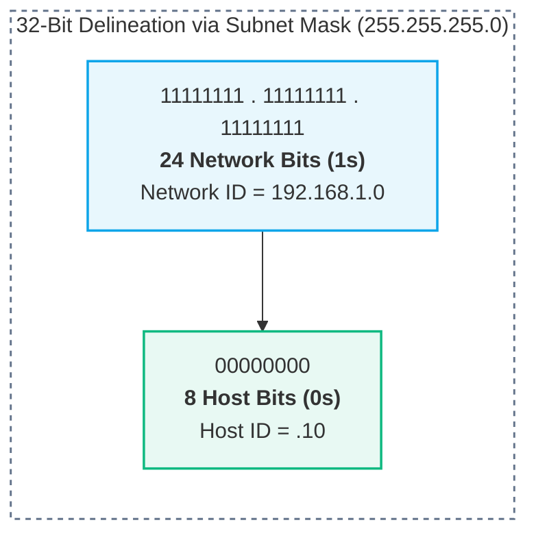

# Network ID and Host ID

> [!abstract] Foundational Concept
> Every 32-bit IPv4 address is fundamentally split into two logical components:
> 1. **Network ID (Network Prefix):** Identifies the specific network, subnet, or autonomous domain the device belongs to.
> 2. **Host ID (Host Identifier):** Identifies the specific device, computer, or interface within that network.

---

## 🏘️ 1. The Street Name & House Number Analogy

Think of how postal mail is delivered to a physical residence:

In computer networking:
- All devices connected to the **same local network/LAN share the exact same Network ID**.
- Each individual machine on that network is assigned a **unique Host ID**.

| Device | Full IP Address | Network ID Portion | Host ID Portion |
| :--- | :--- | :--- | :--- |
| 💻 Laptop | `192.168.1.10` | `192.168.1` | `.10` |
| 📱 Phone | `192.168.1.20` | `192.168.1` | `.20` |
| 🖨️ Printer | `192.168.1.50` | `192.168.1` | `.50` |

---

## 🚨 2. The Core Dilemma: Where Does the Split Occur?

Looking at an IPv4 address in isolation:

`192.168.1.10`

**It is impossible to know where the Network portion ends and the Host portion begins!**

Could the boundary be:
- **Option A:** First 3 octets are Network (`192.168.1`), last octet is Host (`.10`)?
- **Option B:** First 2 octets are Network (`192.168`), last 2 octets are Host (`.1.10`)?
- **Option C:** First 26 bits are Network, remaining 6 bits are Host?

> [!caution] Golden Rule of IP Addressing
> **An IP address ALONE has no inherent boundary.** You CANNOT determine the network ID without a companion **Subnet Mask**.

---

## 🥸 3. Enter the Subnet Mask

A **Subnet Mask** is another 32-bit binary number paired with an IP address. It uses continuous binary `1`s and `0`s to strictly delineate the boundary:

- **Contiguous `1`s:** Mask the **Network portion**.
- **Contiguous `0`s:** Mask the **Host portion**.

### Resulting Split:
- **Network ID:** `192.168.1.0` (Identifies the entire subnet)
- **Host ID:** `.10` (Identifies this specific laptop)

---

## 🧮 4. 8-Bit Binary Place Value Breakdown

An 8-bit octet sums to **255** when all bits are `1`:

| $2^7$ | $2^6$ | $2^5$ | $2^4$ | $2^3$ | $2^2$ | $2^1$ | $2^0$ | Total Sum |
| :---: | :---: | :---: | :---: | :---: | :---: | :---: | :---: | :---: |
| 128 | 64 | 32 | 16 | 8 | 4 | 2 | 1 | **255** |

$$\sum_{i=0}^7 2^i = 128 + 64 + 32 + 16 + 8 + 4 + 2 + 1 = 255$$

---

## 🎯 5. IPv4 Bitwise & Numerical Principles

| Principle | Specification | Rule & Reasoning |
| :--- | :--- | :--- |
| **Total IPv4 Bit Length** | **32 bits** | 4 octets $\times$ 8 bits = 32 bits ($2^{32} \approx 4.29\text{ billion}$ total addresses). |
| **Octet Capacity** | **8 bits ($0 - 255$)** | Range: $00000000_2$ to $11111111_2$. Any value $> 255$ (e.g. `192.168.1.300`) is invalid. |
| **Binary Conversion Example** | `00001010` $\to$ **10** | $(1 \times 8) + (1 \times 2) = 10$. |
| **Subnet Boundary** | Defined by Mask | Only the mask determines which bits belong to the network prefix. |

---

## 🔗 Related Notes & Next Concepts

- **Parent MOC:** [[Computer Networking/README|🌐 Computer Networks MOC]]
- **Prerequisites:**
  - [[IP Addressing Fundamentals|🌐 IP Addressing Fundamentals]]
  - [[Ethernet and MAC Addressing|🏷️ Ethernet and MAC Addressing]]
- **Next Logical Topics (Stage 3 — IP Addressing & Subnetting I):**
  - [[Subnet Masks and CIDR Notation|🎭 Subnet Masks and CIDR Notation]] — Classless Inter-Domain Routing (`/24`, `/26`, prefix lengths, bitwise ANDing).
  - [[Packets and Packet Switching|📦 Packets and Packet Switching]] — Store and forward routing mechanics.

