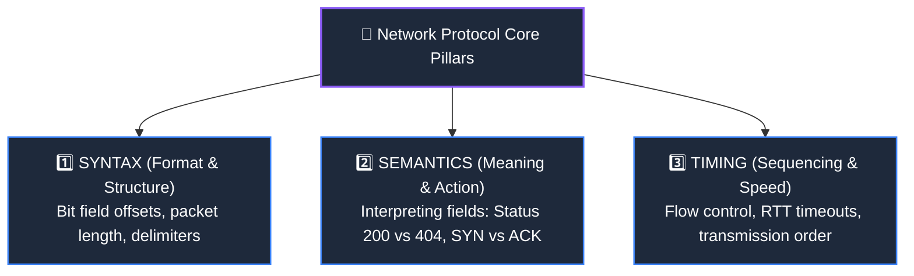
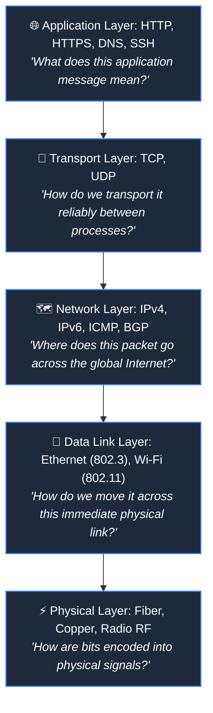

# Network Protocols and Standards

> [!abstract] Key Definition
> A **Network Protocol** is a standardized, agreed-upon set of rules, conventions, and data formats that govern how computing devices exchange information across a network. It dictates the structure of messages, the meaning of each bit field, and the required actions upon sending or receiving data.

---

## ❓ 1. Why Do Networks Need Protocols?

Imagine transmitting a continuous stream of raw binary bits over a wire:

`10110100101100101000111010110101001010110...`

Without an agreed-upon protocol, a receiving computer has no way to answer fundamental questions:
- **Framing / Delimitation:** Where does the message start and where does it end?
- **Addressing:** Who sent this message, and who is the intended recipient?
- **Type / Purpose:** Is this an email, a web page, an audio chunk, or a routing update?
- **Error Detection:** Did electromagnetic noise flip bit #42 during transit?
- **Action / State:** What response or state transition is expected next?

> [!example] Protocol as a Human Agreement Analogy
> If two people agree: *"Whenever I raise my open hand 🙋, it means STOP"*, they have established a protocol.  
> Without that shared agreement, raising a hand is just a random physical motion. In networking, protocols give meaning to physical voltage pulses and light flickers.

---

## 🏛️ 2. The Three Fundamental Pillars of Any Protocol

In computer science, every formal network protocol is defined by three indispensable attributes:

1. **Syntax (Structure & Format):**
   - Refers to the physical layout and sequence of data fields within the message.
   - *Example:* The first 4 bits of an IPv4 header represent the Version field, followed by 4 bits for Header Length (IHL).
2. **Semantics (Meaning & Interpretation):**
   - Refers to the specific meaning assigned to each pattern of bits and what action/response must be taken.
   - *Example:* An HTTP status code `200` means *"Success/OK"*, while `404` means *"Resource Not Found"*. A TCP flag with `SYN=1` means *"Requesting connection establishment"*.
3. **Timing (Synchronization & Sequencing):**
   - Specifies **when** data should be transmitted, how fast it can be sent (flow control), and how timeouts/retransmissions are handled when packets are delayed or lost.
   - *Example:* If a TCP sender does not receive an ACK within a calculated Round-Trip Time timeout ($RTO$), it retransmits the segment.

---

## 🥞 3. The "Stack of Agreements"

Rather than designing one massive, unwieldy protocol that attempts to solve every networking problem at once, networks use specialized protocols operating at different layers of the [[OSI vs TCP-IP Model|protocol stack]]:

### Core Protocols at a Glance:

| Protocol | Layer | Primary Responsibility | Key Function |
| :--- | :--- | :--- | :--- |
| **HTTP / HTTPS** | Layer 5 (App) | Web Communication | Defines request methods (`GET`, `POST`) and response headers. |
| **DNS** | Layer 5 (App) | Name Resolution | Translates human-friendly domain names (`google.com`) to IP addresses. |
| **TCP** | Layer 4 (Transport) | Reliable Transport | Guarantees ordered, lossless delivery with connection handshakes and ACKs. |
| **UDP** | Layer 4 (Transport) | Fast Datagram Transport | Lightweight, low-overhead transport for real-time video/gaming without retries. |
| **IP (IPv4/IPv6)** | Layer 3 (Network) | Logical Routing | Provides global addressing and hop-by-hop packet forwarding across routers. |
| **Ethernet / Wi-Fi** | Layer 2 (Data Link) | Local Frame Delivery | Handles hop-by-hop framing, MAC addressing, and collision avoidance over local media. |

---

## 📜 4. Open Standards & Standards Bodies

To prevent individual corporations from locking users into proprietary, non-interoperable networking ecosystems, Internet protocols are published as open public standards:

- **IETF (Internet Engineering Task Force):** Develops and standardizes Internet protocols via **RFCs (Request for Comments)** (e.g., RFC 791 for IPv4, RFC 793 for TCP, RFC 9110 for HTTP).
- **IEEE (Institute of Electrical and Electronics Engineers):** Standardizes physical and local data link architectures (e.g., IEEE 802.3 for Ethernet, IEEE 802.11 for Wi-Fi).
- **W3C (World Wide Web Consortium):** Standardizes web technologies (HTML, DOM, WebSockets).

---

## 🎯 5. Quick Check: Matching Protocols to Responsibilities

| Responsibility | Matching Protocol | Rationale |
| :--- | :--- | :--- |
| **A. Web communication** | **HTTP / HTTPS** | Application-layer protocol structuring client-server web interactions. |
| **B. Reliable transport** | **TCP** | Transport-layer protocol providing byte-stream reliability and ordering. |
| **C. Addressing/routing packets** | **IP (IPv4/IPv6)** | Network-layer protocol assigning logical addresses and determining global routing. |
| **D. Local Ethernet/Wi-Fi communication** | **Ethernet / Wi-Fi (802.3/802.11)** | Data link protocols managing local hop transmission and MAC addressing. |

---

## 🔗 Related Notes & Next Concepts

- **Parent MOC:** [[Computer Networking/README|🌐 Computer Networks MOC]]
- **Prerequisites:**
  - [[Introduction to Computer Networks|🌍 Introduction to Computer Networks]]
  - [[OSI vs TCP-IP Model|🧱 Layered Network Models (OSI vs TCP/IP)]]
- **Next Logical Topics (Stage 2):**
  - [[Encapsulation and Decapsulation|📦 Encapsulation and Decapsulation]] — How each protocol adds its header metadata to wrap payloads into segments, packets, and frames.
  - [[Data Units - Segment, Packet, Frame, Bits|📊 Data Units - Segment, Packet, Frame, Bits]] — Deep dive into layer-specific PDUs.
  - [[Ethernet and MAC Addressing|🏷️ Ethernet and MAC Addressing]] — 48-bit hex MAC formatting, NICs, and frame structures.
  - [[MTU and Fragmentation|✂️ MTU and Fragmentation]] — Maximum Transmission Unit, IP fragmentation, and reassembly.

