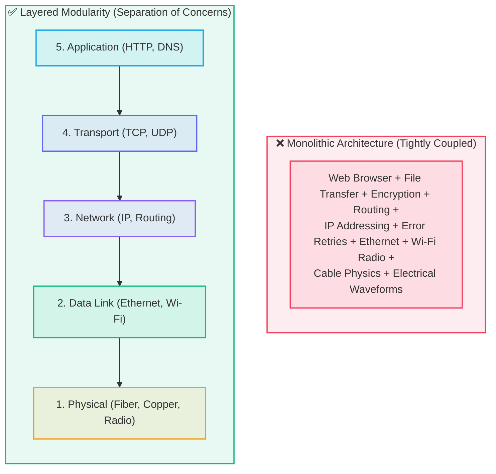
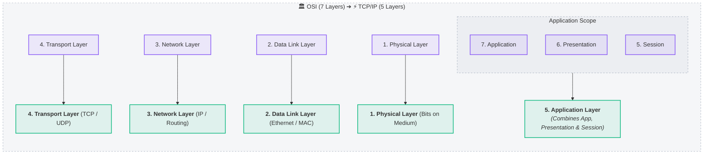
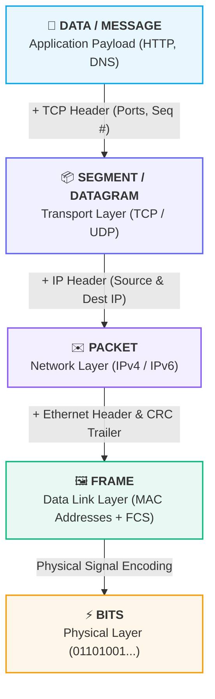
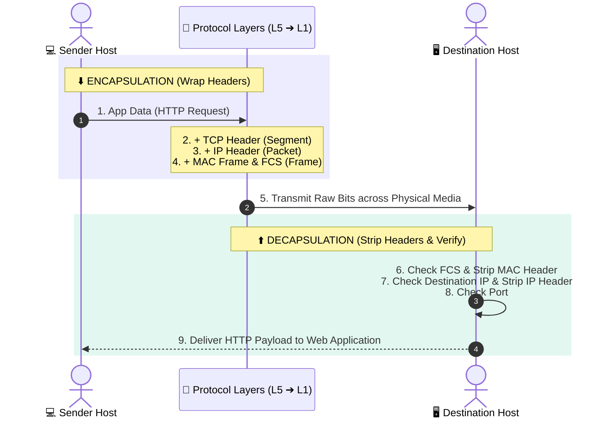

# 🏛️ Layered Network Models: OSI vs. TCP/IP Architecture

> [!important] 🧱 Architectural Foundation
> Network communication is engineered as a **layered protocol stack**. Instead of building a monolithic, unmaintainable system where a web application must handle electrical cables and signal voltages, each layer handles a specific abstraction and interacts only with the layers directly above and below it.

---

## 🧱 1. Why Do Networks Use Layers?

Imagine if a single piece of software had to manage everything from web page rendering down to the radio frequencies of a Wi-Fi antenna:

### The Power of Layered Modularity
By splitting network tasks into distinct layers, systems achieve **modularity and loose coupling**:

1. 🎯 **Separation of Concerns:** Each layer solves one specific problem (routing, reliable delivery, or physical signaling).
2. 🔄 **Interchangeability & Innovation:** You can replace an Ethernet cable with Fiber or Wi-Fi (Layer 1/2) without changing your Web Browser or HTTP logic (Layer 5/7).
3. 🌐 **Standardization:** Hardware and software from hundreds of competing vendors (Cisco, Apple, Intel, Google) interoperate seamlessly through standardized protocol interfaces.

> [!example] 🍔 The Burger Analogy
> - **Top Bun:** Application Layer (User Interface)
> - **Condiments / Sauce:** Transport & Session (Flow Control & Ports)
> - **Patty:** Network Layer (Global Routing Engine)
> - **Bottom Bun:** Physical & Data Link Media (Cables & Wi-Fi)  
> *(You don't need to know how the wheat was milled to eat the burger!)*

---

## 🌐 2. The 5-Layer Internet Protocol Stack

The modern Internet operates on a practical **5-layer architectural model**:

| Layer # & Name | Guiding Question | Core Responsibility | Key Protocols | Hardware / Units |
| :--- | :--- | :--- | :--- | :--- |
| **5. Application** | *"What does the application want to communicate?"* | User interfaces, network services, high-level messaging, encoding. | HTTP, HTTPS, DNS, SMTP, SSH, FTP | Web Browsers, Servers / **Data** |
| **4. Transport** | *"How should data travel between processes?"* | Process-to-process communication, port multiplexing, reliability, flow/congestion control. | **TCP** (Reliable, ordered), **UDP** (Fast, connectionless) | Operating System Sockets / **Segment / Datagram** |
| **3. Network** | *"Where does this packet go globally?"* | Host-to-host routing across disparate networks, logical IP addressing. | **IPv4**, **IPv6**, ICMP, BGP, OSPF | [[Network Hardware - Hub, Switch, Router, Modem#3 Router — The Inter-Network Gateway Layer 3\|Routers]], L3 Switches / **Packet** |
| **2. Data Link** | *"How do I cross this immediate local link?"* | Node-to-node frame delivery across a single physical medium, physical MAC addressing, error checking. | Ethernet (802.3), Wi-Fi (802.11), PPP, ARP | [[Network Hardware - Hub, Switch, Router, Modem#2 Switch — The Intelligent LAN Forwarder Layer 2\|Switches]], Bridges, NICs / **Frame** |
| **1. Physical** | *"How do 0s and 1s physically travel?"* | Transmitting raw binary electrical voltages, optical light pulses, or electromagnetic radio waves. | 1000BASE-T, DSL, DOCSIS, NRZ, Manchester encoding | [[Network Hardware - Hub, Switch, Router, Modem#1 Hub — The Blind Broadcaster Layer 1\|Hubs]], Repeaters, Cables, Modems / **Bits** |

---

## 🏛️ 3. The 7-Layer OSI Reference Model vs. 5-Layer TCP/IP Stack

### The 2 Distinct Layers in OSI:
- **Layer 6 - Presentation Layer:** Handles data translation, character encoding (ASCII, UTF-8), data compression (gzip), and encryption/decryption (TLS/SSL).
- **Layer 5 - Session Layer:** Manages, establishes, maintains, and synchronizes persistent sessions and checkpoints between communicating applications.

> [!tip] Practical Reality
> In the real-world TCP/IP stack, the responsibilities of Presentation (L6) and Session (L5) are implemented directly inside the **Application Layer** (e.g., TLS encryption inside OpenSSL/HTTPS) rather than in separate OS kernel layers.

---

## 📦 4. The Protocol Data Unit (PDU) Hierarchy

As data moves down the stack, each layer wraps the payload with its own control metadata (**Header**):

> [!important] 🔑 The Golden PDU Rule
> - **Application:** Data / Message
> - **Transport:** Segment (TCP) / Datagram (UDP)
> - **Network:** Packet
> - **Data Link:** Frame
> - **Physical:** Bits

---

## 🔄 5. End-to-End Encapsulation and Decapsulation Flow

- **Downward Movement (Sender $\downarrow$):** **Encapsulation** (wrapping headers around upper-layer data).
- **Upward Movement (Receiver $\uparrow$):** **Decapsulation** (stripping headers layer-by-layer to deliver pristine payload to the destination process).

---

## 🎯 6. Scenario Test Answers & Explanations

1. **Which layer is primarily responsible for IP addresses and routing between networks?**
   - **Network Layer (Layer 3).** Handles logical IP addressing and path determination across routers.
2. **Which layer deals with MAC addresses and Ethernet frames?**
   - **Data Link Layer (Layer 2).** Responsible for hop-by-hop local link framing and MAC addressing across switches.
3. **Which layer deals with TCP and UDP?**
   - **Transport Layer (Layer 4).** Provides end-to-end process multiplexing via port numbers.
4. **Which layer is concerned with electrical signals, radio waves, or light pulses?**
   - **Physical Layer (Layer 1).** Handles physical medium transmission and raw bit encoding.
5. **The browser creates data, TCP segments it, IP packetizes it, Ethernet frames it:**
   - **(B) Down the layers (Encapsulation).** The transmitting host builds headers from top to bottom before pushing bits onto the wire.

---

## 🔗 Related Notes & Next Concepts

- **Parent MOC:** [[Computer Networking/README|🌐 Computer Networks MOC]]
- **Prerequisites:**
  - [[Introduction to Computer Networks|🌍 Introduction to Computer Networks]]
  - [[Packets and Packet Switching|📦 Packets and Packet Switching]]
  - [[Network Hardware - Hub, Switch, Router, Modem|🔌 Network Hardware - Hub, Switch, Router, Modem]]
- **Next Logical Topics (Stage 2):**
  - `[[Network Protocols and Standards]]` — The formal rules, syntax, and RFCs governing communication.
  - `[[Encapsulation and Decapsulation]]` — Detailed bit-level breakdown of headers and trailers.
  - `[[Ethernet and MAC Addressing]]` — 48-bit hex MAC formatting, NICs, and frame structures.
  - `[[IP Addressing Fundamentals]]` — Deep dive into 32-bit IPv4 structure and subnetting.
