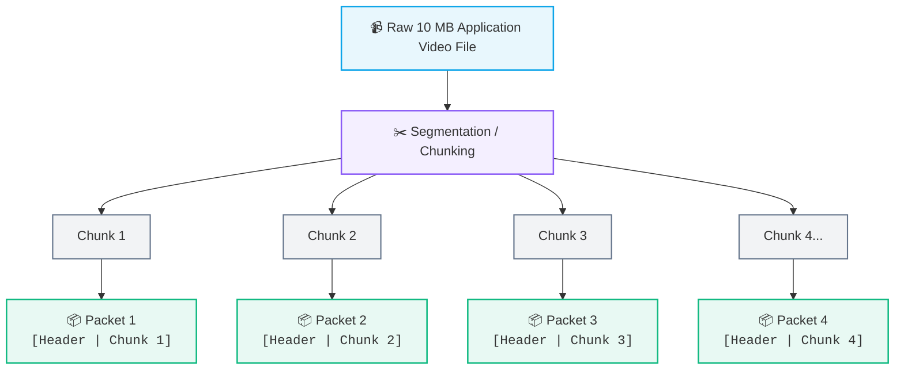
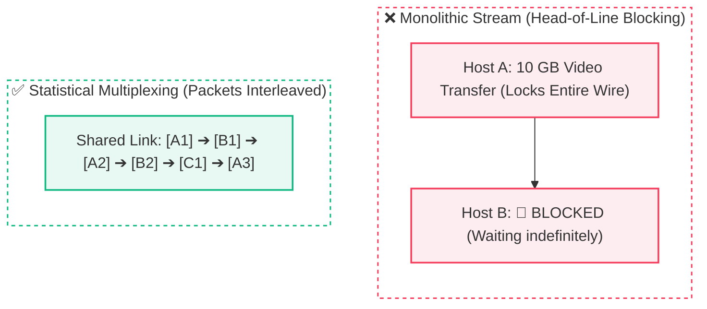
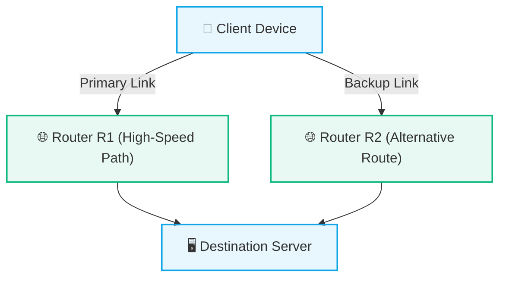

# 📦 Packets and Packet Switching

> [!important] 🎯 Key Definition
> A **Packet** is a formatted, bounded unit of data transmitted over a packet-switched network. Rather than sending a massive, monolithic stream of data continuously over an open circuit, the network layer divides data into discrete packets, each containing control metadata (headers) and user data (payload).

---

## 🧩 1. The Core Concept: Data vs. Packet

It is essential to distinguish between raw application data and a network packet:

- **Data (Application Message):** The complete file or message you wish to transmit (e.g., a 10 MB video, an HTML document, or an image).
- **Packet (Network Transport Unit):** A small, self-contained chunk of that data wrapped with addressing and control information.



---

## ❓ 2. Why Break Data Into Packets?

Why doesn't the Internet send a single continuous 100 MB block across the wire? There are four major engineering reasons:

### 1. 🚦 Fair Sharing & Statistical Multiplexing



Breaking data into packets allows hundreds of hosts to interleave their transmissions smoothly across shared physical infrastructure without waiting for other users' multi-gigabyte transfers to finish.

---

### 2. ⚡ Error Recovery & Retransmission Efficiency

> [!tip] 🛡️ Granular Retransmissions
> - **Without Packets:** 1 corrupted bit in a 100 MB file requires re-downloading the entire 100 MB file.
> - **With Packets:** 1 corrupted packet (1.5 KB) only requires retransmitting that **single 1.5 KB chunk**, saving 99.99% of bandwidth.

---

### 3. 💾 Router Buffer and Memory Feasibility
Routers have high-speed but finite RAM buffers. Small, bounded packets (e.g., standard 1500-byte MTU) can be quickly stored, processed, and forwarded without exhausting hardware memory.

---

### 4. 🔀 Dynamic Path Selection & Resilience (Multipath Routing)



Because each packet contains its own routing metadata, packets belonging to the same stream can dynamically traverse different network paths if an intermediate router experiences congestion or a physical link fails.

---

## 📦 3. Anatomy of a Packet: Header vs. Payload

Every packet is structured into two fundamental components:

```text
┌────────────────────────────────────────────────────────┐
│                        PACKET                          │
├────────────────────────────────────────────────────────┤
│ HEADER (Metadata & Control Information)               │
│ - Source IP Address                                    │
│ - Destination IP Address                               │
│ - Protocol Type (TCP / UDP / ICMP)                    │
│ - Time-to-Live (TTL) / Hop Limit                       │
│ - Sequence / Identification Numbers                    │
│ - Header Checksum (Error Detection)                    │
├────────────────────────────────────────────────────────┤
│ PAYLOAD (Actual User Cargo)                            │
│ - Segment of the video, web page, or message           │
└────────────────────────────────────────────────────────┘
```

### 🚚 The Postal / Delivery Truck Analogy

| Postal / Shipping Concept | Network Packet Counterpart | Function |
| :--- | :--- | :--- |
| **Shipping Box / Truck** | **Packet** | The container carrying cargo across roads. |
| **Shipping Label (To / From)** | **Header (Source & Destination IP)** | Instructions for postal workers (routers) on where to deliver. |
| **Tracking Number / Fragile tag** | **Control Fields (TTL, Protocol, Flags)** | Instructions on handling, priority, and lifetime. |
| **Goods inside the Box** | **Payload** | The actual application data being delivered to the recipient. |

> [!important] Core Rule
> - **Header:** Information *about* the data (metadata used by network equipment to deliver it).
> - **Payload:** The actual *content* being transported for the end application.

---

## 🔄 4. How Packet Switching Works

The Internet's core operates using **Packet Switching** with a **Store-and-Forward** mechanism:

```text
[Host A]
   │
   ▼ (Packet 1)
[Router R1] ─── (Store entire packet -> Check Checksum -> Lookup Route Table)
   │
   ▼ (Forwarding)
[Router R2] ─── (Inspect Destination IP -> Forward to next hop)
   │
   ▼ (Forwarding)
[Host B (Destination)] ─── (Receive -> Strip Header -> Reassemble Chunks -> Reconstruct File)
```

### Hop-by-Hop Lifecycle:
1. **Host Division:** The sending host divides application data into chunks and encapsulates each with headers.
2. **Hop-by-Hop Routing:** Intermediate routers inspect only the **Header** (specifically the Destination IP), evaluate their routing table, and forward the packet along the best next-hop link.
3. **Independent Traversal:** Packets may arrive out of order if they take different physical routes.
4. **Reassembly:** The destination host's transport layer (e.g., [[TCP]]) reorders the arriving packets using sequence numbers and reconstructs the original, pristine file for the application.

---

## ⚠️ 5. Critical Misconceptions vs. Engineering Realities

> [!caution] Avoid These Two Common Traps
> When learning networking, it is easy to adopt flawed intuitions about why packets and alternate routes exist.

### Misconception 1: "Alternate paths are chosen simply because they are 'faster'."
- **The Misconception:** Routers randomly or intuitively pick paths because one "looks faster."
- **The Reality:** Forwarding decisions are strictly computed by deterministic **routing algorithms** (e.g., Dijkstra in OSPF, Bellman-Ford in RIP, path-vector policies in BGP). Paths are chosen based on **link metrics, administrative costs, bandwidth weightings, autonomous system (AS) routing policies, and dynamic link failure detection**, not vague guesses.

### Misconception 2: "Breaking data into packets makes a single transfer faster."
- **The Misconception:** Dividing a file into packets magically accelerates the download speed for an individual user.
- **The Reality:** Every packet carries additional header overhead (typically 20–40 bytes of IP/TCP metadata). On a dedicated, isolated link, sending raw data without headers would technically have slightly less overhead. The true superpower of packet switching is **aggregate efficiency & statistical multiplexing**:
  - Thousands of independent users can share the same pipeline simultaneously without starving each other.
  - A single transmission error only requires re-sending a single packet rather than re-sending the entire multi-megabyte stream.

---

## 📊 6. Monolithic Stream vs. Packet Switching

| Feature | Monolithic Continuous Stream | Packet Switching (The Internet) |
| :--- | :--- | :--- |
| **Network Sharing** | Dedicated or blocked links (unfair) | Statistical multiplexing (fair interleaving) |
| **Failure Cost** | High (Entire transfer restarts on bit error) | Minimal (Only affected packet is retransmitted) |
| **Hardware Demands** | Huge memory buffers required on routers | Small, bounded memory buffers (MTU size) |
| **Route Flexibility** | Rigid single path | Dynamic, adaptive multi-path routing |
| **Overhead** | Minimal header overhead | Small header overhead per packet (e.g., 20–40 bytes) |

---

## 🔗 Related Notes & Next Concepts

- **Parent MOC:** [[Computer Networking/README|🌐 Computer Networks MOC]]
- **Foundations:** [[Introduction to Computer Networks|🌍 Introduction to Computer Networks]]
- **Next Logical Topics:**
  - `[[Switching Techniques - Packet vs Circuit]]` — Detailed comparison of traditional telephone networks (Circuit) vs Internet (Packet).
  - `[[Network Edge and Core]]` — The role of end systems vs packet-switched routing mesh.
  - `[[Encapsulation and Decapsulation]]` — How headers are wrapped and unwrapped across the 7/4 layers.
  - `[[IP Addressing Fundamentals]]` — How the destination and source addresses inside the IP header are structured.
