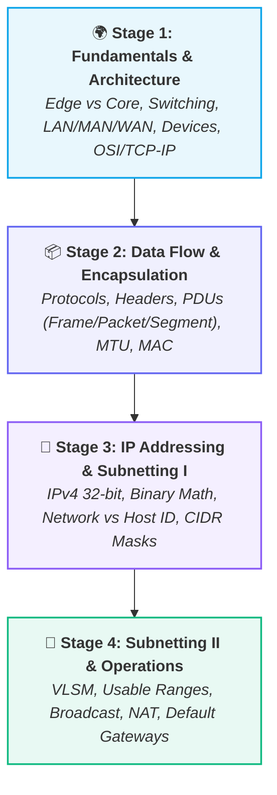

# 🌐 Computer Networks MOC (Map of Content)

> [!abstract] 📚 Domain Overview
> A computer network is an interconnected collection of autonomous computing devices capable of exchanging data and sharing resources. This Map of Content tracks the four-stage foundational roadmap from foundational physics and edge architecture to advanced binary subnetting and packet routing.

---

## 🗺️ Curriculum Roadmap

---

## 📚 Roadmap Stages & Core Notes

### 🌍 Stage 1 — What is a Network & Internet Architecture
- [[Introduction to Computer Networks|🌐 01. Introduction to Computer Networks (Definition, Scale, LAN/MAN/WAN, Internet Model)]]
- [[Packets and Packet Switching|📦 02. Packets and Packet Switching (Data vs Packet, Headers, Multiplexing, Store-and-Forward)]]
- [[Switching Techniques - Packet vs Circuit|🔄 03. Switching Techniques - Packet vs Circuit (Dedicated vs Shared, Bursty Traffic, Statistical Multiplexing)]]
- [[Network Performance - Delay, Latency, Throughput|⏱️ 04. Network Performance - Delay, Latency, Throughput (Nodal Delays, Bandwidth, Throughput, Bottleneck Law)]]
- [[Network Hardware - Hub, Switch, Router, Modem|🔌 05. Network Hardware - Hub, Switch, Router, Modem (Layer 1-3 Devices, MAC Table, Collision Domains)]]
- [[OSI vs TCP-IP Model|🧱 06. Layered Models - OSI vs TCP-IP (5-Layer vs 7-Layer, PDU Hierarchy, Encapsulation Flow)]]
- `[[Network Edge and Core]]` — Hosts, Access Networks, Physical Media vs Packet-Switched Core

---

### 📦 Stage 2 — How Data Travels (Encapsulation & Data Link Layer)
- [[Network Protocols and Standards|📜 07. Network Protocols and Standards (Syntax, Semantics, Timing, Stack of Agreements, RFCs)]]
- [[Encapsulation and Decapsulation|📦 08. Encapsulation and Decapsulation (Nested Envelopes, Headers vs Payloads, Hop-by-Hop Device Processing)]]
- [[Data Units - Segment, Packet, Frame, Bits|📦 09. Protocol Data Units (Segment, Packet, Frame, Bits & TCP vs UDP Trade-offs)]]
- [[Ethernet and MAC Addressing|🪪 10. Ethernet and MAC Addressing (48-bit Hex, OUI, MAC vs IP, Hop-by-Hop Link Delivery)]]
- [[MTU and Fragmentation|📏 11. MTU and IP Fragmentation (1500-Byte Limit, Flags DF/MF, Offset, IPv4 vs IPv6 Rules)]]

---

### 🏠 Stage 3 — IP Addressing & Subnetting I
- [[IP Addressing Fundamentals|🏠 12. IP Addressing Fundamentals (IPv4 32-bit Structure, Binary Math, 8-Bit Magic Table, Octets)]]
- [[Network ID and Host ID|🏘️ 13. Network ID vs Host ID (Street & House Analogy, Ambiguity Dilemma, Role of Subnet Mask)]]
- [[Subnet Masks and CIDR Notation|🥸 14. Subnet Masks & CIDR Notation (/8 to /32 Reference Table, Slash Notation, Bitwise AND)]]
- `[[Special IP Addresses]]` — Public vs Private (RFC 1918), Loopback (`127.0.0.1`), APIPA, Broadcast

---

### 🧮 Stage 4 — Subnetting II & Routing
- `[[Subnetting and Host Range Calculation]]` — Network address, broadcast address, first/last usable IP
- `[[Variable Length Subnet Masking (VLSM)]]` — Efficient address allocation without waste
- `[[Default Gateway and ARP]]` — How packets leave the local LAN (Address Resolution Protocol)
- `[[Network Address Translation (NAT)]]` — Private-to-public IP translation, PAT, port mapping
- `[[IPv6 Fundamentals]]` — 128-bit addressing, hex notation, motivation, coexistence with IPv4

---

## 🔗 Cross-Domain CS Connections

| Related CS Domain | Connection Point |
| :--- | :--- |
| **[[Operating Systems]]** | Sockets, network system calls (`socket()`, `bind()`, `connect()`), I/O multiplexing (`epoll`), kernel network buffers. |
| **[[WebDev/Backend/README\|Backend Development]]** | HTTP/HTTPS, WebSockets, REST APIs, TCP handshake latency, load balancing. |
| **[[Distributed Systems]]** | Network partitions (CAP theorem), consensus over unreliable networks, RPC mechanisms. |
| **Security** | Firewalls, packet filtering, ARP spoofing, Man-in-the-Middle (MitM), TLS/SSL encryption. |
