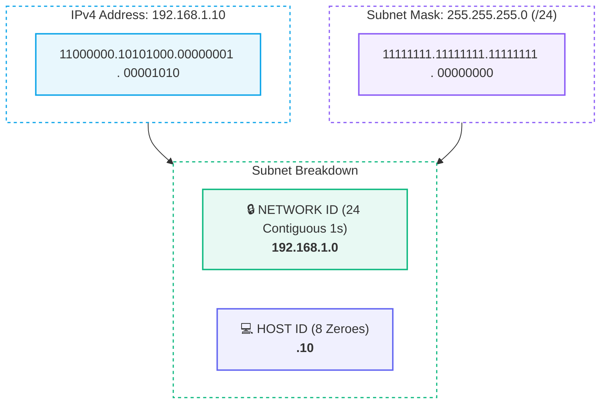
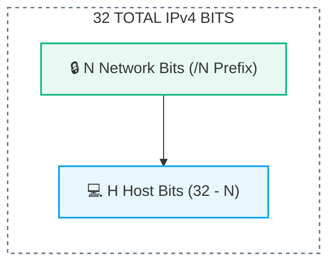

# 🎭 Subnet Masks and CIDR Notation

> [!important] 🎯 Executive Summary
> - **Subnet Mask:** A 32-bit binary number of contiguous `1`s followed by contiguous `0`s that dictates where the **Network ID** ends and the **Host ID** begins in an IPv4 address.
> - **CIDR (Classless Inter-Domain Routing):** The modern standard representing a subnet mask using a forward slash followed by the count of network `1` bits (e.g., `/24`, `/16`, `/8`).

---

## 🥸 1. What Does a Subnet Mask Actually Do?

An IPv4 address like `192.168.1.10` cannot be routed without knowing its boundary. The subnet mask acts as a binary filter:



- **All binary `1`s:** Lock down the **Network Prefix** (cannot be changed by hosts).
- **All binary `0`s:** Allocate the available space for assigning **Individual Devices (Host IDs)**.

---

## ⚡ 2. Understanding CIDR Slash Notation (`/n`)

Instead of writing cumbersome dotted-decimal subnet masks like `255.255.255.0`, **CIDR notation** prefixes the address with a slash `/` followed by the number of network bits:

$$\boxed{\text{Total Bits (32)} = \text{Network Bits } (N) + \text{Host Bits } (H)}$$
$$\boxed{\text{Host Bits } (H) = 32 - N}$$
$$\boxed{\text{Total IP Addresses} = 2^H}$$



---

## 🏛️ 3. Standard Octet Boundaries (`/8`, `/16`, `/24`)

When the CIDR prefix falls cleanly on an 8-bit octet boundary, identifying the network and host portions is immediate:

| CIDR Prefix | Subnet Mask | Network Portion | Host Portion | Total Addresses ($2^H$) |
| :--- | :--- | :--- | :--- | :--- |
| **`/24`** | `255.255.255.0` | `192.168.1` (First 3 Octets) | `.50` (Last Octet) | $2^8 = \mathbf{256}$ |
| **`/16`** | `255.255.0.0` | `10.20` (First 2 Octets) | `.30.40` (Last 2 Octets) | $2^{16} = \mathbf{65,536}$ |
| **`/8`** | `255.0.0.0` | `10` (First Octet) | `.20.30.40` (Last 3 Octets) | $2^{24} = \mathbf{16,777,216}$ |

---

## 🧮 4. The Master CIDR Subnet Mask Reference Table

When subnetting cuts across the middle of an octet (e.g., `/25` through `/30`), the decimal value of the last octet is calculated by summing the corresponding active powers of 2 ($128, 64, 32, 16, 8, 4, 2, 1$):

| CIDR Prefix | Subnet Mask (Dotted-Decimal) | Last Octet Binary | Host Bits ($H$) | Total Addresses ($2^H$) | Common Use Case |
| :--- | :--- | :--- | :--- | :--- | :--- |
| **/8** | `255.0.0.0` | `00000000` | 24 | $16,777,216$ | Huge Enterprise / ISP Core |
| **/16** | `255.255.0.0` | `00000000` | 16 | $65,536$ | Large Campus / Cloud VPC |
| **/24** | `255.255.255.0` | `00000000` | 8 | $256$ | Standard Office / Home LAN |
| **/25** | `255.255.255.128` | `10000000` | 7 | $128$ | Medium Department (2 subnets) |
| **/26** | `255.255.255.192` | `11000000` | 6 | $64$ | Small Branch Office (4 subnets) |
| **/27** | `255.255.255.224` | `11100000` | 5 | $32$ | Server Farm Cluster |
| **/28** | `255.255.255.240` | `11110000` | 4 | $16$ | Small Workgroup Subnet |
| **/29** | `255.255.255.248` | `11111000` | 3 | $8$ | Public Static IP Block |
| **/30** | `255.255.255.252` | `11111100` | 2 | $4$ | Point-to-Point Router Link |
| **/32** | `255.255.255.255` | `11111111` | 0 | $1$ | Single Host Loopback Route |

---

## 🔍 5. How Routers Find the Network Address: Bitwise AND

To determine which network an incoming packet belongs to, routers perform a hardware **Bitwise AND** operation between the Destination IP and the Subnet Mask:

> [!tip] 🧮 Bitwise AND Rule
> `1 AND 1 = 1` | Any other combination (`1 AND 0`, `0 AND 0`) `= 0`.

```text
  IP:          192.168.1.10   ──>  11000000.10101000.00000001.00001010
  Mask:    AND 255.255.255.0  ──>  11111111.11111111.11111111.00000000
  ────────────────────────────────────────────────────────────────────
  Network:     192.168.1.0    ──>  11000000.10101000.00000001.00000000
```

---

## 🎯 6. Quick Test Answers & Explanations

1. **For `192.168.1.50/24`, what is the network portion?**
   - **`192.168.1`** (Network Address: `192.168.1.0`).
2. **How many bits are used for the network in `/24`?**
   - **24 bits** (The first 3 octets).
3. **How many bits remain for hosts in `/24`?**
   - **8 bits** ($32 - 24 = 8\text{ bits}$, allowing $2^8 = 256$ total addresses).
4. **For `10.20.30.40/16`, which part is the network?**
   - **(B) `10.20`** (First 16 bits = first 2 octets).

---

## 🔗 Related Notes & Next Concepts

- **Parent MOC:** [[Computer Networking/README|🌐 Computer Networks MOC]]
- **Prerequisites:**
  - [[IP Addressing Fundamentals|🏠 IP Addressing Fundamentals]]
  - [[Network ID and Host ID|🏘️ Network ID vs Host ID]]
- **Next Logical Topics (Stage 3 & 4):**
  - `[[Special IP Addresses]]` — Public vs Private (RFC 1918), Loopback (`127.0.0.1`), APIPA (`169.254.x.x`), Broadcast.
  - `[[Subnetting and Host Range Calculation]]` — Calculating Network Address, Broadcast Address, First/Last Usable IPs for `/26`, `/27`, `/28`.
  - `[[Variable Length Subnet Masking (VLSM)]]` — Subnetting subnets efficiently without wasting IP addresses.
