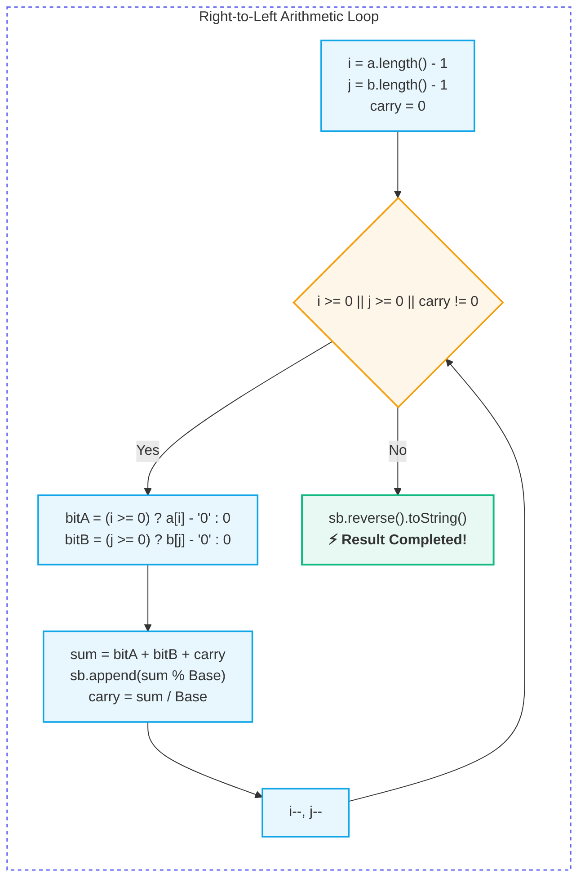
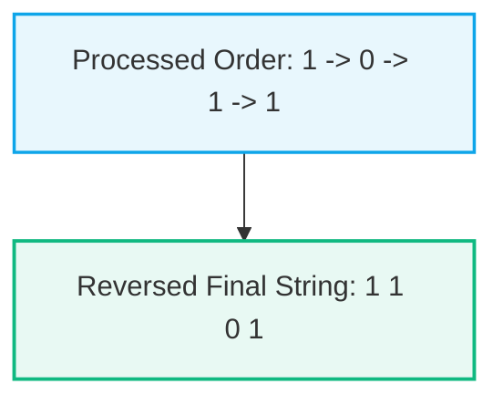

# ➕ String Arithmetic & Add Binary Pattern

> [!abstract] Module Overview
> **Module Hub:** [[DSA/01. Strings/README|01. Strings]] | **Master Roadmap:** [[DSA/README|DSA Master Roadmap]] | **Quick Reference:** [[Quick Look|⚡ Quick Look Cheatsheet]]

---

> [!note] Why this belongs in String Notes (Not Bit Manipulation)
> Even though this problem deals with binary digits (`'0'` and `'1'`), strings can be thousands of characters long ($10^4$), which far exceeds 64-bit `long` integer limits. 
> Therefore, this is purely a **String Manipulation, `StringBuilder` memory optimization, character arithmetic (`c - '0'`), and Two-Pointer simulation** technique.

---

## 💡 The Core Problem

When adding two large numbers represented as strings (such as **binary strings** like `"1011"` + `"1101"`, or large **decimal strings** like `"987"` + `"456"`), we cannot simply parse them into `int` or `long` because they will overflow.

We simulate manual column-by-column addition from **right to left** (least significant digit to most significant).



---

## 🧠 Why `StringBuilder` instead of `String`?

When processing right $\to$ left:
- 1st calculated bit $\to$ rightmost bit of actual result
- 2nd calculated bit $\to$ next bit to the left
- 3rd calculated bit $\to$ next bit to the left



### The Java String Trap:
- In Java, `String` is **immutable**.
- Repeatedly prepending characters (`ans = bit + ans;`) creates a new `String` object in every iteration, copying all previous characters $\implies$ **$O(N^2)$ time complexity**.

### The Optimal Solution: `StringBuilder`
- `StringBuilder` provides $O(1)$ amortized append operations.
- **Pattern:** Append each result bit to the end (`ans.append(resultBit)`), and call `ans.reverse()` at the end!

---

## ⚙️ The Universal Right-to-Left Arithmetic Template

```java
int i = a.length() - 1;
int j = b.length() - 1;
int carry = 0;
StringBuilder ans = new StringBuilder();

while (i >= 0 || j >= 0 || carry != 0) {
    // If a pointer is out of bounds, default its contribution to 0
    int bit1 = (i >= 0) ? a.charAt(i) - '0' : 0;
    int bit2 = (j >= 0) ? b.charAt(j) - '0' : 0;

    int sum = bit1 + bit2 + carry;
    
    ans.append(sum % 2); // For binary: remainder is result bit (0 or 1)
    carry = sum / 2;     // For binary: carry to next column (0 or 1)

    i--;
    j--;
}

return ans.reverse().toString();
```

---

## ❓ Edge Case Deep-Dive: Unequal String Lengths

> [!important] Missing Digits Rule
> If `i < 0` (meaning string `A` has no bits left), but `B` still has bits (`j >= 0`), `bit1` defaults to `0`.  
> Just like manual column addition on paper, missing leading positions are treated as leading zeros:
> - String A: `" 1 0 1"` $\to$ `"0 1 0 1"`
> - String B: `"+ 1 1 0 1"` $\to$ `"+ 1 1 0 1"`

### The Three Loop Conditions (`while (i >= 0 || j >= 0 || carry != 0)`)
1. `i >= 0`: String `A` still has digits.
2. `j >= 0`: String `B` still has digits.
3. `carry != 0`: Both strings are exhausted, but a **final carry** remains (e.g. `"1"` + `"1"` $\to$ sum 2 $\to$ result `0`, carry `1` $\to$ final result `"10"`).

---

## 💻 Full Implementation: LeetCode 67 (Add Binary)

```java
class Solution {
    public String addBinary(String a, String b) {
        StringBuilder sb = new StringBuilder();
        int i = a.length() - 1;
        int j = b.length() - 1;
        int carry = 0;

        while (i >= 0 || j >= 0 || carry != 0) {
            int bitA = (i >= 0) ? a.charAt(i) - '0' : 0;
            int bitB = (j >= 0) ? b.charAt(j) - '0' : 0;

            int sum = bitA + bitB + carry;
            sb.append(sum % 2); // 0, 1, 2 (-> 0), 3 (-> 1)
            carry = sum / 2;    // 0 or 1

            i--;
            j--;
        }

        return sb.reverse().toString();
    }
}
```

### Complexity:
- **Time Complexity:** $O(\max(N, M))$ where $N, M$ are lengths of `a` and `b`. Single pass through the longer string.
- **Space Complexity:** $O(\max(N, M))$ to store the resulting `StringBuilder`.

---

## 🔄 Generalization: Decimal String Addition (LeetCode 415: Add Strings)

The exact same template solves base-10 addition by simply replacing `% 2` and `/ 2` with `% 10` and `/ 10`:

```java
class Solution {
    public String addStrings(String num1, String num2) {
        StringBuilder sb = new StringBuilder();
        int i = num1.length() - 1;
        int j = num2.length() - 1;
        int carry = 0;

        while (i >= 0 || j >= 0 || carry != 0) {
            int digit1 = (i >= 0) ? num1.charAt(i) - '0' : 0;
            int digit2 = (j >= 0) ? num2.charAt(j) - '0' : 0;

            int sum = digit1 + digit2 + carry;
            sb.append(sum % 10);
            carry = sum / 10;

            i--;
            j--;
        }

        return sb.reverse().toString();
    }
}
```

---

## 🔗 Related Notes
- [[DSA/01. Strings/README|📁 01. Strings Master MOC]]
- [[DSA/DSA Problems/67. Add Binary|💡 67. Add Binary (Problem Walkthrough & Top 100% char[] Optimization)]]
- [[DSA/01. Strings/StringBuilder|🏗️ StringBuilder Deep Dive]]
- [[DSA/README|🌳 DSA Master Roadmap]]
- [[Quick Look|⚡ Quick Look (Java / DSA Cheatsheet)]]
- [[Dashboard|🧭 Main Command Center]]

