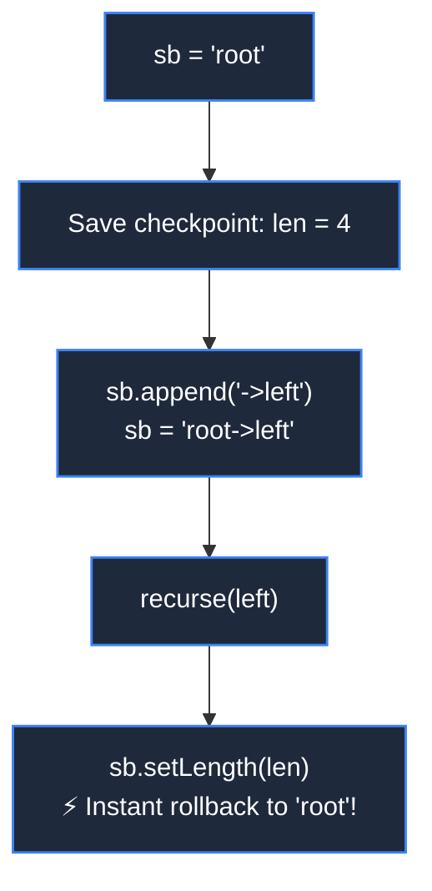

# 🏗️ StringBuilder (Architecture, Methods & DSA Patterns)

> [!abstract] Module Overview
> **Module Hub:** [[DSA/01. Strings/README|01. Strings]] | **Roadmap:** [[DSA/README|DSA Master Roadmap]] | **Java Foundations:** [[JAVA/README|Java MOC]]

---

## 💡 1. What is `StringBuilder`?

`StringBuilder` is a **mutable sequence of characters** in Java. Unlike standard `String` objects (which are immutable and cannot be altered once created), a `StringBuilder` allows characters and substrings to be appended, inserted, modified, or removed in-place without generating garbage objects on the heap.

```mermaid
flowchart TD
    subgraph S ["❌ String Concatenation (Immutable Heap Allocation: O(N^2))"]
        direction LR
        S1["'hello'"] -->|'+ world'| S2["'hello world'<br/><i>(New Heap Object Allocated)</i>"]
    end

    subgraph SB ["✅ StringBuilder Mutation (In-Place Dynamic Buffer: O(N))"]
        direction LR
        B1["['h','e','l','l','o', _, _, ...]"] -->|'.append()'| B2["['h','e','l','l','o',' ','w','o','r','l','d']<br/><i>(Zero Garbage Allocations)</i>"]
    end

    classDef bad fill:#1e293b,stroke:#ef4444,stroke-width:1.5px,color:#fff;
    classDef good fill:#1e293b,stroke:#10b981,stroke-width:1.5px,color:#fff;
    class S1,S2 bad;
    class B1,B2 good;
```

---

## ⚔️ 2. The Big Comparison: `String` vs `StringBuilder` vs `StringBuffer`

| Feature | `String` | `StringBuilder` *(DSA Choice)* | `StringBuffer` |
| :--- | :--- | :--- | :--- |
| **Mutability** | **Immutable** (cannot change) | **Mutable** (in-place edits) | **Mutable** (in-place edits) |
| **Concatenation in loop** | $O(N^2)$ (copies entire string) | **$O(N)$ total** ($O(1)$ amortized append) | $O(N)$ total |
| **Thread Safety** | Thread-safe (read-only) | **Not Thread-Safe** (Fastest) | **Thread-Safe** (`synchronized` methods) |
| **Memory Overhead** | Creates intermediate objects | Single dynamic buffer | Single dynamic buffer + sync lock overhead |
| **Best Use Case** | Constants, Map keys, read-only text | **Algorithms, DSA, loops, single-thread** | Legacy multithreaded logging |

> [!danger] Why `String +=` is an Anti-Pattern in Loops
> Concatenating strings in a loop of size $N$:
> ```java
> String s = "";
> for (int i = 0; i < n; i++) {
>     s += i; // ⚠️ O(N^2) total time! Copies (1 + 2 + 3 + ... + N) chars
> }
> ```
> Using `StringBuilder`:
> ```java
> StringBuilder sb = new StringBuilder();
> for (int i = 0; i < n; i++) {
>     sb.append(i); // ✅ O(N) total time!
> }
> String s = sb.toString();
> ```

---

## 🏛️ 3. Internal Architecture & Capacity

Internally, `StringBuilder` is backed by a resizable character array (`char[]` in Java 8, `byte[]` with Latin-1/UTF-16 encoding in Java 9+):
- **Default Capacity:** `16` characters.
- **Dynamic Resizing Formula:**
  $$\text{New Capacity} = (\text{Old Capacity} \times 2) + 2$$
- **Pre-sizing for Optimization:** If you know the expected length, allocate capacity upfront to avoid array reallocation and copying:
  ```java
  StringBuilder sb = new StringBuilder(10000); // Allocates buffer of 10,000 chars upfront
  ```

---

## 🛠️ 4. Essential Methods & Time Complexities

| Method | Description | Time Complexity |
| :--- | :--- | :---: |
| `sb.append(x)` | Appends boolean, char, int, long, String, etc. to the end | **$O(1)$ amortized** |
| `sb.insert(offset, x)` | Inserts data at the specified index, shifting trailing elements | **$O(N)$** |
| `sb.charAt(i)` | Returns char at index `i` (0-indexed) | **$O(1)$** |
| `sb.setCharAt(i, c)` | Replaces character at index `i` in-place | **$O(1)$** |
| `sb.deleteCharAt(i)` | Removes single character at index `i` (shifts remaining) | **$O(N)$** *(O(1) if removing last)* |
| `sb.delete(start, end)` | Removes substring in range `[start, end)` | **$O(N)$** |
| `sb.reverse()` | Reverses the entire character sequence in-place | **$O(N)$** |
| `sb.substring(start, end)`| Returns new `String` representing substring `[start, end)` | **$O(K)$** |
| `sb.length()` | Returns current number of characters | **$O(1)$** |
| `sb.setLength(newLen)` | Truncates or extends length (instant buffer reset) | **$O(1)$** |
| `sb.toString()` | Converts the builder content into an immutable `String` | **$O(N)$** |

---

## 🎯 5. High-Frequency DSA Patterns

### Pattern 1: Backtracking & DFS (Path Construction)



```java
void backtrack(TreeNode root, StringBuilder sb, List<String> result) {
    if (root == null) return;
    
    int len = sb.length(); // Save checkpoint
    sb.append(root.val);

    if (root.left == null && root.right == null) {
        result.add(sb.toString());
    } else {
        sb.append("->");
        backtrack(root.left, sb, result);
        backtrack(root.right, sb, result);
    }

    sb.setLength(len); // ⚡ Instant backtrack rollback to checkpoint!
}
```

---

### Pattern 2: Right-to-Left Arithmetic & Reversal
When computing arithmetic from least to most significant digit (e.g. [[DSA/01. Strings/Add Binary & String Arithmetic|Add Binary]], Add Strings, Multiply Strings):

```java
StringBuilder ans = new StringBuilder();
while (i >= 0 || j >= 0 || carry != 0) {
    int sum = carry;
    if (i >= 0) sum += a.charAt(i--) - '0';
    if (j >= 0) sum += b.charAt(j--) - '0';
    ans.append(sum % base);
    carry = sum / base;
}
return ans.reverse().toString(); // In-place reverse at the very end
```

---

### Pattern 3: Efficient Buffer Resetting
Instead of allocating a new `StringBuilder` inside an intensive loop (which triggers garbage collection):

```java
StringBuilder sb = new StringBuilder();
for (String query : queries) {
    sb.setLength(0); // ⚡ Clears content in O(1) without reallocating underlying array!
    sb.append(process(query));
    // ...
}
```

---

## ⚠️ 6. Common Pitfalls & Traps

> [!warning] 1. `StringBuilder.equals()` Compares Memory References!
> `StringBuilder` does **NOT** override `Object.equals()`.
> ```java
> StringBuilder sb1 = new StringBuilder("abc");
> StringBuilder sb2 = new StringBuilder("abc");
> 
> sb1.equals(sb2);              // ❌ FALSE! (Compares memory addresses, not characters)
> sb1.toString().equals(sb2.toString()); // ✅ TRUE!
> sb1.compareTo(sb2) == 0;      // ✅ TRUE! (Java 11+)
> ```

> [!warning] 2. Accidental String Concatenation inside `append()`
> ```java
> sb.append("Hello " + name + "!"); // ❌ Bad: creates intermediate String via '+' before appending
> sb.append("Hello ").append(name).append("!"); // ✅ Good: zero intermediate allocations
> ```

> [!tip] 3. `deleteCharAt()` vs `setLength()`
> To remove the last character:
> - `sb.deleteCharAt(sb.length() - 1);` $\to O(1)$ since it's the tail.
> - `sb.setLength(sb.length() - 1);` $\to O(1)$ and slightly faster.

---

## 🔗 Related Notes
- [[DSA/01. Strings/README|📁 01. Strings Master MOC]]
- [[DSA/01. Strings/Add Binary & String Arithmetic|➕ Add Binary & String Arithmetic]]
- [[Quick Look|⚡ Quick Look (Java / DSA Cheatsheet)]]
- [[JAVA/README|☕ Java Foundations]]
- [[Dashboard|🧭 Main Command Center]]

