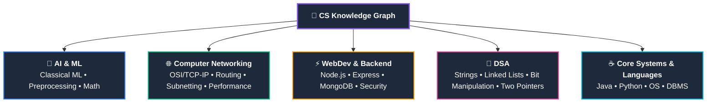

# 🧭 Computer Science Knowledge Vault: Command Center

> [!quote]- Daily Engineering Focus
> *"The mind is not a vessel to be filled, but a fire to be kindled."* — Plutarch

---

## 🗺️ Vault Architecture & Domain Map

---

## ⚡ Quick Actions & Reference Utilities

> [!abstract]+ ⚡ High-Yield Cheatsheets & Roadmaps
> - ⚡ **DSA Rapid Reference:** [[Quick Look|⚡ Quick Look (Java & DSA Cheatsheet)]]
> - 🌳 **DSA Master Roadmap:** [[DSA/README|🌳 DSA Master Hub]]
> - 🌐 **Networking Master Roadmap:** [[Computer Networking/README|🌐 Networking Master Hub]]
> - 🤖 **AI & ML Master Roadmap:** [[AI & ML/README|🤖 AI & ML Master Hub]]
> - ⚡ **Backend Master Roadmap:** [[WebDev/Backend/README|⚡ Backend Development Hub]]
> - 🎓 **Course Resources:** [[Extra_Courses]]

---

## 🧠 Core Domain Master MOCs

> [!tip]+ 🤖 Artificial Intelligence & Machine Learning
> - [[AI & ML/README|🤖 AI & Machine Learning Master Roadmap (MOC)]]
>   - [[AI & ML/Classical ML/README|📊 01. Classical Machine Learning Foundations]]
>     - [[AI & ML/Classical ML/Introduction to Machine Learning|🧠 Introduction to Machine Learning]]
>     - [[AI & ML/Classical ML/Supervised vs Unsupervised Learning|⚖️ Supervised vs Unsupervised Learning]]
>   - [[AI & ML/Data Preprocessing/README|🧹 02. Data Preprocessing & Feature Engineering]]
>     - [[AI & ML/Data Preprocessing/Data Leakage|🛡️ Data Leakage & Safe Transformation]]
>     - [[AI & ML/Data Preprocessing/Categorical Encoding|🏷️ Categorical Encoding (Nominal vs Ordinal)]]
>     - [[AI & ML/Data Preprocessing/Missing Value Imputation|🩹 Missing Value Imputation]]
>     - [[AI & ML/Data Preprocessing/Feature Scaling|📐 Feature Scaling & Loss Surface Geometry]]

> [!info]+ 🌐 Computer Networking
> - [[Computer Networking/README|🌐 Computer Networks Master Roadmap (MOC)]]
>   - [[Introduction to Computer Networks|🌍 01. Introduction to Computer Networks]]
>   - [[Packets and Packet Switching|📦 02. Packets and Packet Switching]]
>   - [[Switching Techniques - Packet vs Circuit|🔄 03. Switching Techniques (Packet vs Circuit)]]
>   - [[Network Performance - Delay, Latency, Throughput|⏱️ 04. Delay, Latency & Nodal Delays]]
>   - [[Network Hardware - Hub, Switch, Router, Modem|🔌 05. Network Hardware (Hub, Switch, Router, Modem)]]
>   - [[OSI vs TCP-IP Model|🧱 06. Layered Models (OSI vs TCP/IP & PDUs)]]
>   - [[Network Protocols and Standards|📜 07. Network Protocols & Standards]]
>   - [[Encapsulation and Decapsulation|📦 08. Encapsulation & Decapsulation]]
>   - [[Data Units - Segment, Packet, Frame, Bits|📊 09. PDUs & TCP vs UDP]]
>   - [[Ethernet and MAC Addressing|🏷️ 10. Ethernet & MAC Addressing]]
>   - [[MTU and Fragmentation|✂️ 11. MTU & IP Fragmentation]]
>   - [[IP Addressing Fundamentals|🌐 12. IPv4 & Binary Fundamentals]]
>   - [[Network ID and Host ID|🎯 13. Network ID vs Host ID]]
>   - [[Subnet Masks and CIDR Notation|🎭 14. Subnet Masks & CIDR Notation]]

> [!note]+ 🌳 Data Structures & Algorithms (DSA)
> - [[DSA/README|🌳 DSA Master Roadmap (MOC)]]
>   - [[Quick Look|⚡ Quick Look & Cheatsheet (Frequently Forgotten Syntax)]]
>   - [[DSA/01. Strings/README|🔤 01. Strings (Master Note)]]
>     - [[DSA/01. Strings/StringBuilder|🏗️ StringBuilder (Architecture & Patterns)]]
>     - [[DSA/01. Strings/Add Binary & String Arithmetic|➕ Add Binary & String Arithmetic]]
>     - [[DSA/DSA Problems/67. Add Binary|💡 67. Add Binary (Problem Walkthrough & Optimization)]]
>   - [[Binary Search|🔍 02. Binary Search]]
>   - [[DSA/03. Linked Lists/README|🔗 03. Linked Lists]]
>     - [[Linked List Fundamentals|🧱 Linked List Fundamentals]]
>     - [[Linked List Patterns|🧠 Linked List Patterns]]
>   - [[Bit Manipulation|⚡ 04. Bit Manipulation]]
>     - [[Bitwise Operators]]
>     - [[Bit Tricks]]
>     - [[XOR Patterns]]
>     - [[Bit Manipulation Problems|💡 Bit Manipulation Problems]]

> [!important]+ ⚡ Web Development & Backend Engineering
> - [[WebDev/Backend/README|🌐 Backend Master Roadmap (MOC)]]
>   - [[WebDev/Backend/JavaScript/README|🟨 01. JavaScript Foundations]]
>   - [[WebDev/Backend/Node.js/README|🟢 02. Node.js Runtime & Architecture]]
>   - [[ShopKart Auth Project|🛒 03. ShopKart Authentication Architecture]]

> [!example]+ ☕ Programming Languages & Core Systems
> - [[JAVA/README|☕ Java Foundations & Roadmap (MOC)]]
> - [[Python|🐍 Python Language Hub]]
> - **Operating Systems (OS)** & **DBMS** *(Structured directories ready for upcoming modules)*

