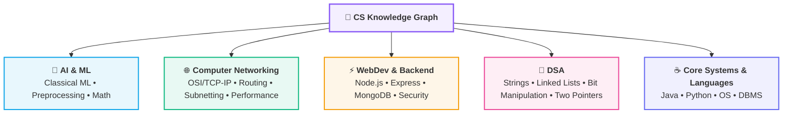

# 🧭 Computer Science Knowledge Vault: Command Center

> [!quote]- Daily Engineering Focus
> *"The mind is not a vessel to be filled, but a fire to be kindled."* — Plutarch

---

## 🗺️ Vault Architecture & Domain Map

---

## ⚡ Quick Actions & Reference Utilities

> [!abstract]+ ⚡ High-Yield Cheatsheets & Roadmaps
> - ⚡ **DSA Rapid Reference:** [[Quick Look|⚡ Quick Look (Java & DSA Cheatsheet)]]
> - 🌳 **DSA Master Roadmap:** [[CS/DSA/README|🌳 DSA Master Hub]]
> - 🌐 **Networking Master Roadmap:** [[CS/Computer Networking/README|🌐 Networking Master Hub]]
> - 🤖 **AI & ML Master Roadmap:** [[CS/AI & ML/README|🤖 AI & ML Master Hub]]
> - ⚡ **Backend Master Roadmap:** [[CS/WebDev/Backend/README|⚡ Backend Development Hub]]
> - 🎓 **Course Resources:** [[Extra_Courses]]

---

## 🧠 Core Domain Master MOCs (Study Order)

> [!tip]+ 🤖 Artificial Intelligence & Machine Learning
> - [[CS/AI & ML/README|🤖 AI & Machine Learning Master Roadmap (MOC)]]
>   - **01. Classical Machine Learning Foundations**
>     - [[CS/AI & ML/01. Classical ML/01. Introduction to Machine Learning|🧠 01. Introduction to Machine Learning]]
>     - [[CS/AI & ML/01. Classical ML/02. Supervised vs Unsupervised Learning|⚖️ 02. Supervised vs Unsupervised Learning]]
>     - [[CS/AI & ML/01. Classical ML/03. Features, Targets, and Datasets|📊 03. Features, Targets & Datasets]]
>     - [[CS/AI & ML/01. Classical ML/04. Train-Test Split and Generalization|✂️ 04. Train-Test Split & Generalization]]
>     - [[CS/AI & ML/01. Classical ML/05. End-to-End ML Pipeline|🔁 05. End-to-End ML Pipeline]]
>     - [[CS/AI & ML/01. Classical ML/06. Linear Regression Assumptions|📐 06. Linear Regression Assumptions & Residuals]]
>     - [[CS/AI & ML/01. Classical ML/07. Regression Evaluation Metrics|📊 07. Regression Evaluation Metrics (MSE, RMSE, MAE, R²)]]
>     - [[CS/AI & ML/01. Classical ML/08. Gradient Descent and Cost Functions|🏔️ 08. Gradient Descent & Cost Functions (Batch / SGD / Mini-Batch)]]
>     - [[CS/AI & ML/01. Classical ML/09. R-Squared and Adjusted R-Squared Calculation|🧮 09. Hand-Calculation: R² & Adjusted R² (5-Student Example)]]
>   - **02. Data Preprocessing & Feature Engineering**
>     - [[CS/AI & ML/02. Data Preprocessing/01. Data Leakage|🛡️ 01. Data Leakage & Safe Transformation (3 Types)]]
>     - [[CS/AI & ML/02. Data Preprocessing/02. Categorical Encoding|🏷️ 02. Categorical Encoding (Nominal vs Ordinal)]]
>     - [[CS/AI & ML/02. Data Preprocessing/03. Missing Value Imputation|🩹 03. Missing Value Imputation (MCAR / MAR / MNAR)]]
>     - [[CS/AI & ML/02. Data Preprocessing/04. Feature Scaling|📐 04. Feature Scaling & Loss Surface Geometry]]
>     - [[CS/AI & ML/02. Data Preprocessing/05. Scikit-Learn Pipeline|🚂 05. Scikit-Learn Pipeline & ColumnTransformer]]

> [!info]+ 🌐 Computer Networking
> - [[CS/Computer Networking/README|🌐 Computer Networks Master Roadmap (MOC)]]
>   - **01. Architecture & Fundamentals**
>     - [[01. Introduction to Computer Networks|🌍 01. Introduction to Computer Networks]]
>     - [[02. Packets and Packet Switching|📦 02. Packets and Packet Switching]]
>     - [[03. Switching Techniques - Packet vs Circuit|🔄 03. Switching Techniques (Packet vs Circuit)]]
>     - [[04. Network Performance - Delay, Latency, Throughput|⏱️ 04. Delay, Latency & Nodal Delays]]
>     - [[05. Network Hardware - Hub, Switch, Router, Modem|🔌 05. Network Hardware (Hub, Switch, Router, Modem)]]
>     - [[06. OSI vs TCP-IP Model|🧱 06. Layered Models (OSI vs TCP/IP & PDUs)]]
>   - **02. Data Flow & Encapsulation**
>     - [[01. Network Protocols and Standards|📜 01. Network Protocols & Standards]]
>     - [[02. Encapsulation and Decapsulation|📦 02. Encapsulation & Decapsulation]]
>     - [[03. Data Units - Segment, Packet, Frame, Bits|📊 03. PDUs & TCP vs UDP]]
>     - [[04. Ethernet and MAC Addressing|🏷️ 04. Ethernet & MAC Addressing]]
>     - [[05. MTU and Fragmentation|✂️ 05. MTU & IP Fragmentation]]
>   - **03. IP Addressing & Subnetting**
>     - [[01. IP Addressing Fundamentals|🌐 01. IPv4 & Binary Fundamentals]]
>     - [[02. Network ID and Host ID|🎯 02. Network ID vs Host ID]]
>     - [[03. Subnet Masks and CIDR Notation|🎭 03. Subnet Masks & CIDR Notation]]
>   - **04. Routing & Network Layer**
>     - [[01. Routing Fundamentals - Routing vs Forwarding and Graph Models|🌐 01. Routing Fundamentals (Routing vs Forwarding & Graph Models)]]
>     - [[02. Distance Vector Routing and RIP|📡 02. Distance Vector Routing & RIP (Bellman-Ford & Convergence)]]
>     - [[03. Bellman-Ford Algorithm|🧠 03. Bellman-Ford Algorithm (Relaxation & Negative Cycles)]]

> [!note]+ 🌳 Data Structures & Algorithms (DSA)
> - [[CS/DSA/README|🌳 DSA Master Roadmap (MOC)]]
>   - [[Quick Look|⚡ Quick Look & Cheatsheet (Frequently Forgotten Syntax)]]
>   - [[CS/DSA/01. Strings/README|🔤 01. Strings & Character Arrays (Master Hub)]]
>     - [[CS/DSA/01. Strings/StringBuilder|🏗️ 01. StringBuilder (Architecture & Growth Model)]]
>     - [[CS/DSA/01. Strings/Add Binary & String Arithmetic|➕ 02. Add Binary & String Arithmetic]]
>     - [[CS/DSA/DSA Problems/67. Add Binary|💡 03. LeetCode 67: Add Binary]]
>   - [[Binary Search|🔍 02. Binary Search & Halving Search Spaces]]
>   - [[CS/DSA/03. Linked Lists/README|🔗 03. Linked Lists (Master Hub)]]
>     - [[01. Linked List Fundamentals|🧱 01. Linked List Fundamentals]]
>     - [[02. Linked List Patterns|🧠 02. Linked List Patterns (Tortoise & Hare, In-Place Reversal)]]
>   - [[Bit Manipulation|⚡ 04. Bit Manipulation (Master Hub)]]
>     - [[01. Bitwise Operators|🔢 01. Bitwise Operators & Truth Tables]]
>     - [[02. Bit Tricks|🪄 02. Bit Tricks & Low-Level Masking]]
>     - [[03. XOR Patterns|🔮 03. XOR Properties & Duplicate Cancellation]]
>     - [[04. Bit Manipulation Problems|💡 04. Bit Manipulation Problem Set]]

> [!important]+ ⚡ Web Development & Backend Engineering
> - [[CS/WebDev/Backend/README|🌐 Backend Master Roadmap (MOC)]]
>   - [[CS/WebDev/Backend/JavaScript/README|🟨 01. JavaScript Foundations & Async Engine]]
>   - [[CS/WebDev/Backend/Node.js/README|🟢 02. Node.js Runtime & Event Loop]]
>   - [[ShopKart Auth Project|🛒 03. ShopKart Authentication & JWT Architecture]]

> [!example]+ ☕ Programming Languages & Core Systems
> - [[CS/JAVA/README|☕ 01. Java Foundations & OOP Architecture (MOC)]]
> - [[CS/Python|🐍 02. Python Language Hub & Scientific Computing]]
> - **03. Operating Systems (OS) & DBMS Foundations** *(Structured directories ready for upcoming modules)*
