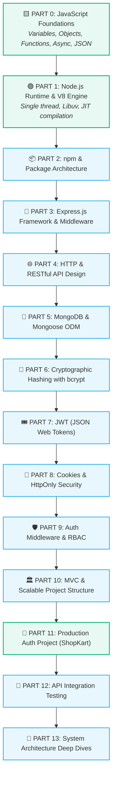
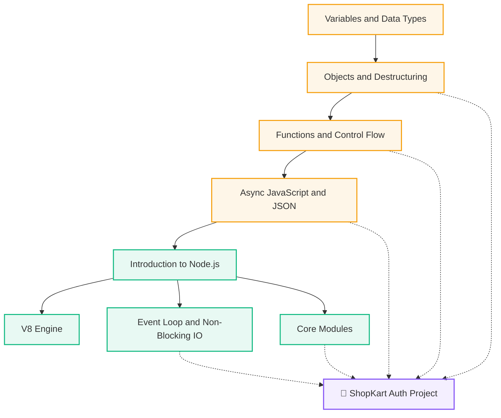

# 🌐 Backend Development Knowledge Base

> [!abstract] Master Backend MOC
> Welcome to the **Backend Development Knowledge Base**. This repository contains interconnected architecture notes designed to take you from core JavaScript runtime mechanics to production-ready backend architectures with [[Introduction to Node.js|Node.js]], Express, MongoDB, and Authentication.

---

## 🗺️ Master 13-Part Learning Roadmap

---

## 📚 Core Modules

### 1. [[WebDev/Backend/JavaScript/README|01. JavaScript Foundations]]
The essential JavaScript concepts required for backend engineering:
- [[Variables and Data Types]] — `const` vs `let`, primitives, `null` vs `undefined`, string methods
- [[Objects and Destructuring]] — Key-value pairs, nested payloads, destructuring `req.body`
- [[Functions and Control Flow]] — Declarations, parameters vs arguments, arrow functions, early `return`, `if/else`
- [[Async JavaScript and JSON]] — `async/await`, Promises, non-blocking DB calls, JSON data format

### 2. [[WebDev/Backend/Node.js/README|02. Node.js Runtime & Architecture]]
How JavaScript executes outside the browser on servers:
- [[Introduction to Node.js]] — JavaScript runtime environment & browser vs server capabilities
- [[V8 Engine]] — Google's C++ engine, JIT compilation, machine code
- [[Event Loop and Non-Blocking IO]] — Single-threaded concurrency & worker pool
- [[Core Modules]] — Built-in modules (`fs`, `http`, `path`, `os`)

### 3. Practical Implementation
- [[ShopKart Auth Project]] — The complete authentication request lifecycle, bcrypt hashing, and HttpOnly session cookies.

---

## 🔄 Knowledge Flow Graph

---

## 🔗 Quick Links
- [[Dashboard|🧭 Main Command Center]]
- [[WebDev/Backend/JavaScript/README|📁 JavaScript Foundations MOC]]
- [[WebDev/Backend/Node.js/README|📁 Node.js Runtime MOC]]
- [[ShopKart Auth Project|🛒 ShopKart Auth Project]]

