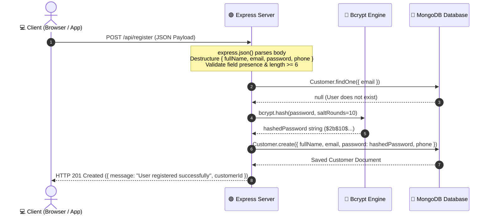
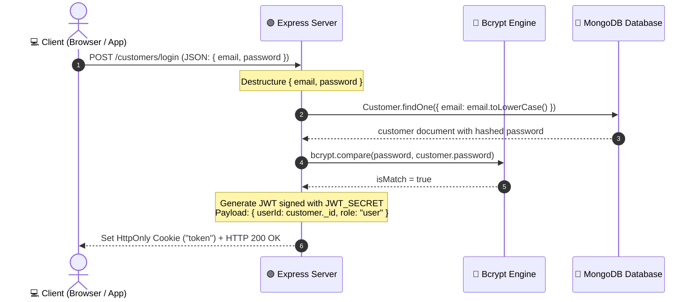

# 🛒 ShopKart Authentication Architecture & Engineering Guide

> [!abstract] Project Architecture Overview
> In the **ShopKart** project, our goal is to build a robust, secure authentication system from scratch using [[Introduction to Node.js|Node.js]], Express, and MongoDB.
> 
> This note documents how foundational backend concepts connect together in the **Registration** and **Login** request lifecycles, along with security considerations and core architecture patterns.

---

## 🔄 End-to-End Registration Request Lifecycle



> [!tip] Security Best Practice: Password Hashing
> Passwords must **never** be stored in plaintext. `bcrypt` utilizes a cryptographic salt with a configurable cost factor (work factor) to generate a slow one-way hash, protecting against rainbow table and brute-force attacks.

---

## 🔑 End-to-End Login Request Lifecycle



> [!important] HttpOnly Cookie Protection
> Storing authentication tokens in `HttpOnly` cookies prevents client-side JavaScript (e.g., via Cross-Site Scripting / XSS attacks) from reading the sensitive session token.

---

## 💻 Complete Registration Controller Example

```javascript
const bcrypt = require("bcrypt");
const Customer = require("../models/Customer");

const registerCustomer = async (req, res) => {
    try {
        // Step 1: Destructure properties from req.body
        const { fullName, email, password, phone } = req.body;

        // Step 2: Validate input
        if (!fullName || !email || !password || !phone) {
            return res.status(400).json({ message: "All fields are required" });
        }

        if (password.length < 6) {
            return res.status(400).json({ message: "Password must be at least 6 characters long" });
        }

        // Step 3: Check if email already exists
        const existingCustomer = await Customer.findOne({ email: email.toLowerCase() });
        if (existingCustomer) {
            return res.status(400).json({ message: "Email already in use" });
        }

        // Step 4: Hash the password securely
        const saltRounds = 10;
        const hashedPassword = await bcrypt.hash(password, saltRounds);

        // Step 5: Create and save customer in MongoDB
        const newCustomer = await Customer.create({
            fullName,
            email: email.toLowerCase(),
            password: hashedPassword,
            phone
        });

        // Step 6: Return success response
        return res.status(201).json({
            message: "Customer registered successfully",
            customerId: newCustomer._id
        });

    } catch (error) {
        console.error("Registration error:", error);
        return res.status(500).json({ message: "Internal server error" });
    }
};

module.exports = { registerCustomer };
```

---

## 💡 Core Backend Architectural Q&A

> [!question]- 1. What is an Object in JavaScript and why is it important for backend development?
> **Answer:** An object is an in-memory data structure of key-value pairs representing entities. In backend development, objects are crucial because incoming HTTP request data (`req.body`), database records (MongoDB documents), and API JSON responses are all structured and manipulated as JavaScript objects.

> [!question]- 2. What is the line `const { fullName, email, password, phone } = req.body;` doing?
> **Answer:** It uses **object destructuring** to unpack properties from the `req.body` object and assign them directly to local constants with the same names, avoiding verbose lines like `const email = req.body.email;`.

> [!question]- 3. What is the difference between `let` and `const`?
> **Answer:** 
> - `let` allows reassigning the variable to a new value later in code execution.
> - `const` creates a read-only reference that cannot be reassigned after declaration. In backend code, `const` is the default choice for modules, functions, and immutable references.

> [!question]- 4. Why must we use `return` when sending error responses (e.g., `return res.status(400)...`)?
> **Answer:** Calling `res.status().json()` sends a response to the client but does *not* stop JavaScript function execution. The `return` keyword ensures the controller function halts immediately, preventing subsequent code from executing and causing a server crash (*"Cannot set headers after they are sent to the client"*).

> [!question]- 5. What is the difference between JSON and a JavaScript Object?
> **Answer:** JSON (JavaScript Object Notation) is a standardized plain-text format used to exchange structured data over the network. A JavaScript Object is an active in-memory data structure inside the V8 engine. `JSON.stringify()` converts an object to text, and `JSON.parse()` (or Express's `express.json()`) parses text into a JS object.

> [!question]- 6. Why is `async/await` required for database operations like `Customer.findOne`?
> **Answer:** Database queries are asynchronous I/O operations that take physical time. Instead of blocking the Node.js main thread, `await` pauses execution of that specific asynchronous function while allowing the server to handle other requests until the database resolves the Promise.

> [!question]- 7. Is Node.js completely single-threaded?
> **Answer:** The JavaScript execution model (Call Stack) is single-threaded, meaning your JavaScript code executes line-by-line on one thread. However, Node.js itself uses background multi-threaded worker pools (via libuv) and operating system kernel asynchronous APIs to handle disk I/O, networking, and cryptography concurrently without freezing the main thread.

---

## 🔗 Related Notes
- [[WebDev/Backend/README|🌐 Backend Master MOC]]
- [[WebDev/Backend/JavaScript/README|🟨 JavaScript Foundations MOC]]
- [[WebDev/Backend/Node.js/README|🟢 Node.js MOC]]
- [[Objects and Destructuring]]
- [[Async JavaScript and JSON]]
- [[Introduction to Node.js]]
- [[Event Loop and Non-Blocking IO]]

